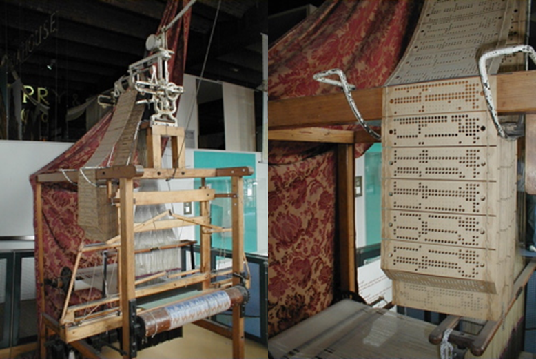
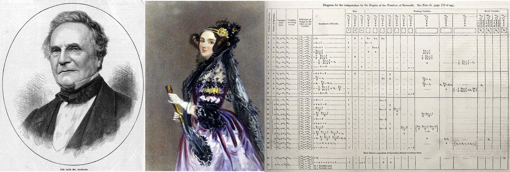
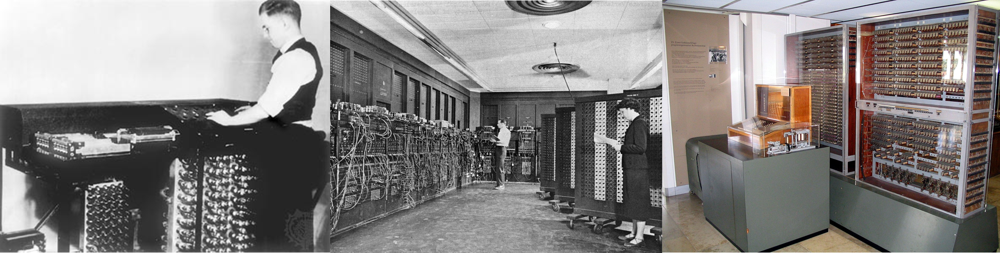
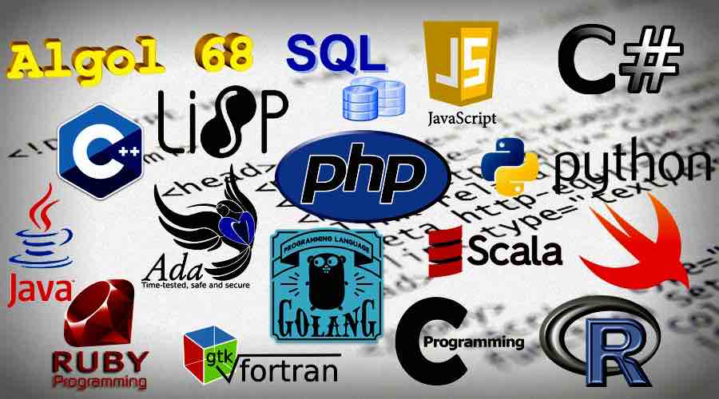

# Introducción a la Programación

## Qué es la programación

Las computadoras son una parte esencial de nuestra vida cotidiana. Casi todos los aparatos que usamos tienen algún tipo de computadora capaz de ejecutar ciertas tareas: lavarropas con distintos modos de lavado, consolas de juegos para momentos de entretenimiento, calculadoras súper potentes, computadoras personales que se usan para un montón de propósitos, teléfonos celulares con un sinfín de aplicaciones y miles de cosas más.

Todos estos dispositivos con computadoras de distinto tipo tienen algo en común: alguien "les dice" cómo funcionar, es decir, les indica cuáles son los pasos que deben seguir para cumplir una tarea. De eso se trata la *programación*: es la actividad mediante la cual las *personas* le entregan a una *computadora* un conjunto de instrucciones para que, al ejecutarlas, ésta pueda *resolver un problema*. Quienes realizan esta actividad reciben el nombre de *programadores*. Sin las personas que las programen, las computadoras dejan de ser útiles, por más complejos que sean estos aparatos. Los conjuntos de instrucciones que reciben las computadoras reciben el nombre de *programas*.

La programación es un proceso creativo: en muchas ocasiones la tarea en cuestión puede cumplirse siguiendo distintos caminos y el programador es el que debe imaginar cuáles son y elegir uno. Algunos de estos caminos pueden ser mejores que otros, pero en cualquier caso  la computadora se limitará a seguir las instrucciones ideadas por el programador.

Desafortunadamente, las computadoras no entienden español ni otro idioma humano. Hay que pasarles las instrucciones en un lenguaje que sean capaces de entender. Para eso debemos aprender algún *lenguaje de programación*, que no es más que un lenguaje artificial compuesto por una serie de expresiones que la computadora puede interpretar. Las computadoras interpretan nuestras instrucciones de forma muy literal, por lo tanto a la hora de programar hay que ser muy específicos. Es necesario respetar las reglas del lenguaje de programación y ser claros en las indicaciones provistas.

Ahora bien, ¿por qué debemos estudiar programación en la Licenciatura en Estadística? La actividad de los profesionales estadísticos está atravesada en su totalidad por la necesidad de manejar con soltura herramientas informáticas que nos asisten en las distintas etapas de nuestra labor, desde la recolección y depuración de conjuntos de datos, pasando por la aplicación de distintas metodologías de análisis, hasta la comunicación efectiva de los resultados. Por eso, en la asignatura *Introducción a la Programación* estudiaremos los conceptos básicos de esta disciplina, fomentando la ejercitación del pensamiento abstracto y lógico necesario para poder entendernos hábilmente con la computadora y lograr que la misma realice las tareas que necesitamos.

Para poner en práctica los conceptos sobre Programación que aprenderemos, vamos a emplear un lenguaje que ha sido desarrollado específicamente para realizar tareas estadísticas, llamado *R*. Sin embargo, debemos resaltar que éste no es un curso sobre R, es decir, no nos dedicaremos a aprender las herramientas que este lenguaje brinda para el análisis de datos. De hecho, frente a variados problemas vamos a dedicarnos a crear soluciones que ya existen y están disponibles en R, pero lo haremos con el fin de utilizar dicho lenguaje para aprender y ejercitar nociones básicas de programación.

## Una breve reseña histórica sobre la programación

La historia de la programación está vinculada directamente con la de la computación. Esta palabra proviene del latín *computatio*, que deriva del verbo *computare*, cuyo significado es "enumerar cantidades". Computación, en este sentido, designa la acción y efecto de computar, realizar una cuenta, un cálculo matemático. De allí que antiguamente computación fuese un término usado para referirse a los cálculos realizados por una persona con un instrumento expresamente utilizado para tal fin (como el ábaco, por ejemplo) o sin él. En este sentido, la computación ha estado presente desde tiempos ancestrales, sin embargo debemos remontarnos al siglo XVII para encontrar los primeros dispositivos diseñados para automatizar cómputos matemáticos.

En 1617 el matemático escocés John Napier (el mismo que definió los logaritmos) inventó un sistema conocido como *los huesos de Napier* o *huesos neperianos* que facilitaba la tarea de multiplicar, dividir y tomar raíces cuadradas, usando unas barras de hueso o marfil que tenían dígitos grabados. Esta fue la base para otras ideas más avanzadas, entre ellas la que dio origen a la primera calculadora mecánica, inventada por el alemán Wilhelm Schickard en 1623, capaz de realizar cómputos aritméticos sencillos funcionando a base de ruedas y engranajes. Se componía de dos mecanismos diferenciados, un ábaco de Napier de forma cilíndrica en la parte superior y un mecanismo en la inferior para realizar sumas parciales de los resultados obtenidos con el aparato de la parte superior. Fue llamado *reloj calculador*. A partir de aquí se fueron desarrollando otros modelos, todos ellos teniendo en común el hecho de ser puramente mecánicos, sin motores ni otras fuentes de energía. El operador ingresaba números ubicando ruedas de metal en posiciones particulares y al girarlas otras partes de la máquina se movían y mostraban el resultado. Algunos ejemplos son las calculadoras del inglés William Oughtred en 1624, de Blaise Pascal en 1645 (llamada *pascalina*), la de Samuel Morland en 1666 y las de Leibniz, en 1673 y 1694.

```{r calculadora, out.width='100%', fig.show='hold', fig.cap='De izquierda a derecha: los huesos de Napier (Museo Arqueológico Nacional de España), el reloj calculador de Schickard (Museo de la Ciencia de la Universidad Pública de Navarra) y una pascalina del año 1952', echo=FALSE, fig.align="center"}
knitr::include_graphics('images/historia/calculadoras.png')
```

El siglo XVIII trajo consigo algunos otros diseños, pero un gran salto se dio a comienzos del siglo XIX de mano de un tejedor y comerciante francés, Joseph Jacquard. En 1801 creó un telar que tenía un sistema de tarjetas perforadas para controlar las puntadas del tejido, de forma que fuera posible *programar* una gran diversidad de tramas y figuras. Sin saberlo, Jacquard sentó una idea fundamental para la creación de las computadoras.

```{r , out.width='50%', fig.show='hold', fig.cap='Un telar de Jacquard y sus tarjetas perforadas en el Museo de la ciencia y la industria en Mánchester.', echo=FALSE, fig.align="center"}

```

En 1822 el matemático británico Charles Babbage publicó un diseño para la construcción de una *máquina diferencial*, que podía calcular valores de funciones polinómicas mediante el método de las diferencias. Este complejo sistema de ruedas y engranajes era el primero que podía trabajar automáticamente utilizando resultados de operaciones previas. Si bien el diseño era viable, por motivos técnicos y económicos no lo pudo concretar (sólo construyó un modelo de menor escala). Sin embargo, Babbage no se dio por vencido y en 1837 presentó el diseño de una *máquina analítica*, un aparato capaz de ejecutar cualquier tipo de cálculo matemático y que, por lo tanto, se podría utilizar con cualquier propósito. Tal como el telar de Jacquard, la operación de esta máquina sería controlada por un patrón de perforaciones hechas sobre una tarjetas que la misma podría leer. Al cambiar el patrón de las perforaciones, se podría cambiar el comportamiento de la máquina para que resuelva diferentes tipos de cálculos. Para la salida de resultados, la máquina sería capaz de perforar tarjetas. Además, funcionaría con un motor a vapor y su tamaño hubiese sido de 30 metros de largo por 10 de ancho. Si bien Babbage tampoco llegó a concretar en vida este diseño que dejó plasmado en más de 300 dibujos y 2200 páginas por motivos políticos, se lo considera como la primera conceptualización de lo que hoy conocemos como computadora, por lo cual Babbage es conocido como *el padre de la computación*. 

En 1843 Lady Ada Lovelace, una matemática y escritora británica, publicó una serie de notas sobre la máquina analítica de Babbage, en las que resaltaba sus potenciales aplicaciones prácticas, incluyendo la descripción detallada de tarjetas perforadas para que sea capaz de calcular los números de Bernoulli. Al haber señalado los pasos para que la máquina pueda cumplir con estas y otras tareas, Ada es considerada actualmente como la primera programadora del mundo, a pesar de que en la época no fue tomada en serio por la comunidad científica, principalmente por su condición de mujer.

```{r , out.width='100%', fig.show='hold', fig.cap='Charles Babbage, Ada Lovelace y el algoritmo que publicó Ada para calcular los números de Bernoulli con la máquina analítica de Charles.', echo=FALSE, fig.align="center"}

```

La utilidad de las tarjetas perforadas quedó confirmada en 1890, cuando Herman Hollerith las utilizó para automatizar la tabulación de datos en el censo de Estados Unidos. Las perforaciones en determinados lugares representaban información como el sexo o la edad de las personas, logrando que se pudieran lograr clasificaciones y conteos de forma muy veloz. Así, se tardaron sólo 3 años en procesar la información del censo, cinco años menos que en el anterior de 1880. Con el fin de comercializar esta tecnología, Hollerith fundó una compañía que terminaría siendo la famosa International Business Machine (IBM), empresa líder en informática hasta el día de hoy. 

Sin embargo, la visión de Babbage de una computadora programable no se hizo realidad hasta los años 1940, cuando el advenimiento de la electrónica hizo posible superar a los dispositivos mecánicos existentes. John Atanasoff y Clifford Barry (Iowa State College, Estados Unidos) terminaron en 1942 en Iowa State College (Estados Unidos) una computadora electrónica capaz de resolver sistemas de ecuaciones lineales simultáneas, llamada *ABC* (por "Atanasoff Berry Computer"). La misma contaba con 300 tubos de vacío, unas bombillas de vidrio con ciertos componentes que podían recibir y modificar una señal eléctrica mediante el control del movimiento de los electrones produciendo una respuesta, que habían sido presentados por primera vez en 1906 por el estadounidense Lee De Forest. La *ABC* dio comienzo a la conocida como la *primera generación de computadoras* basadas en el empleo de tubos de vacío.

La primera computadora electrónica de propósito general fue la *ENIAC*, *Electronic Numerical Integrator and Computer*, completada por Presper Eckert y John Mauchly en la Universidad de Pensilvania. Podía realizar cinco mil operaciones aritmética por segundo y tenía más de 18000 tubos de vacío, ocupando una sala de 9x15 metros en un sótano de la universidad donde se montó un sistema de aire acondicionado especial. 

Ni la *ABC* ni la *ENIAC* eran reprogramables: la *ABC* servía el propósito específico de resolver sistemas de ecuaciones y la *ENIAC* era controlada conectando ciertos cables en un panel, lo que hacía muy compleja su programación. El siguiente gran avance se produjo en 1945, cuando el matemático húngaro-estadounidense John von Neumann (Universidad de Princeton) propuso que los programas, es decir, las instrucciones para que la máquina opere, y también los datos necesarios, podrían ser representados y guardados en una memoria electrónica interna. Así nació el concepto de *programa almacenado* (o *stored-program*), en contraposición con el uso de tableros de conexiones y mecanismos similares de los modelos vigentes. Los creadores de la ENIAC, bajo la consultoría de von Neumann, implementaron esto en el diseño de su sucesora, la *EDVAC*, terminada en 1949.
También ya había experimentado con esta idea el alemán Konrad Zuse, quien entre 1937 y 1941 desarrolló la *Z3*, por lo cual es considerada por algunos como la primera máquina completamente automática y programable. En lugar de usar tubos de vacíos, empleaba un conjunto de 2600 relés, unos dispositivos electromagnéticos inventados en 1835 y empleados, por ejemplo, en telegrafía. 
<!-- Un relé funciona como un interruptor controlado por una bobina y un electroimán que integrado en un circuito eléctrico acciona uno o varios contactos, abriendo o cerrando otros circuitos eléctricos independientes.  -->
El modelo original de la Z3 fue destruido en Berlín por un bombardeo durante la segunda guerra mundial.

```{r berry, out.width='100%', fig.show='hold', fig.cap='De izquierda a derecha: las computadoras ABC, ENIAC y Z3', echo=FALSE, fig.align="center"}

```

Este nuevo paradigma cambió la historia de la computación, como también lo hizo la invención del *transistor* en 1947 en los Laboratorios Bell. Un *transistor* es un dispositivo electrónico semiconductor que entrega una señal de salida en respuesta a una señal de entrada, mucho más pequeño que los tubos de vacío y que consumen menos energía eléctrica. Así, una computadora podía tener cientos de miles de transistores, no obstante ocupando mucho espacio. 

Desde entonces, la computación ha evolucionado muy rápidamente, con la introducción de nuevos sistemas y conceptos, que llegan a los complejos y poderosos diseños electrónicos que caracterizan la vida actual. En un intento de caracterizar y resumir esta impactante evolución, algunos historiadores dividen al desarrollo de las computadoras modernas en  "generaciones" (esta clasificación no es única y existen diversas versiones de la misma):

- *Primera generación* (aprox. 1940-1958): se trata de las computadoras electrónicas que usaban tubos de vacío para su circuito interno. Los equipos eran enormes y ocupan habitaciones enteras. Consumían mucha electricidad y generaban demasiado calor. Podía llevar días o semanas modificar las conexiones para hacer que la computadora resuelva un problema diferente. Usaban tarjetas perforadas y cinta de papel para la lectura de datos e impresiones para mostrar las salidas.
- *Segunda generación* (aprox. 1958-1964): se caracteriza por el uso de *transistores* (inventados en 1947) en lugar de tubos de vacío, permitiendo que las computadoras tengan un consumo eléctrico más eficiente, sean más baratas, más pequeñas y más rápidas. 
- *Tercera generación* (aprox. 1964-1971): se inició en 1959 con el desarrollo de un circuito integrado ("chip") que se trata de una pequeña placa de silicio sobre el cual se imprime un gran número de transistores conectados. La primera computadora de este estilo fue de IBM en 1960. Al ser más pequeñas y baratas, su uso llegó a una mayor audiencia. Se pudo interactuar con la máquina mediante teclados, monitores y un sistema operativo, que posibilitaba ejecutar múltiples acciones a la vez bajo el monitoreo de un programa central.
- *Cuarta generación* (aprox. 1971-presente): los avances tecnológicos permitieron construir la unidad entera de procesamiento de una computadora sobre un único chip de silicio (*microprocesador*), incluyendo la memoria y los controles de entrada y salida de datos. Todo lo que en una computadora de la primera generación ocupaba una habitación entera, fue capaz de entrar en la palma de una mano. El primer microprocesador fue el Intel 4004 de 1971, mientras que la primera computadora de uso doméstico fue desarrollada por IBM en 1981. Surgieron también en esta generación el ratón (*mouse*) y las interfaces gráficas de usuario (como Windows, en 1985). 

```{r evolucion, out.width='50%', fig.show='hold', fig.cap='De derecha a izquierda: un tubo de vacío, un transistor y un chip.', echo=FALSE, fig.align="center"}
knitr::include_graphics('images/historia/05_tubovacio_transistor_chip.jpg')
```

## Software y hardware

Como podemos ver, en la historia de la computación hubo dos aspectos que fueron evolucionando: las máquinas y los programas que las dirigen. Hacemos referencia a estos elementos como *hardware* y *software* respectivamente, y es la conjunción de ambos la que le da vida a la computación y hace posible la programación.

```{r hardvssoft, out.width='50%', fig.show='hold', fig.cap='Representación de la diferencia entre hardware y software.', echo=FALSE, fig.align="center"}
knitr::include_graphics('images/intro/06_hardsoft.jpg')
```

El *hardware* es el conjunto de piezas físicas y tangibles de la computadora. Existen diversas formas de clasificar a los elementos que componene al hardware, según distintos criterios:

<!-- Table: (\#tab:hardware) Clasificación del hardware. -->

`r if (knitr::is_latex_output()) '<!--'` 

<caption> (\#tab:hardware) Clasificación del hardware </caption>
<style type="text/css">
.tg  {border-collapse:collapse;border-color:#9ABAD9;border-spacing:0;}
.tg td{background-color:#EBF5FF;border-color:#9ABAD9;border-style:solid;border-width:1px;color:#444;
  font-family:Arial, sans-serif;font-size:14px;overflow:hidden;padding:10px 5px;word-break:normal;}
.tg th{background-color:#409cff;border-color:#9ABAD9;border-style:solid;border-width:1px;color:#fff;
  font-family:Arial, sans-serif;font-size:14px;font-weight:normal;overflow:hidden;padding:10px 5px;word-break:normal;}
.tg .tg-9wq8{border-color:inherit;text-align:center;vertical-align:middle}
.tg .tg-nrix{text-align:center;vertical-align:middle}
</style>
<table class="tg">
<thead>
  <tr>
    <th class="tg-9wq8">Critero</th>
    <th class="tg-9wq8">Clasificación</th>
    <th class="tg-9wq8">Descripción</th>
    <th class="tg-nrix">Ejemplos</th>
  </tr>
</thead>
<tbody>
  <tr>
    <td class="tg-9wq8" rowspan="4">Según su utilidad</td>
    <td class="tg-9wq8">Dispositivos de procesamiento</td>
    <td class="tg-9wq8">Son los que reciben las instrucciones mediante señales eléctricas y usan cálculos y lógica para interpretarlas y emitir otras señales eléctricas como resultado.</td>
    <td class="tg-nrix">microprocesador, tarjeta gráfica, tarjeta de sonido, etc.</td>
  </tr>
  <tr>
    <td class="tg-nrix">Dispositivos de almacenamiento</td>
    <td class="tg-nrix">Son capaces de guardar información para que esté disponible para el sistema.</td>
    <td class="tg-nrix"><span style="font-weight:400;font-style:normal">disco duro, pen drive, DVD, etc.</span></td>
  </tr>
  <tr>
    <td class="tg-nrix">Dispositivos de entrada</td>
    <td class="tg-nrix">Captan instrucciones por parte de los usuarios y las transforman en señales eléctricas interpretables por la máquina.</td>
    <td class="tg-nrix">teclado, mouse, touch pad, etc.</td>
  </tr>
  <tr>
    <td class="tg-nrix">Dispositivos de salida</td>
    <td class="tg-nrix">Transforman los resultados de los dispositivos de procesamiento para presentarlos de una forma fácilmente interpretable para el usuario.</td>
    <td class="tg-nrix">monitor, impresora, etc</td>
  </tr>
  <tr>
    <td class="tg-nrix" rowspan="2">Según su ubicación</td>
    <td class="tg-nrix">Dispositivos internos</td>
    <td class="tg-nrix">Generalmente se incluye dentro de la carcasa de la computadora.</td>
    <td class="tg-nrix">microprocesador, disco rígido, ventiladores, módem, tarjeta gráfica, fuente de alimentación, puertos, etc.</td>
  </tr>
  <tr>
    <td class="tg-nrix">Dispositivos externos o periféricos</td>
    <td class="tg-nrix">No se incluye dentro de la carcasa de la computadora y está al alcance del usuario</td>
    <td class="tg-nrix">monitor, teclado, mouse, joystick, micrófono, impresora, escáner, pen drive, lectores de código de barras, etc.</td>
  </tr>
  <tr>
    <td class="tg-nrix" rowspan="2">Según su importancia</td>
    <td class="tg-nrix">Hardware principal</td>
    <td class="tg-nrix">Dispositvos esenciales para el funcionamiento de la computadora</td>
    <td class="tg-nrix">microprocesador, disco rígido, memoria RAM, fuente de alimentación, monitor, etc.</td>
  </tr>
  <tr>
    <td class="tg-nrix">Hardware complementario</td>
    <td class="tg-nrix">Aquellos elementos no indispensables (claramente, dependiendo del contexto, alguna pieza del hardware que en alguna situación podría considerarse complementaria, en otras resulta principal).</td>
    <td class="tg-nrix"></td>
  </tr>
</tbody>
</table>

`r if (knitr::is_latex_output()) '-->'`

`r if (knitr::is_html_output()) '<!--'` 
\begin{table}[H]
\caption{Clasificación del hardware.}
%\begin{tabular}{@{}cccc@{}}
\begin{tabular}{ p{3.5cm} p{2.5cm} p{6cm}p{4cm}}
\toprule
Critero                               & Clasificación                       & Descripción                                                                                                                                                                                    & Ejemplos                                                                                                        \\ \midrule
\multirow{4}{*}{Según su utilidad}    & Dispositivos de procesamiento       & Son los que reciben las instrucciones mediante señales eléctricas y usan cálculos y lógica para interpretarlas y emitir otras señales eléctricas como resultado.                               & microprocesador, tarjeta gráfica, tarjeta de sonido, etc.                                                       \\ \cmidrule(l){2-4} 
                                      & Dispositivos de almacenamiento      & Son capaces de guardar información para que esté disponible para el sistema.                                                                                                                   & disco duro, pen drive, DVD, etc.                                                                                \\ \cmidrule(l){2-4} 
                                      & Dispositivos de entrada             & Captan instrucciones por parte de los usuarios y las transforman en señales eléctricas interpretables por la máquina.                                                                          & teclado, mouse, touch pad, etc.                                                                                 \\ \cmidrule(l){2-4} 
                                      & Dispositivos de salida              & Transforman los resultados de los dispositivos de procesamiento para presentarlos de una forma fácilmente interpretable para el usuario.                                                       & monitor, impresora, etc                                                                                         \\ \midrule
\multirow{2}{*}{Según su ubicación}   & Dispositivos internos               & Generalmente se incluye dentro de la carcasa de la computadora.                                                                                                                                & microprocesador, disco rígido, ventiladores, módem, tarjeta gráfica, fuente de alimentación, puertos, etc.      \\ \cmidrule(l){2-4} 
                                      & Dispositivos externos o periféricos & No se incluye dentro de la carcasa de la computadora y está al alcance del usuario                                                                                                             & monitor, teclado, mouse, joystick, micrófono, impresora, escáner, pen drive, lectores de código de barras, etc. \\ \midrule
\multirow{2}{*}{Según su importancia} & Hardware principal                  & Dispositvos esenciales para el funcionamiento de la computadora                                                                                                                                & microprocesador, disco rígido, memoria RAM, fuente de alimentación, monitor, etc.                               \\ \cmidrule(l){2-4} 
                                      & Hardware complementario             & Aquellos elementos no indispensables (claramente, dependiendo del contexto, alguna pieza del hardware que en alguna situación podría considerarse complementaria, en otras resulta principal). &                                                                                                                 \\ \bottomrule
\end{tabular}
\end{table}
`r if (knitr::is_html_output()) '-->'`


$~$

Por otro lado tenemos al *software*, que es el conjunto de todos los programas (es decir, todas las instrucciones que recibe la computadora) que permiten que el hardware funcione y que se pueda concretar la ejecución de las tareas. No tiene una existencia física, sino que es intangible. El software se puede clasificar de la siguiente forma:

<!-- Table: (\#tab:software) Clasificación del software. -->

`r if (knitr::is_latex_output()) '<!--'`
<caption> (\#tab:software) Clasificación del software </caption>
<style type="text/css">
.tg  {border-collapse:collapse;border-color:#9ABAD9;border-spacing:0;}
.tg td{background-color:#EBF5FF;border-color:#9ABAD9;border-style:solid;border-width:1px;color:#444;
  font-family:Arial, sans-serif;font-size:14px;overflow:hidden;padding:10px 5px;word-break:normal;}
.tg th{background-color:#409cff;border-color:#9ABAD9;border-style:solid;border-width:1px;color:#fff;
  font-family:Arial, sans-serif;font-size:14px;font-weight:normal;overflow:hidden;padding:10px 5px;word-break:normal;}
.tg .tg-c3ow{border-color:inherit;text-align:center;vertical-align:top}
</style>
<table class="tg">
<thead>
  <tr>
    <th class="tg-c3ow">Clasificación</th>
    <th class="tg-c3ow">Descripción</th>
    <th class="tg-c3ow">Ejemplos</th>
  </tr>
</thead>
<tbody>
  <tr>
    <td class="tg-c3ow">Software de sistema o software base</td>
    <td class="tg-c3ow">Son los programas informáticos que están escritos en lenguaje de bajo nivel como el de máquina o ensamblador y cuyas instrucciones controlan de forma directa el hardware</td>
    <td class="tg-c3ow">BIOS o UEFIs (sistemas que se encargan de operaciones básicas como el arranque del sistema, la configuración del hardware, etc), sistemas operativos (Linux, Windows, iOS, Android), controladores o *drivers*, etc.</td>
  </tr>
  <tr>
    <td class="tg-c3ow">Software de aplicación o utilitario</td>
    <td class="tg-c3ow">Son los programas o aplicaciones que usamos habitualmente para realizar alguna tarea específica.</td>
    <td class="tg-c3ow">procesadores de texto como Word, reproductor de música, Whatsapp, Guaraní, navegadores web, juegos, etc.</td>
  </tr>
  <tr>
    <td class="tg-c3ow">Software de programación o de desarrollo</td>
    <td class="tg-c3ow">Son los programas y entornos que nos permiten desarrollar nuestras propias herramientas de software o nuevos programas. Aquí se incluyen los lenguajes de programación</td>
    <td class="tg-c3ow">C++, Java, Python, R, etc.</td>
  </tr>
</tbody>
</table>
`r if (knitr::is_latex_output()) '-->'`

`r if (knitr::is_html_output()) '<!--'`
\begin{table}[H]
\caption{Clasificación del software.}
\begin{tabular}{ p{4cm} p{6cm} p{6cm}}
\toprule
Clasificación                            & Descripción                                                                                                                                                               & Ejemplos                                                                                                                                                                                                            \\ \midrule
Software de sistema o software base      & Son los programas informáticos que están escritos en lenguaje de bajo nivel como el de máquina o ensamblador y cuyas instrucciones controlan de forma directa el hardware & BIOS o UEFIs (sistemas que se encargan de operaciones básicas como el arranque del sistema, la configuración del hardware, etc), sistemas operativos (Linux, Windows, iOS, Android), controladores o *drivers*, etc. \\ \midrule
Software de aplicación o utilitario      & Son los programas o aplicaciones que usamos habitualmente para realizar alguna tarea específica.                                                                          & procesadores de texto como Word, reproductor de música, Whatsapp, Guaraní, navegadores web, juegos, etc.                                                                                                            \\ \midrule
Software de programación o de desarrollo & Son los programas y entornos que nos permiten desarrollar nuestras propias herramientas de software o nuevos programas. Aquí se incluyen los lenguajes de programación    & C++, Java, Python, R, etc.                                                                                                                                                                                          \\ \bottomrule
\end{tabular}
\end{table}
`r if (knitr::is_html_output()) '-->'`

<!-- https://www.xataka.com/basics/uefi-y-bios-cuales-son-las-diferencias -->

## Problemas, algoritmos y lenguajes de programación

Mencionamos anteriormente que la *programación* consistía en instruir a una computadora para que resuelva un problema y que la comunicación de esas instrucciones debe ser realizada de forma clara. Es por eso que, ante un problema que debe ser resuelto computacionalmente, el primer paso es pensar detalladamente cuál puede ser una forma de resolverlo, es decir, crear un *algoritmo*. Un *algoritmo* es una estrategia consistente de un conjunto ordenado de pasos que nos lleva a la solución de un problema o alcance de un objetivo. Luego, hay que traducir el algoritmo elegido al idioma de la computadora. 

Entonces, podemos decir que la resolución computacional de un problema consiste de dos etapas básicas:

1. *Diseño algorítmico*: desarrollar un algoritmo, o elegir uno existente, que resuelva el problema.
2. *Codificación*: expresar un algoritmo en un lenguaje de programación para que la computadora lo pueda interpretar y ejecutar.

Al aprender sobre programación, comenzamos enfrentándonos a problemas simples para los cuales la primera etapa parece sencilla, mientras que la codificación se torna dificultosa ya que hay que aprender las reglas del lenguaje de programación. Sin embargo, mientras que con práctica rápidamente podemos ganar facilidad para la escritura de código, el diseño algorítmico se torna cada vez más desafiante al encarar problemas más complejos. Es por eso que haremos hincapié en el planteo y desarrollo de algoritmos como una etapa fundamental en la programación.

### El diseño algorítmico

Cotidianamente, hacemos uso de algoritmos para llevar adelante casi todas las actividades que realizamos: preparar el desayuno, sacar a pasear la mascota, poner en la tele un servicio de *streaming* para ver una película, etc. Cada una de estas tareas requiere llevar adelante algunas acciones de forma ordenada, aunque no hagamos un listado de las mismas y procedamos casi sin pensar.

Sin embargo, cuando estamos pensando la solución para un problema que va a resolver una computadora, debemos ser claros y concretos, para asegurarnos de que al seguir los pasos del algoritmo se llegue a la solución y para que quien tenga que codificarlo, nosotros mismos u otras personas, lo pueda entender sin problemas. Por eso, el primer paso es idear un algoritmo para su solución y expresarlo por escrito, por ejemplo, en español, pero adaptando el lenguaje humano a formas lógicas que se acerquen a las tareas que puede realizar una computadora. En programación, el lenguaje artificial e informal que usan los desarrolladores en la confección de algoritmos recibe el nombre de *pseudocódigo*. Es la herramienta que utilizamos para describir los algoritmos mezclando el lenguaje común con instrucciones de programación. No es en sí mismo un lenguaje de programación, es decir, la computadora no es capaz de entenderlo, sino que el objetivo del mismo es que el programador se centre en la solución lógica y luego lo utilice como guía al escribir el programa.

El pseudocódigo, como cualquier otro lenguaje, está compuesto por:

- Un *léxico*: conjunto de palabras o frases válidas para escribir las instrucciones.
- Una *sintaxis*: reglas que establecen cómo se pueden combinar las distintas partes.
- Una *semántica*: significado que se les da a las palabras o frases.

El pseudocódigo sigue una *estructura secuencial*: define una acción o instrucción que sigue a otra en secuencia. Esta estructura puede representarse de la siguiente forma:

```{r, tidy=FALSE, eval=FALSE, highlight=FALSE }
ALGORITMO: "Ejemplo"
COMENZAR
    Acción 1
    Acción 2
    ...
    Acción N
FIN
```

Se comienza con un título que describa el problema que el algoritmo resuelve, seguido por la palabra `COMENZAR`. Luego se detallan las acciones o instrucciones a seguir y se concluye con la palabra `FIN`. Por ejemplo, si nuestro problema es poner en marcha un auto, el algoritmo para resolverlo puede ser expresado mediante el siguiente pseudocódigo:

```{r, tidy=FALSE, eval=FALSE, highlight=FALSE }
ALGORITMO: "Arrancar el auto"
COMENZAR
    INSERTAR la llave de contacto
    UBICAR el cambio en punto muerto
    GIRAR la llave hasta la posición de arranque
    SI el motor arranca 
        ENTONCES
            DEJAR la llave en posición "encendido"
        SI NO
            LLAMAR al mecánico
    FINSI
FIN
```

Es importante destacar la presencia de sangrías (*sangrado*) en el ejemplo anterior, que facilitan la lectura.

Los algoritmos suelen ser representados también mediante *diagramas de flujo*, como el que se muestra en la siguiente figura^[En este curso no emplearemos diagramas de flujo]. 

```{r algoritmo, out.width='70%', fig.show='hold', fig.cap='Ejemplo del algoritmo "Arrancar el auto" representado gráficamente con un diagrama de flujo.', echo=FALSE, fig.align="center"}
knitr::include_graphics('images/intro/flujo.png')
```

### Codificación

El algoritmo anterior está presentado en pseudocódigo utilizando el lenguaje español, una opción razonable para compartir esta estrategia entre personas que se comuniquen con este idioma. Claramente, si queremos presentarle nuestro algoritmo a alguien que sólo habla francés, el español ya no sería una buena elección, y mucho menos si queremos presentarle el algoritmo a una computadora. Para que una computadora pueda entender nuestro algoritmo, debemos traducirlo en un *lenguaje de programación*, que, como dijimos antes, es un idioma artificial diseñado para expresar cómputos que puedan ser llevados a cabo por equipos electrónicos, es decir es un medio de comunicación entre el humano y la máquina.

Si bien hay distintos lenguajes de programación, una computadora en definitiva es un aparato que sólo sabe *hablar* en *binario*, es decir, sólo interpreta señales eléctricas con dos estados posibles, los cuales son representados por los dígitos binarios 0 y 1. Toda instrucción que recibe la computadora se construye mediante una adecuada y larga combinación de ceros y unos^[Como vimos anteriormente, las computadoras de la primera generación no se manejaban con lenguajes de programación, sino que para introducir información e instrucciones en las primeras computadoras se usaban tarjetas perforadas, en las cuales los orificios representaban un "0" y las posiciones que no los tenían se entendían como un "1", de modo que la máquina podía operar empleando el sistema binario.]. Este sistema de código con ceros y unos que la computadora interpreta como instrucciones o conjuntos de datos se llama *lenguaje de máquina* (o código de máquina).

Programar en lenguaje de máquina es muy complejo y lento, y es fácil cometer errores pero es difícil arreglarlos. Por eso a principios de la década de 1950 se inventaron los *lenguaje ensambladores*, que usan palabras para representar simbólicamente las operaciones que debe realizar la computadora. Cada una de estas palabras reemplaza un código de máquina binario, siendo un poco más fácil programar. Imaginemos que deseamos crear un programa que permita sumar dos números elegidos por una persona. La computadora puede hacer esto si se lo comunicamos mediante un mensaje compuesto por una larga cadena de ceros y unos (lenguaje de máquina) que a simple vista no podríamos entender. Sin embargo, escrito en lenguaje de máquina, el programa se vería así (por ejemplo):

```{r out.width='100%', fig.show='hold', fig.cap='Programa en lenguaje ensamblador para leer dos números, sumarlos y mostrar el resultado. Al final de cada línea hay una descripción de la operación realizada.', echo=FALSE, fig.align="center"}
knitr::include_graphics('images/intro/ensamblador.png')
```

El programa que se encarga de traducir esto al código de máquina se llama *ensamblador*. A pesar de que no haya ceros y unos como en el lenguaje de máquina, probablemente el código anterior tampoco sea fácil de entender. Aparecen instrucciones que tal vez podemos interpretar, como *add* por sumar o *sub* por substraer, pero está lleno de cálculos hexadecimales, referencias a posiciones en la memoria de la computadora y movimientos de valores que no lo hacen muy amigable. Por eso, a pesar de que la existencia de los lenguajes ensambladores simplificó mucho la comunicación con la computadora, se hizo necesario desarrollar lenguajes que sean aún más sencillos de usar.

Por ejemplo, con el lenguaje que vamos a aprender, R, el problema de pedirle dos números a una persona y sumarlos se resumen en las siguientes líneas de código:

```
n1 <- scan()
n2 <- scan()
print(n1 + n2)
```

En las dos primeras líneas con la instrucción `scan()` (que quiere decir "escanear", "leer") se le pide a la persona que indique dos números y en la tercera línea se muestra el resultado de la suma, con la instrucción `print()` ("imprimir", "mostrar"). Mucho más corto y entendible. 

Esta simplificación es posible porque nos permitimos *ignorar* ciertos aspectos del proceso que realiza la computadora. Todas esas acciones que se ven ejemplificadas en la imagen con el código ensamblador se llevan a cabo de todas formas, pero no lo vemos. Nosotros sólo tenemos que aprender esas últimas tres líneas de código, de forma que nos podemos concentrar en el problema a resolver (ingresar dos números, sumarlos y mostrar el resultado) y no en las complejas operaciones internas que tiene que hacer el microprocesador.

En programación, la idea de simplificar un proceso complejo ignorando algunas de sus partes para comprender mejor lo que hay que realizar y así resolver un problema se conoce como *abstracción*^[La abstracción no es una idea exclusiva de la programación. Se encuentra, también, por ejemplo, en el *arte abstracto*.]. Esto quiere decir que los lenguajes de programación pueden tener distintos niveles de abstracción:

- *Lenguajes de bajo nivel de abstracción*: permiten controlar directamente el *hardware* de la computadora, son específicos para cada tipo de máquina, y son más rígidos y complicados de entender para nosotros. El lenguaje ensamblador entra en esta categoría.
- *Lenguajes de alto nivel de abstracción*: diseñados para que sea fácil para los humanos expresar los algoritmos sin necesidad de entender en detalle cómo hace exactamente el hardware para ejecutarlos. El lenguaje que utilizaremos en este taller, R, es de alto nivel. Son independientes del tipo de máquina.
- *Lenguajes de nivel medio de abstracción*: son lenguajes con características mixtas entre ambos grupos anteriores.

```{r lenguajes, out.width='70%', fig.show='hold', fig.cap='Distintos lenguajes de programación y sus logos.', echo=FALSE, fig.align="center"}

```

Si bien podemos programar usando un lenguaje de alto nivel para que nos resulte más sencillo, *alguien* o *algo* debe traducirlo a lenguaje de máquina para que la computadora, que sólo entiende de ceros y unos, pueda realizar las tareas. Esto también es necesario incluso si programáramos en lenguaje ensamblador. Para estos procesos de traducción se crearon los *compiladores* e *intérpretes*.

Un *compilador* es un programa que toma el código escrito en un lenguaje de alto nivel y lo traduce a código de máquina, guardándolo en un archivo que la computadora ejecutará posteriormente (archivo ejecutable). Para ilustrar el rol del compilador, imaginemos que alguien que sólo habla español le quiere mandar una carta escrita en español a alguien que vive en Alemania y sólo habla alemán. Cuando esta persona la reciba, no la va a entender. Se necesita de un intermediario que tome la carta en español, la traduzca y la escriba en alemán y luego se la mande al destinatario, quien ahora sí la podrá entender. Ese es el rol de un *compilador* en la computadora. Ahora bien, el resultado de la traducción, que es la carta escrita en alemán, sólo sive para gente que hable alemán. Si se quiere enviar el mismo mensaje a personas que hablen otros idiomas, necesitaremos hacer la traducción que corresponda. De la misma forma, el código generado por un compilador es específico para cada máquina, depende de su arquitectura.

Además de los compiladores, para realizar este pasaje también existen los *intérpretes*. Un intérprete es un programa que traduce el código escrito en lenguaje de alto nivel a código de máquina, pero lo va haciendo a medida que se necesita, es decir, su resultado reside en la memoria temporal de la computadora y no se genera ningún archivo ejecutable. Siguiendo con el ejemplo anterior, es similar a viajar a Alemania con un intérprete que nos vaya traduciendo en vivo y en directo cada vez que le queramos decir algo a alguien de ese país. En su implementación por defecto, el lenguaje R es interpretado, no compilado.

<!-- https://stackoverflow.com/questions/1677021/is-r-an-interpreted-or-compiled-programming-language -->
<!-- https://cran.r-project.org/doc/FAQ/R-FAQ.html#What-is-R_003f -->
<!-- https://www.oreilly.com/library/view/r-in-a/9781449358204/ch05s09.html#:~:text=R%20is%20an%20interpreted%20language,programs%20into%20an%20object%20language. -->

Concluyendo, gracias al concepto de la *abstracción* podemos escribir programas en un lenguaje que nos resulte fácil entender, y gracias al trabajo de los *compiladores* e *intérpretes* la computadora podrá llevar adelante las tareas necesarias.

Cada una de las acciones que componen al algoritmo son codificadas con una o varias *instrucciones*, expresadas en el lenguaje de programación elegido, y el conjunto de todas ellas constituye un *programa*. El programa se guarda en un *archivo* con un nombre generalmente dividido en dos partes por un punto, por ejemplo: `mi_primer_programa.R`. La primera parte es la *raíz* del nombre con la cual podemos describir el contenido del archivo. La segunda parte es indicativa del uso del archivo, por ejemplo, `.R` indica que contiene un programa escrito en el lenguaje R. El proceso general de ingresar o modificar el contenido de un archivo se denomina *edición*. 

## Errores de programación

Apenas iniciemos nuestro camino en el mundo de la programación nos daremos cuenta que tendremos siempre ciertos compañeros de viaje: los *errores*. Muchas veces nos pasará que queremos ejecutar nuestro código y el mismo no anda o no produce el resultado esperado. No importa cuán cuidadosos seamos, ni cuánta experiencia tengamos, los errores están siempre presentes. Con el tiempo y práctica, vamos a poder identificarlos y corregirlos con mayor facilidad, pero probablemente nunca dejemos de cometerlos. 

A los errores en programación se los suele llamar *bugs* (insecto o bicho en inglés) y el proceso de la corrección de los mismos se conoce como *debugging* (depuración)^[Algunos usan el término bug para referirse exclusivamente a errores lógicos]. Se dice que esta terminología proviene de 1947, cuando una computadora en la Universidad de Harvard (la *Mark II*) dejó de funcionar y finalmente se descubrió que la causa del problema era la presencia de una polilla en un relé electromagnético de la máquina. Sin embargo, otros historiadores sostienen que el término ya se usaba desde antes.

```{r, out.width='70%', fig.show='hold', fig.cap='La polilla (bug) encontrada por la científica de la computación Grace Hooper en la Mark II fue pegada con cinta en un reporte sobre el malfuncionamiento de la máquina.', echo=FALSE, fig.align="center"}
knitr::include_graphics('images/intro/First_Computer_Bug.jpg')
```

A continuación se presenta una de las posibles clasificaciones de los errores que se pueden cometer en programación:

- *Errores de sintaxis*. Tal como el lenguaje humano, los lenguajes de programación tienen su propio vocabulario y su propia sintaxis, que es el conjunto de reglas gramaticales que establecen cómo se pueden combinar las distintas partes. Estas reglas sintácticas determinan que ciertas instrucciones están correctamente construidas, mientras que otras no.  Cuando ejecutamos un programa, el compilador o el intérprete chequea si el mismo es sintácticamente correcto. Si hemos violado alguna regla, por ejemplo, nos faltó una coma o nos sobra un paréntesis, mostrará un mensaje de error y debemos editar nuestro programa para corregirlo. En estos casos, hay que interpretar el mensaje de error, revisar el código y corregir el error.

- *Errores lógicos*. Se presentan cuando el programa puede ser compilado sin errores pero arroja resultados incorrectos o ningún resultado. El software no muestra mensajes de error, debido a que, por supuesto, no sabe cuál es el resultado deseado, sino que sólo se limita a hacer lo que hemos programado. En estos casos hay que revisar el programa para encontrar algún error en su lógica. Este tipo de errores suelen ser los más problemáticos. Algunas ideas para enfrentarlos incluyen volver a pensar paso por paso lo que se debería hacer para solucionar el problema y compararlo con lo que se ha programado, agregar pasos para mostrar resultados intermedios o emplear herramientas especializadas de *debugging* (llamadas *debugger*) para explorar el código paso a paso hasta identificar el error.

- *Errores en la ejecución* (*runtime errors*). Se presentan cuando el programa está bien escrito, sin errores lógicos ni sintácticos, pero igualmente se comporta de alguna forma incorrecta. Se dan a pesar de que el programa ande bien en el entorno de desarrollo del programador, pero no cuando algún usuario lo utiliza en algún contexto particular. Puede ser que se intente abrir un archivo que no existe, que el proceso supere la memoria disponible, que tomen lugar operaciones aritméticas no definidas como la división por cero, etc.

Los errores en la programación son tan comunes, que un científico de la computación muy reconocido, Edsger Dijkstra, dijo una vez: "si la depuración es el proceso de eliminar errores, entonces la programación es el proceso de generarlos". Ante la presencia de uno, no hay más que respirar profundo y con paciencia revisar hasta encontrarlo y solucionarlo.

```{r bug, out.width='50%', fig.show='hold', fig.cap='Encontrando un bug en un programa.', echo=FALSE, fig.align="center"}
knitr::include_graphics('images/intro/08_bug.jpg')
```

## Procesador, ambiente y acciones

Hemos definido a un algoritmo como una lista de instrucciones para resolver un problema. En este contexto, se entiende por *procesador* a todo agente capaz de comprender los pasos de un algoritmo y ejecutar el trabajo indicado por el mismo. Para cumplir con el objetivo, el procesador emplea ciertos recursos que tiene a disposición. Todos los elementos disponibles para ser utilizados por el procesador constituyen su *entorno* o *ambiente*. Cada una de las instrucciones que componen el algoritmo modifican el entorno de alguna manera y se denominan *acciones*.

Ejemplificaremos estos conceptos con los siguientes ejemplos:

*Ejemplo 1*

- *Problema*: preparar una tortilla de 6 huevos.
- *Entorno*:  una mesa, una hornalla, una sartén, un plato, un tenedor, aceite, una fuente con huevos, un tarro de basura.
- *Procesador*: una persona adulta.
- *Acciones comprensibles por el procesador*: agarrar un huevo, romper un huevo en un plato, batir huevos, poner aceite, poner en la sartén, poner al fuego, retirar del fuego, tirar las cáscaras, encender el fuego.

¿Cuál es un algoritmo adecuado para solucionar este problema? Podría ser:

```{r, tidy=FALSE, eval=FALSE, highlight=FALSE, echo=T}
ALGORITMO: "Preparar una tortilla de 6 huevos"
COMENZAR
    ROMPER seis huevos en un plato
    TIRAR las cáscaras en el tacho
    BATIR los huevos
    CALENTAR aceite en la sartén
    PONER el contenido del plato en la sartén
    ESPERAR diez minutos
    RETIRAR la tortilla del fuego
    APAGAR el fuego
FIN
```

*Ejemplo 2*

- *Problema*: calcular el factorial del número 5.
- *Entorno*: se dispone de una calculadora común.
- *Procesador*: una persona adulta.
- *Acciones comprensibles por el procesador*: pulsar teclas de la calculadora.

¿Cuál es un algoritmo adecuado para solucionar este problema? Podría ser:

```{r, tidy=FALSE, eval=FALSE, highlight=FALSE, echo=T}
ALGORITMO: "Calcular 5!"
COMENZAR
    PULSAR [ON]
    PULSAR [1]
    PULSAR [X]
    PULSAR [2]
    PULSAR [X]
    PULSAR [3]
    PULSAR [X]
    PULSAR [4]
    PULSAR [X]
    PULSAR [5]
    PULSAR [=]
    MOSTRAR la pantalla
FIN
```

Las acciones del algoritmo pueden clasificarse en función de su complejidad:

- *Acción primitiva*: acción sencilla directamente realizable por el procesador sin necesidad de contar con mayor información.
- *Acción compuesta*: acción integrada por una sucesión de acciones primitivas.

La descripción de un algoritmo en términos de acciones compuestas puede facilitar su comprensión, pero al desarrollar el programa será necesario descomponerlas en acciones primitivas que son las que realmente ejecuta el procesador. Por ejemplo, la acción compuesta en el ejemplo de la tortilla de "romper seis huevos en un plato" puede descomponerse en acciones más simples:

```{r, tidy=FALSE, eval=FALSE, highlight=FALSE, echo=T}
REPETIR 6 VECES
    TOMAR un huevo
    GOLPEAR el huevo para generar una fractura en la cáscara
    EJERCER presión sobre la cáscara
    DERRAMAR la clara y la yema sobre el plato
```

En el contexto de la resolución de un problema computacional, el *procesador* será la computadora; las acciones estarán dadas por las instrucciones disponibles en el lenguaje de programación utilizado o las que podamos crear en base al mismo; y el *ambiente* estará constituido por un conjunto de variables, estructuras de datos, funciones y otros elementos que serán de utilidad en la programación.

## R y RStudio

Como dijimos anteriormente, pondremos en práctica los conceptos sobre programación utilizando **R**, un lenguaje orientado a la realización de procesos estadísticos y gráficos. A diferencia de muchos otros, este es un software libre y gratuito: se distribuye bajo la licencia *GNU GPLv2* que establece la libertad de usarlo con cualquier propósito, de ver cómo fue hecho, cómo funciona y modificarlo, de distribuir copias y crear contribuciones y agregados para que estén disponibles para otros ^[**R** tiene una comunidad de usuarios muy activa, de las más diversas áreas, con muchos blogs, portales y encuentros en persona para buscar y recibir ayuda. Por ejemplo, existe el grupo de R en Rosario: (https://renrosario.rbind.io)].

Si bien R será nuestro medio de comunicación con la computadora, vamos a usar otro programa que brinda algunas herramientas para facilitar nuestro trabajo de programación, es decir, vamos a usar un **entorno de desarrollo integrado** (o *IDE*, por *integrated development environment*). Un IDE es un programa que hace que la codificación sea más sencilla porque permite manejar varios archivos de código, visualizar el *ambiente* de trabajo, utilizar resaltado con colores para distintas partes del código, emplear autocompletado para escribir más rápido, explorar páginas de ayuda, implementar estrategias de depuración e incluso intercalar la ejecución de instrucciones con la visualización de los resultados mientras avanzamos en el análisis o solución del problema. El IDE más popularmente empleado para programar con R es **RStudio** y será el programa que estaremos usando todo el tiempo. 

Para instalar estos programas, se debe visitar las páginas oficiales de [R](https://www.r-project.org/) y de [RStudio](https://www.rstudio.org/), descargar los instaladores y ejecutarlos. En este [enlace](https://www.youtube.com/watch?v=D9Bp11iZssc) se presenta un video con la instalación completa. 

### Organización de RStudio

Cuando se abre RStudio se pueden visualizar cuatro paneles: 

```{r, out.width='100%', fig.cap='Captura de pantalla de RStudio', echo=FALSE, fig.align="center"}
knitr::include_graphics('images/intro/12_AbrirRStudio.png')
```

- A la izquierda:
	
	- Arriba está el **editor de archivos**. Es el lugar donde escribiremos y editaremos nuestros programas, para luego guardarlos (una especie de *Bloc de Notas* o de un *Word* muy simple). La primera vez que se abre RStudio después de su instalación puede ser que este panel no esté presente, pero aparece si vamos a `File > New File > R Script`, con el atajo `Ctrl + Shift + N` o haciendo clic en el primer ícono de la barra de herramientas. Podemos abrir varios archivos a la vez.
	- Abajo está la **consola**. Es la ventana que se comunica con R. A través de ella se envían las instrucciones a R para que las evalúe (también decimos, que las ejecute o corra) y se visualizan los resultados.

- Arriba a la derecha hay un panel con algunas pestañas:

  - **Environment** (*ambiente*): muestra todos los elementos que componen al ambiente o entorno. 
  - **History** (*historial*): lista todas las instrucciones que R ha corrido anteriormente.
  - **Otras más que no nos interesan por ahora**

- Abajo a la derecha hay otro panel con más pestañas:

	- **Files**: explorador de archivos de la computadora
	- **Plots**: ventana donde aparecen los gráficos si es que nuestro código produce alguno
	- **Packages**: listado de los "paquetes" que tenemos instalados (ver más adelante)
	- **Help**: manual de ayuda sobre todas las funciones de R
	- **Viewer**: espacio para ver salidas de los programas con algún componente dinámico o interactivo.

### Uso de la consola

Podemos usar la consola de R que encontramos en el panel de la izquierda para introducir allí nuestras instrucciones y al hacer `Enter` serán evaluadas, produciendo algún resultado. Por ejemplo, podemos hacer algunos cálculos matemáticos como dividir, multiplicar, sumar, restar, calcular potencias, logaritmos, raíces y mucho más:

```{r}
1 + 2
5 * 3
exp(2)
sqrt(100)
1 / 0
(2 + 3i) * (3 + 6i)
1i ^ 2
```

Si bien podemos escribir nuestras instrucciones en la consola y dar `Enter` para que se ejecuten, en general queremos que queden escritas y guardadas en el archivo de código, por eso vamos a escribir nuestros programas en el panel de arriba a la izquierda. Una vez que escribimos una instrucción en el script, podemos *correrla* (es decir, enviarla a la consola para que se ejecute) haciendo clic en el ícono *Run* o con el atajo *Ctrl + Enter*. De esta forma, se *corre* la línea en la cual está el cursor o las líneas que hayamos seleccionado.

En todo lenguaje de programación existe un caracter especial que, al ser colocado al comienzo de una línea de código, le indica al software que dicha línea no debe ser evaluada. Esto se utiliza para incluir **comentarios**, es decir, líneas que expresan en español explicaciones o aclaraciones para nosotros mismos u otros que puedan utilizar nuestro código. También se utiliza para añadir encabezados con descripciones sobre el script, o indicar distintas secciones o partes en el programa. En R, este caracter especial es el símbolo numera (`#`). Si *corremos* líneas que empiezan con `#`, R no hará nada con ellas, las salteará. Por ejemplo

```{r}
5^1
# 5^2
5^3
```

### Diseño del sistema R

R Se divide en dos partes:

- La **base** (*R Base*), que se instala cuando descargamos el programa desde [CRAN](https://cran.r-project.org/) ("Comprehensive R Archive Network"). Contiene, entre otras cosas, una serie de herramientas básicas y fundamentales de R.

- **Paquetes adicionales**. Un paquete es un conjunto de archivos que se descarga de forma opcional desde CRAN u otros repositorios y que sirven para hacer alguna tarea especial. Por ejemplo, para poder hacer gráficos lindos, se puede usar un paquete que se llama `ggplot2`.

Como dijimos antes, en la pestaña *Packages* del panel de abajo a la derecha tiene el listado de todos los paquetes que ya están instalados (muchos vienen con R Base). Allí también hay un botón para instalar nuevos, aunque otra opción es correr la instrucción `install.packages("nombredelpaquete")`, por ejemplo, `install.packages("ggplot2")`. También es posible instalar paquetes publicados en otros repositorios^[Por ejemplo, es muy común descargar paquetes en desarrollo o en experimentación que estén disponibles en la plataforma Github. Estos paquetes se instalan especificando el nombre de la cuenta de Github de quien lo haya publicado y el nombre del paquete, por ejemplo: `devtools::install_github("mpru/karel")`. Para esto previamente hay que haber instalado desde CRAN el paquete `devtools` con `install.packages("devtools")`.].

Un paquete se instala una sola vez, pero cada vez que lo queramos usar debemos *cargarlo* para que las herramientas que trae queden a nuestra disposición. Eso se hace con la instrucción `library("nombredelpaquete")`, por ejemplo, `library("ggplot2")`.

## Guía de estilo

Es sumamente importante mantener la prolijidad en la escritura tanto del pseudocódigo como de los programas, para facilitar la lectura de los mismos, especialmente cuando estamos trabajando con problemas largos. Siempre hay que tener en cuenta de que cuando escribimos un programa, tenemos dos públicos potenciales: integrantes de nuestro equipo de trabajo que tienen leer el código y hacer sus propios aportes y nosotros mismos en el futuro, cuando retomemos código hecho en el pasado y necesitemos interpretar qué es lo que hicimos hacer. 

Es por eso que se establecen conjuntos de reglas para controlar y unificar la forma de escribir programas, que se conocen como **guía de estilo**. Estas reglas cubren aspectos como, por ejemplo, la forma de escribir comentarios en el código, la utilización de espacios o renglones en blanco, el formato de los nombres para los elementos que creamos nosotros mismos (como las funciones) y para los archivos que generamos, etc. Una *guía de estilo* no indica la única forma de escribir código, ni siquiera la forma correcta de hacerlo, sino que establece una convención para que todos trabajen de la misma forma, basándose en costumbres que sí se ha visto que pueden tener más ventajas que otras.

Por ejemplo, para programar en R, existe una guía de estilo llamada [The tidyverse style guide](https://style.tidyverse.org/), que es la que utilizan la gente de Google y de RStudio. En este curso vamos a adherir a sus recomendaciones. Si bien es una lectura muy interesante, particularmente si tenés intenciones de profundizar tus conocimientos sobre programación en R, no es necesario que lean dicha guía completa. Por ahora es suficiente con que imiten con atención el estilo que usamos en los ejemplos provistos en esta guía.

Recordemos siempre que seguir un buen estilo para programar es como hacer uso de una correcta puntuación cuando escribimos, podemos entendernos sin ella, peroesmuchomasdificilleerloqueescribimossinolarespetamosno?
