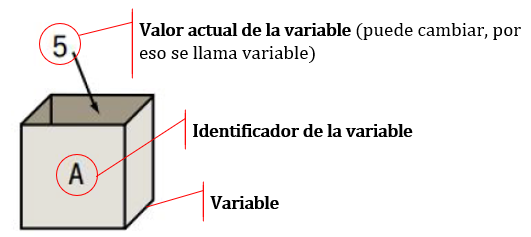

# Objetos y operadores

Hemos mencionado que para resolver un problema computacional se necesita de un *procesador*, capaz de entender y ejecutar ciertas *acciones* a partir de ciertos elementos disponibles en el *ambiente* o *entorno*. En este capítulo vamos aprender acerca de dichos elementos, a los que llamamos *objetos*.

## Objetos

Los **objetos** son las distintas piezas de información, o más sencillamente, *datos*, que componen al *entorno* y que el procesador debe manipular para resolver una tarea. Las distintas acciones del algoritmo van creando o modificando a los objetos del entorno. A medida que avancemos, veremos que hay distintas clases de objetos, algunos con estructuras más simples y otros más complejos. Es más, cada lenguaje de programación propone su propio catálogo de clases de objetos y cada programador puede crear otras nuevas. Sin embargo, en general todos los lenguajes tienen en común el hecho de que sus objetos pueden almacenar los siguientes tres tipos de datos básicos, conocidos como **tipos de datos primitivos**:

- **Datos de tipo numérico**: representan valores escalares de forma numérica y permiten realizar operaciones aritméticas comunes. Ejemplo: 230, 2.
- **Datos de tipo caracter**: representan texto y no es posible hacer operaciones matemáticas con ellos. Representamos estos valores entre comillas. Ejemplo: "hola", "chau123"
- **Datos de tipo lógico**: pueden tomar dos valores (*VERDADERO* o *FALSO*), ya que representan el resultado de alguna comparación entre otros objetos. En R, estos valores son `TRUE` y `FALSE`, escritos sin comillas.

De manera general, al nombre de un objeto se le dice **identificador**, el cual es una secuencia de caracteres alfanuméricos que sirve para identificarlo a lo largo del algoritmo. Nombrar los objetos hace posible referirse a los mismos. La elección de los identificadores es una tarea del programador, pero cada lenguaje tiene sus propias reglas. Por ejemplo, en R los nombres de los objetos:

- Deben empezar con una letra o un punto (no pueden empezar con un número).
- Sólo pueden contener letras, números, guiones bajos y puntos (se puede forzar a R para que acepte nombres con otros caracteres, pero no es aconsejable).
- No se pueden usar las siguientes palabras como nombres, ya que son palabras claves reservadas para R: `break`, `else`, `FALSE`, `for`, `function`, `if`, `Inf`, `NA`, `NaN`, `next`, `repeat`, `return`, `TRUE`, `while`.

Es aconsejable elegir un nombre que sea representativo de la información que va a guardar el objeto, ya que esto facilita la lectura y la comprensión tanto del algoritmo como del programa. Por ejemplo, si se necesita un objeto para guardar el valor numérico del precio de algún producto, el identificador `p` sería una mala elección, mientras que `precio` sería mejor. Si se necesitan varios identificadores para distinguir los precios de diversos productos, podríamos usar algo como `precio_manzana`, `precio_banana`, etc. Otra opción podría ser `preciomanzana` o `precioManzana`, pero en este curso seguiremos la convención de usar guiones bajos para facilitar la lectura de los nombres elegidos. No sería posible usar como identificador a `precio manazana`, puesto que un nombre no puede tener espacios.

Ciertos objetos almacenan temporalmente un valor durante la ejecución de un proceso y su contenido puede cambiar mientras corre el programa. Este tipo de objetos reciben el nombre de **variables**. Por ejemplo, en un programa creado para un comercio puede existir un objeto llamado `stock` (identificador) de tipo numérico que representa la cantidad de artículos disponibles y cuyo valor se modifica cada vez que se registra una nueva venta. Podemos pensar a una variable como una caja etiquetada con un nombre (su identificador) y que guarda un valor (numérico, lógico o de caracter).

```{r cajas, out.width='50%', fig.show='hold', fig.cap='La variable A contiene al valor 5.', echo=FALSE, fig.align="center"}

```

Si un objeto tiene siempre necesariamente un valor fijo, se dice que es una **constante**. El valor es siempre el mismo para cualquier ejecución del programa, es decir, no puede cambiar de una ejecución a otra. Son ejemplos de constantes el número de meses del año, las constantes matemáticas tales como el número $\pi$, los factores de conversión de unidades de medida, etc. Las constantes pueden usarse literalmente, es decir, usando explícitamente el valor, o también a través de un objeto que asocie un identificador al valor constante (por ejemplo, asociar el nombre `pi` a la constante 3.14159265).

### Declaración de variables y constantes

Al expresar nuestros algoritmos en pseudocódigo tomaremos la costumbre de declarar al inicio del mismo las variables y constantes necesarias para resolver el problema, explicitando su identificador y determinando el tipo de valor que guarda. Muchos lenguajes de programación utilizan esta declaración para reservar en la memoria de la computadora un espacio para almacenar la información correspondiente de manera adecuada. 

Veamos un ejemplo:

```{r, tidy=FALSE, eval=FALSE, highlight=FALSE, echo=T}
ALGORITMO: "Calcular área de un círculo"
COMENZAR
    CONSTANTE numérica pi
    VARIABLE numérica radio, area
		...restantes acciones del algoritmo...
FIN
```

Una vez que una variable o constante ha sido definida con un tipo particular, es incorrecto intentar asignarle un valor de otro tipo, por ejemplo, asignarle a la variable `radio` del ejemplo anterior un valor de tipo caracter. Esto generaría ambigüedad, además de que en ciertos lenguajes de programación produciría un error.

R es un lenguaje dinámico que no requiere la declaración previa de las variables que serán utilizadas, sino que estas pueden definirse dinámicamente a lo largo del programa. Por eso, incluiremos declaración de variables y constantes sólo en los algoritmos y no cuando estos sean traducidos a R. Al no necesitar una declaración previa, en R es posible asignar, por ejemplo, un valor de tipo caracter a un identificador que anteriormente contenía un valor de tipo numérico, pero trataremos de evitar esto.

### Acción de asignación

Para hacer que una variable guarde un determinado valor se recurre a una **acción de asignación**. Mediante asignaciones podemos dar valores iniciales a las variables, modificar el valor que tenían hasta el momento o guardar en ellas resultados intermedios o finales del algoritmo.

En pseudocódigo expresaremos a la asignación como se muestra en estos ejemplos:

```{r, tidy=FALSE, eval=FALSE, highlight=FALSE, echo=T}
ALGORITMO: "Calcular área de un círculo"
COMENZAR
    CONSTANTE numérica pi
    VARIABLE numérica radio, area
    pi <- 3.14159265358979
    radio <- 3
    ...restantes acciones del algoritmo...
FIN
```

Si intervienen variables o constantes en la expresión a la derecha de una acción de asignación, se usará el valor que tengan las mismas en ese momento. Por ejemplo, la siguiente secuencia de acciones en un algoritmo:

```{r, tidy=FALSE, eval=FALSE, highlight=FALSE, echo=T}
var1 <- 2
var2 <- var1
var1 <- 7
var3 <- var1
```

resultará en que las variables `var1`, `var2` y `var3` tengan almacenados los valores 7, 2 y 7 respectivamente. Un caso particular se da cuando a una variable se le asigna el valor de una operación de la que forma parte la misma variable. Por ejemplo:

```{r, tidy=FALSE, eval=FALSE, highlight=FALSE, echo=T}
stock <- 43
ventas <- 29
compras <- 12
stock <- stock - ventas + compras
```

### Creación y manejo de objetos en R

En R también se usa el operador "flechita" para asignar valores a variables. Como lo vamos a usar muchísimas veces, es conveniente recordar su *shortcut*: `Alt + -` (teclas *Alt* y guión medio). Como ya mencionamos antes, R es un lenguaje dinámico, lo cual significa que no tenemos que declarar las variables antes de asignarles un valor. Por ejemplo, si necesitamos registrar el peso y lugar de nacimiento de una persona, solamente tenemos que hacer:

```{r, tidy=FALSE, eval=FALSE, highlight=FALSE, echo=T}
lugar_nacimiento <- "Bombal"
peso_nacimiento <- 3.423
```

En este caso, `lugar_nacimiento` es un objeto de tipo carácter, ya que la información que contiene es `"Bombal"`, y `peso_nacimiento` es un objeto numérico. Vale aclarar que en R el punto decimal se representa con el punto `.` y no con la coma `,` como solemos escribir habitualmente, por lo que el número indicado se lee "tres coma cuatrocientos veintitrés" y no "tres mil cuatrocientos veintitrés". Asimismo, no se usan separadores de miles al escribir los números.

Por otro lado, R provee algunas funciones para poder averiguar en cualquier momento qué tipo de dato está almacenado en alguna variable. Todavía no hemos definido formalmente a las *funciones*, pero por ahora nos alcanza con saber que son otro tipo de objetos que cuando las usamos se encargan de cumplir con alguna tarea específica. Las funciones también tienen un nombre (*identificador*) y están seguidas por un par de paréntesis, dentro de los cuales se escriben opciones para que ellas operen. La función `class()` es la que nos dice qué tipo de dato hay en una variable:

```{r}
var1 <- 2
var2 <- "Hola Mundo"
var3 <- TRUE
class(var1)
class(var2)
class(var3)
```

También hay algunas funciones que devuelven `TRUE` o `FALSE` a modo de respuesta cuando le preguntamos a R si una variable tiene un dato de tipo numérico, caracter o lógico:

```{r}
is.numeric(var1)
is.numeric(var2)
is.character(var3)
is.logical(var3)
```

Todos los objetos que vamos definiendo en nuestro algoritmo y, posteriormente, en nuestro programa, forman parte del *ambiente*. En Rstudio podemos ver listados todos los objetos presentes en el ambiente en la pestaña *Environment* del panel superior derecho. También podemos ver en la consola un listado de todos los nombres de los objetos que existen en el ambiente con la función `ls()`, por ejemplo:

```{r}
ls()
```

Es probable que mientras estamos escribiendo el código, necesitemos probar si algunas partes funcionan y para eso corremos algunas líneas de código, creando objetos en el ambiente. Entre intento e intento, probablemnte necesitemos borrar alguno o todos esos objetos que se crearon, para poder comenzar con un ambiente libre. Si deseamos borrar todos los objetos del ambiente podemos correr la sentencia `rm(list = ls())` o hacer clic en el ícono de la escoba en el panel *Environment*. Si queremos eliminar sólo un objeto debemos ejecutar la función `rm()`, indicando entre paréntesis el identificador del objeto que deseamos borrar, por ejemplo:

```{r}
rm(var1)
```

Todos los objetos generados viven temporalmente en la memoria de la computadora mientras dure la sesión de R en la que estamos trabajando. Si cerramos R, toda esa información desaparecerá. Muchas veces eso es algo deseable: una vez finalizado el programa, guardamos algún resultado que nos interese (por ejemplo, un conjunto de datos en un archivo de Excel) y todos los objetos del ambiente que fuimos necesitando en el camino son descartados. Sin embargo, en otras oportunidades nos interesa guardar de forma permanente en la computadora una copia de todo lo que se encuentra en el ambiente en un archivo dentro de alguna carpeta. Los archivos que contienen los objetos creados en R tienen extensión `.RData`. Estos archivos se generan con el ícono de guardar en la pestaña *Environment* o usando la función `save.image()`, que necesita que escribamos entre los paréntesis la carpeta donde guardaremos el archivo y el nombre elegido para el mismo, por ejemplo:

```{r, eval = FALSE}
save.image("C:/Users/Ana/Documentos/Facultad/objetos.RData")
```

Si por el contrario necesitamos *importar* al ambiente objetos que estén guardados en algún lugar de nuestra compu en un archivo `.RData`, podemos usar el ícono de abrir en la pestaña *Environment* o la función `load()`, por ejemplo:

```{r, eval=FALSE}
load("C:/Users/Ana/Documentos/Facultad/objetos.RData")
```

## Operadores

El desarrollo de un algoritmo involucra la necesidad de efectuar operaciones de distinto tipo entre los valores guardados en los objetos: suma, resta, concatenación de caracteres, comparaciones, etc. Los elementos que describen el tipo de operación a realizar entre dos objetos se denominan **operadores**.

### Operadores aritméticos

Los operadores aritméticos permiten realizar operaciones matemáticas con datos de tipo numérico. A continuación presentamos su simbología más comúnmente empleada a la hora de expresarlos en pseudocódigo, junto con sus equivalentes en el lenguaje R:

Table: (\#tab:op-mat) Operadores aritméticos.

|               Operación                 | Operador en pseudocódigo | Operador en R | Ejemplo | Rtdo para x <- 7, y <- 3 |
|:---------------------------------------:|:------------------------:|:-------------:|:-------:|:------------------------:|
|                 Suma                    |             +            |       +       |  x + y  |            10            |
|                 Resta                   |             -            |       -       |  x - y  |             4            |
|            Multiplicación               |             *            |       *       |  x * y  |            21            |
|               División                  |             /            |       /       |  x / y  |           2.33           |
|             Potenciación                |             ^            |       ^       |  x ^ y  |            343           |
|            División entera              |            DIV           |      %/%      | x %/% y |             2            |
| División módular (resto de la división) |            MOD           |       %%      |  x %% y |             1            |

```{r, tidy=FALSE, eval=F, highlight=T, echo=F, results = 'asis'}
# otra forma de poner una tabla
library(knitr)
tabla <- matrix(c("+", "Suma",
                  "-", "Resta",
                  "*", "Multiplicación",
                  "/", "División",
                  "^", "Potenciación",
                  "MOD", "Resto de la división entera"),
                byrow = T, ncol = 2)
colnames(tabla) <- c("Signo", "Significado")
kable(tabla, caption = "Signos para operadores aritméticos que se pueden utilizar en el pseudocódigo.")
```

Los operadores aritméticos actúan con un orden de prioridad establecido, también conocido como *orden de evaluación* u *orden de precedencia*, tal como estamos acostumbrados en matemática. Las expresiones entre paréntesis se evalúan primero. Si hay paréntesis anidados se evalúan desde adentro hacia afuera. Dentro de una misma expresión, **en R** los operadores se evalúan en este orden:

1. Potenciación (`^`)
2. División entera y módulo (`%/%`, `%%`, y cualquier otro operador especial del tipo `%...%`)
2. Multiplicación y división (`*`, `/`)
3. Suma y resta (`+`, `-`)

Si la expresión presenta operadores con igual nivel de prioridad, se evalúan de izquierda a derecha. Veamos algunos ejemplos:

Table: (\#tab:ej-op-mat) Ejemplos de operaciones aritméticas según el orden de precedencia de R.

|              Operación              |  Resultado |
|:-----------------------------------:|:----------:|
|              4 + 2 * 4              |     12     |
|              23 * 2 / 5             |     9.2    |
|        3 + 5 * (10 - (2 + 4))       |     23     |
|           2.1 * 1.5 + 12.3          |    15.45   |
|          2.1 * (1.5 + 12.3)         |    28.98   |
|               1 %% 4                |      1     |
| 8 * (7 - 6 + 5) %% (1 + 8 / 2) - 1  |      7     |

<!-- Rpta CUANDO USABA IML QUE MODULO ERA IGUAL QUE MULTIPLICACION Y DIVISION: 
8 * 6 MOD 5 - 1
48 MOD 5 -1
3 - 1
2

EN R
8 * 6 %% 5 - 1
8 * 1 - 1
7
-->

### Operadores relacionales o de comparación

Los operadores relacionales sirven para comparar dos valores de cualquier tipo y dan como resultado un valor lógico: *VERDADERO* (`T` o `TRUE` en R) o *FALSO* (`F` o `FALSE` en R).

Table: (\#tab:op-rel) Operadores relacionales o de comparación.

|    Comparación    | Operador en pseudocódigo | Operador en R | Ejemplo | Rtdo para x <- 7, y <- 3 |
|:-----------------:|:------------------------:|:-------------:|:-------:|:------------------------:|
|     Mayor que     |             >            |       >       |  x > y  |           TRUE           |
|     Menor que     |             <            |       <       |  x < y  |           FALSE          |
| Mayor o igual que |            >=            |       >=      |  x >= y |           TRUE           |
| Menor o igual que |            <=            |       <=      |  x <= y |           FALSE          |
|      Igual a      |          = o ==          |       ==      |  x == y |           FALSE          |
|     Distinto a    |          ¬= o !=         |       !=      |  x != y |           TRUE           |


```{r, tidy=FALSE, eval=F, highlight=T, echo=F, results = 'asis'}
# tabla vieja
library(knitr)
tabla <- matrix(c(">", "Mayor que",
                  "<", "Menor que",
                  ">=", "Mayor o igual que",
                  "<=", "Menor o igual que",
                  "==", "Igual a",
                  "!=", "Distinto a"),
                byrow = T, ncol = 2)
colnames(tabla) <- c("Signo", "Significado")
kable(tabla, caption = "Signos para operadores lógicos que se pueden utilizar en el pseudocódigo.")
```

Otros ejemplos:

```{r}
a <- 3
b <- 4
d <- 2
e <- 10
f <- 15
(a * b) == (d + e)
(a * b) != (f - b)
```

Es interesante notar que primero se evalúan las operaciones a cada lado de los operadores relacionales y luego se hace la comparación. Es decir, **los operadores aritméticos preceden a los relacionales en el orden de prioridad**. Por eso, en los ejemplos anteriores no eran necesarios los paréntesis y podríamos poner directamente:

```{r}
a * b == d + e
a * b != f - b
```

Si bien en pseudocódigo podemos usar tanto `=` o `==` para probar la igualdad entre dos elementos, **en R no debemos usar** `=` para este fin, puesto que `=` no es un operador de comparación sino de asignación, parecido al `<-`.

### Operadores lógicos

Mientras que los operadores relacionales comparan cualquier tipo de valores, los operadores lógicos sólo toman operandos de tipo lógico y producen también un resultado lógico. Los operadores lógicos que utilizaremos son:

Table: (\#tab:op-log) Operadores lógicos.

|  Operación | Operador en pseudocódigo | Operador en R | Ejemplo | Rtdo para x <- T, y <- F |
|:----------:|:------------------------:|:-------------:|:-------:|:------------------------:|
| Conjunción |             Y            |     &&        |  x && y |           FALSE          |
| Disyunción |             O            |     \|\|      |x \|\| y |           TRUE           |
|  Negación  |          NO o ¬          |       !       |    !x   |           FALSE          |

- La operación de conjunción (Y) devuelve un valor **VERDADERO** sólo si son verdaderas **ambas** expresiones que vincula. Ejemplo: `(3 > 2) Y (3 > 5)` resulta en `VERDADERO Y FALSO` y esto es `FALSO`.
- La operación de disyunción (O) devuelve un valor **VERDADERO** si **al menos una** de las dos expresiones que vincula es verdadera. Ejemplo: `(3 > 2) O (3 > 5)` resulta en `VERDADERO O FALSO` y esto es `VERDADERO`.
- La operación de negación (NO) niega un valor lógico, es decir, devuelve el opuesto. Ejemplo: `NO (3 > 2)` resulta en `NO VERDADERO` y esto es `FALSO`.

Tanto para la conjunción como para la disyunción, R provee dos operadores, repitiendo o no el símbolo correspondiente: `&&` vs `&`; `||` vs `|`. Hay una diferencia entre ellos que por ahora no viene al caso, pero vamos a señalar que por ahora estaremos usando las versiones presentadas anteriormente: `&&` y `||`.

La **tabla de verdad** o **tabla de valores de verdad** se utiliza para mostrar los resultados de estas operaciones lógicas:

Table: (\#tab:verdad) Operadores relacionales o de comparación.

| Valor 1 | Operador | Valor 2 | Resultado |
|:-------:|:--------:|:-------:|:---------:|
|    F    |     Y    |    F    |     F     |
|    F    |     Y    |    V    |     F     |
|    V    |     Y    |    F    |     F     |
|    V    |     Y    |    V    |     V     |
|    F    |     O    |    F    |     F     |
|    F    |     O    |    V    |     V     |
|    V    |     O    |    F    |     V     |
|    V    |     O    |    V    |     V     |
|         |    NO    |    F    |     V     |
|         |    NO    |    V    |     F     |

Con estos operadores es posible construir evaluaciones lógicas más elaboradas como los siguientes ejemplos:

1. Evaluar si el valor de `ancho` está entre 5 y 7: `(ancho > 5) Y (ancho < 7)`.

	```{r}
	ancho <- 6.4
	(ancho > 5) && (ancho < 7)
	```
	
2. Establecer si una persona estudia Estadística o Economía: `(carrera == "Estadística") O (carrera == "Economía")`.

	```{r}
	carrera <- "Administración"
	(carrera == "Estadística") || (carrera == "Economía")
	```

3. Determinar si una persona no estudia Estadística: `NO (carrera == "Estadística")`.

	```{r}
	carrera <- "Administración"
	!(carrera == "Estadística")
	```
	
4. Verificar que el valor guardado en `x` no sea igual a 2 ni a 3:
	
	- Opción correcta 1: `(x != 2) Y (x != 3)`
	
	```{r}
	# Da verdadero porque x no es ni 2 ni 3
	x <- 10
	(x != 2) && (x != 3)
	
	# Da falso porque x es igual a 3
	x <- 3
	(x != 2) && (x != 3)
	```
	
	- Opción correcta 2: `NO ((x == 2) O (x == 3))`
	
	```{r}
	# Da verdadero porque x no es ni 2 ni 3
	x <- 10
	!(x == 2 || x == 3)
	
	# Da falso porque x es igual a 3
	x <- 3
	!(x == 2 || x == 3)
	```
	
	- Opción incorrecta: `(x != 2) O (x != 3)`
	
	```{r}
	# Da verdadero, porque al ser x igual a 3, es distinto de 2,
	# haciendo que la primera parte sea verdadera 
	x <- 3
	(x != 2) || (x != 3)
	```

Este último ejemplo se relaciona con las **Leyes de Morgan**: siendo `b` y `c` valores lógicos, se tiene:

- `NO (b O c)` es equivalente a `NO b Y NO c`.
- `NO (b Y c)` es equivalente a `NO b O NO c`.

Es importante notar que todos los paréntesis usados en el código de R del ejemplo 4 son innecesarios, puesto que **los operadores relacionales preceden a los lógicos en el orden de prioridad**. Sin embargo, a veces preferimos usar paréntesis para que la lectura sea más sencilla. En el siguiente ejemplo, ambas expresiones son equivalentes:

```{r}
ancho <- 6.4
(ancho > 5) && (ancho < 7)
ancho > 5 && ancho < 7
```

Para pensar: predecir el resultado de las siguientes operaciones y luego verificar:

```{r, eval=F}
x <- 2
y <- -2
x > 0 && y < 0
x > 0 || y < 0
!(x > 0 && y < 0)
```

#### Evaluación en cortocircuito

Para evaluar la operación de conjunción `x && y`, en R se comienza por evaluar la expresión del primer operando `x` y si su resultado es `FALSE` ya no se evalúa la expresión `y` del segundo operando. Esto es porque si `x` es `FALSE`, el resultado de `x && y` ya no depende de `y`, será siempre `FALSE`. Por este motivo se dice que el operador `&&` se evalúa en *cortocircuito*. La evaluación en cortocircuito evita realizar operaciones innecesarias^[El otro operador de conjunción, &, no evalúa en cortocircuito, además de poseer otras diferencias.]

Por ejemplo:

```{r, error=T}
x <- 1
y <- 2

# La primera parte da TRUE, se continúa con la segunda, pero da error porque no
# existe un objeto llamado z
(y > x) && (x > z)
```

```{r}
# La primera parte da FALSE, entonces toda la operación será FALSE, no se
# continúa con la segunda parte, con lo cual no se intenta usar el objeto
# inexistente z y no hay error
(y < x) && (x > z)
```

La operación de disyunción también se evalúa en cortocircuito, es decir, si se encuentra que uno de los operandos es `TRUE`, no hace falta evaluar los restantes, puesto que el resultado general será `TRUE`:

```{r, error=T}
# Es TRUE porque la primera parte es TRUE, sin evaluar la segunda, que daría
# error
(y > x) || (x > z)

# Como la primera parte es FALSE, debe evaluar la segunda, no encuentra a z y da
# error
(x > y) || (x > z)
```

#### Orden de precedencia completo en R

Resumiendo la información anterior, a continuación se presenta el orden completo de precedencia de los operadores en R que utilizaremos (hay algunos más que pueden ver en `?Syntax`):

Table: (\#tab:orden) Orden de precedencia de los operadores en R.

| Orden |               Operaciones              |    Operadores   |
|:-----:|:--------------------------------------:|:---------------:|
|   1   |              Potenciación              |        ^        |
|   2   |       Signo de un número (ej: -3)      |       +  -      |
|   3   |         División entera y resto        |     %/%  %%     |
|   4   |        Multiplicación y división       |       * /       |
|   5   |              Suma y resta              |       +  -      |
|   6   | Operaciones relaciones o comparaciones | < > <= >= == != |
|   7   |                Negación                |        !        |
|   8   |               Conjunción               |      &&  &      |
|   9   |               Disyunción               |      \|\|  \|   |
|   10  |    Asignación (izquierda a derecha)    |        <-       |

Dentro de una misma expresión, operadores con igual prioridad se evalúan de izquierda a derecha.

## Entrada y salida de información

En la resolución de problemas puede ser necesario que alguna fuente externa (como un usuario del programa) provea información. En estos casos se debe registrar dicha información como un valor que debe ser asignado a una variable. Cuando escribamos nuestros algoritmos en pseudocódigo, para esto utilizaremos la acción `LEER`. Cuando deseamos mostrar un resultado en un mensaje empleamos la acción `ESCRIBIR`. Las palabras o frases literales que se desean mostrar en el mensaje deben estar encerradas entre comillas porque son cadenas de texto, mientras que si se desea mostrar el valor de una variable se debe escribir su identificador sin comillas.

Por ahora, en R ejecutaremos a la acción `LEER` mediante la asignación directa de un valor a una variable a través del operador `<-`. La acción `ESCRIBIR` puede ser ejecutada a través de la función `cat()` si se quiere mostrar una frase compuesta. En los casos en los que sólo interesa mostrar un valor (sin escribir una frase) no será necesario usar `cat()`, ya que sencillamente al correr el nombre de un objeto, su valor es mostrado en la consola. En otros casos usaremos la función `print()`. Ya iremos viendo la utilidad de cada una de estas opciones.

Vamos a completar el ejemplo del algoritmo para el cálculo del área de un círculo, integrando todo lo mencionado anteriormente:

**Pseudocódigo**:

```{r, tidy=FALSE, eval=FALSE, highlight=FALSE, echo=T}
ALGORITMO: "Calcular área de un círculo"
COMENZAR
    CONSTANTE numérica pi
    VARIABLE numérica radio, area
    pi <- 3.14159265358979
    LEER radio
    area <- pi * radio^2
    ESCRIBIR "El área del círculo es " area
FIN
```

**En R**:

```{r, eval=T, echo=T}
# PROGRAMA: "Calcular área de un círculo" ---------------------------

pi <-  3.14159265358979
radio <- 5
area <- pi * radio^2
cat("El área del círculo es", area)
```

*Nota*: `pi` ya es una constante incorporada en R Base, en realidad no es necesario crear esta constante y asignarle valor.
