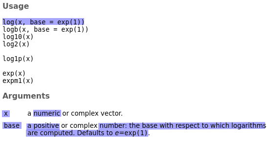

<!-- 
RECURSOS CONSULTADOS PARA LA ESCRITURA DE ESTE CAPITULO

# Paradigmas de programacion
https://hackr.io/blog/programming-paradigms

# Distintos tipos de subalgoritmos:
https://softwareengineering.stackexchange.com/questions/20909/method-vs-function-vs-procedure
https://softwareengineering.stackexchange.com/questions/123159/what-are-the-specific-meanings-of-the-terms-functions-methods-procedures-and?rq=1
A function is something that takes a bunch of inputs and returns one or more values. If the returned values are entirely determined by the inputs, and the function doesn't have any side effects (logging, perhaps, or causing state changes outside itself), then it's called a pure function.
A procedure is a function that doesn't return a value. In particular, this means that a procedure can only cause side effects. (That might include mutating an input parameter!)

# Ámbito de variables:
https://www.tutorialspoint.com/cprogramming/c_scope_rules.htm
https://www.r-bloggers.com/dont-run-afoul-of-scoping-rules-in-r/
Pag. 116 de Cerveron
Cap 7 de Cerradas Sommolinos
Scope refers to the visibility of variables. In other words, which parts of your program can see or use it. 

# Paradigma de programacion de R
https://stackoverflow.com/questions/6098810/what-is-the-programming-paradigm-of-r
https://www.researchgate.net/publication/262057846_The_Functional_Programming_Language_R_and_the_Paradigm_of_Dynamic_Scientific_Programming
https://cs.stackexchange.com/questions/8948/what-would-be-the-classification-of-r-according-to-paradigms
https://study.com/academy/lesson/programming-paradigm-of-r-definition-type.html

# Más cosas interesantes sobre funciones en R: 
http://adv-r.had.co.nz/Functions.html

# Pasaje de parámetros en R
https://www.r-bloggers.com/call-by-reference-in-r/
https://stackoverflow.com/questions/2603184/can-you-pass-by-reference-in-r
https://www.stat.berkeley.edu/~paciorek/computingTips/Pointers_passing_reference_.html
http://homepage.divms.uiowa.edu/~luke/R/references.html

# Variables locales y globales en R
https://www.datamentor.io/r-programming/environment-scope/
https://stackoverflow.com/questions/1236620/global-variables-in-r
https://stackoverflow.com/questions/10904124/global-and-local-variables-in-r/10904810
-->

# Descomposición algorítmica

Un principio fundamental en la resolución de un problema es intentar descomponerlo en partes más pequeñas, que puedan ser más fáciles de afrontar. Este concepto también se aplica en la programación. Nuestros algoritmos pueden descomponerse en **subalgoritmos** que den solución a un aspecto del problema, de menor extensión. Este proceso se conoce como **descomposición algorítmica** o **descomposición modular**. Cada subalgoritmo debe ser independiente de los demás y a su vez podría seguir descomponiéndose en partes más sencillas en lo que se conoce como **refinamiento sucesivo**. Si un programa es muy largo se corre el riesgo de que sea muy difícil de entender como un todo, pero siempre se lo puede dividir en secciones más simples y manejables. Un subalgoritmo se escribe una vez y luego es utilizado por todos aquellos algoritmos que lo necesiten. 

Cada vez que, como parte de la resolución de un problema, desde un algoritmo se solicita que se realicen las acciones establecidas por un subalgoritmo, se dice que se lo está **invocando** o **llamando**. Al algoritmo que invoca a los subalgoritmos a veces le decimos *algoritmo principal* para darle un mayor énfasis a la idea que, desde el curso de acción principal, cada tanto se delega la ejecución de algunas al subalgoritmo.

El empleo de subalgoritmos, desarrollando por separado ciertas partes del problema, resulta especialmente ventajoso en los casos siguientes:

- **En algoritmos complejos**: si el algoritmo, y luego el programa, se escribe todo seguido y en un único archivo de código, resulta muy complicado de entender, porque se pierde la visión de su estructura global dada la gran cantidad de operaciones que lo conforman. Aislando ciertas partes como subalgoritmos separados se reduce la complejidad.
- **Cuando se repiten operaciones análogas**: si la resolución de un problema requiere realizar una tarea que se repite varias veces en el algoritmo, podemos definir dicha tarea como un subalgoritmo por separado. De esta manera, su código se escribirá sólo una vez aunque se use en muchos puntos del programa. 

En este capítulo hay algunas secciones indicadas como "opcionales" y algunos comentarios agregados como notas al pie. Estas partes añaden información para quienes estén interesados en saber un poco más, pero su contenido no será requerido en la práctica ni en las evaluaciones.

## Tipos de subalgoritmos

En el mundo de la programación existen muchos términos para definir distintos tipos de subalgoritmos: subrutinas, funciones, procedimientos, métodos, subprogramas, etc. No es posible obtener una definición que capture todas las variantes que existen en el uso de estos términos debido a que el signficado de cada uno de ellos varía según el paradigma
^[Se usa el término paradigma de programación para clasificar a los lenguajes según sus características. En [este link](https://hackr.io/blog/programming-paradigms) se puede encontrar una breve descripción de los principales paradigmas de programación] 
y el lenguaje de programación escogidos. Qué se entiende por cada uno de ellos depende muchas veces del paradigma de programación empleado y del lenguaje escogido, por lo cual no existe una definición lo suficientemente general para cada uno.

Sin embargo, suele haber bastante consenso en distinguir, dentro de los subalgoritmos, a las **funciones** y a los **procedimientos** de esta forma:

- Una **función** es un subalgoritmo que al ser evaluado devuelve un único resultado (por ejemplo, un valor numérico) que es utilizado en el algoritmo principal que lo invoca.
- Un **procedimiento** es un subalgoritmo que al ser evaluado no devuelve un valor, sino que produce *efectos secundarios* en el ambiente del algoritmo principal que lo invoca. Persigue el objetivo de ayudar en la modularidad del programa.

## Funciones

Una **función** es un subalgoritmo que devuelve un único resultado a partir de otros valores provistos.  El valor que la función devuelve define su **tipo**, de modo que una función puede ser de tipo **numérica**, **caracter** o **lógica** ^[No siempre se pueden clasificar de esta forma a las funciones, ya que hay algunas que pueden devolver distinto tipos de valores según el caso o que devuelven otras clases de objetos.]. 

Para ejemplificar, podemos decir que la noción de *función* en programación se asemeja a la idea matemática de *función de una o más variables*. Por ejemplo, podemos pensar en la función $f(x, y) = x^2 + 3y$ (ejemplo 1). Si queremos saber cuál es el valor numérico de la función $f$ cuando $x$ toma el valor $4$ e $y$ toma el valor $5$, reemplazamos en la expresión anterior las variables por los valores mencionados y obtenemos: $f(4, 5) = 4^2 + 3 \times 5 = 31$.

Podemos definir dicha función en pseudocódigo de la siguiente manera:

```
FUNCIÓN f(x: numérico, y: numérico): numérico
COMENZAR
	DEVOLVER x^2 + 3 * y
FIN FUNCIÓN
```

El primer renglón de la definición comienza con la palabra clave `FUNCIÓN` y termina, luego de los dos puntos, con la palabra `numérico` para indicar que esta función devuelve como resultado un valor numérico. 

En el medio se encuentra el nombre elegido para la función (`f`), seguido por la declaración entre paréntesis de los *parámetros* o *argumentos* que la función necesita para operar, es decir, el *input* o información de entrada con la cual se realizarán las operaciones. Se dice que $x$ e $y$ son los **parámetros formales** o **ficticios**, ya que no tienen un valor asignado en sí mismos sino que permiten expresar de manera general las acciones que la función ejecuta. Describen lo que uno diría en palabras: "hay que tomar a $x$, elevarlo al cuadrado y sumarle la $y$ multiplicada por 3". Entre los paréntesis también se aclara que estos parámetros formales son de tipo numérico. 

Los valores en los cuales se quiere evaluar la función se llaman **parámetros actuales** o **reales**. Por ejemplo, si nos interesa calcular $f(4, 5)$, los valores $4$ y $5$ son los parámetros actuales y se establece una correspondencia entre el parámetro formal $x$ y el actual $4$, así como entre la $y$ y el $5$. El resultado que se obtiene, como observamos antes, es $31$ y este es el valor que la función *devuelve*.

La definición anterior también puede ser expresada como:

```
FUNCIÓN f(x: numérico, y: numérico): numérico
COMENZAR
	VARIABLE numérica resultado
	resultado <- x^2 + 3 * y
	DEVOLVER resultado
FIN FUNCIÓN
```

Aquí notamos que no debemos declarar a `x` e `y` puesto que son los parámetros de la función (quedan declarados entre los paréntesis en la primera línea). Sin embargo, sí declaramos cualquier otra nueva variable que sea creada dentro de la función, por ejemplo, la variable `resultado`.

De manera general, la definición de una función es:

```
FUNCIÓN nombre(lista de parámetros formales): tipo de resultado
COMENZAR
	Declaración de variables
	Acciones
	DEVOLVER valor
FIN FUNCIÓN
```

La palabra clave `DEVOLVER` provoca la inmediata finalización de la ejecución de la función e indica cuál es el resultado de la misma, cuyo tipo debe coincidir con el tipo de función declarado en el encabezado. La acción `DEVOLVER` se puede insertar en cualquier punto del cuerpo de la función y, además, es posible utilizar más de una sentencia `DEVOLVER` en una misma función, aunque sólo una llegue a ejecutarse. Esto puede verse en el siguiente ejemplo (ejemplo 2):

```
FUNCIÓN maximo(num1: numérico, num2: numérico): numérico
COMENZAR
	SI num1 >= num2 ENTONCES
		DEVOLVER num1
	SI NO
		DEVOLVER num2
	FIN SI
FIN FUNCIÓN
```

Para usar una función en un algoritmo, se la invoca escribiendo su nombre seguido por los valores actuales entre paréntesis, separados por coma. Esta invocación representa un valor que puede ser usado como operando en otra expresión. Por ejemplo:

```
ALGORITMO: "Hallar el máximo entre dos valores y restarle 100"
COMENZAR
	VARIABLE numérica x, y, rtdo
	LEER x, y
	rtdo <- maximo(x, y) - 100
	ESCRIBIR "El resultado es " rtdo
FIN
```
Al invocar una función es obligatorio que los valores suministrados para los argumentos actuales entre los paréntesis correspondan en cantidad, tipo y orden con los argumentos formales de la definición de la función. Es por esto que los siguientes casos son ejemplos de un **uso incorrecto** de funciones en el algoritmo principal:

```
ALGORITMO: "Incorrecto por proveer pocos argumentos para la función"
COMENZAR
	VARIABLE numérica x, y, rtdo
	LEER x, y
	rtdo <- maximo(x) - 100
	ESCRIBIR "El resultado es " rtdo
FIN

ALGORITMO: "Incorrecto por proveer valores de tipo caracter para la función"
COMENZAR
	VARIABLE numérica rtdo
	VARIABLE caracter x, y
	x <- "chau"
	y <- "hola"
	rtdo <- maximo(x, y) - 100
	ESCRIBIR "El resultado es " rtdo
FIN

ALGORITMO: "Incorrecto por no proveer argumentos para la función"
COMENZAR
	VARIABLE numérica x, y, rtdo
	LEER x, y
	rtdo <- maximo - 100
	ESCRIBIR "El resultado es " rtdo
FIN
```

Para motivar el uso de una buena práctica que ayude a distinguir entre las acciones de los subalgoritmos y del algoritmo, vamos a escribir los subalgoritmos **antes** y **por fuera** del algoritmo principal^[Es más, podríamos escribirlos y guardarlos en archivos distintos.]. Consideremos el ejemplo 3 mostrado a continuación. Primero definimos los subalgoritmos que necesitaremos (son los de los ejemplos 1 y 2) y luego escribiremos un algoritmo principal que hace uso de ellos para resolver un problema en particular:

```
---------------------------------------------------------------
SUBALGORITMOS
---------------------------------------------------------------

FUNCIÓN f(x: numérico, y: numérico): numérico
COMENZAR
	DEVOLVER x^2 + 3 * y
FIN FUNCIÓN

FUNCIÓN maximo(num1: numérico, num2: numérico): numérico
COMENZAR
	SI num1 >= num2 ENTONCES
		DEVOLVER num1
	SI NO
		DEVOLVER num2
	FIN SI
FIN FUNCIÓN

--------------------------------------------------------------
ALGORITMO PRINCIPAL
--------------------------------------------------------------

ALGORITMO: "Realizar  operaciones matemáticas muy importantes"
COMENZAR
	VARIABLE numérica rtdo1, rtdo2, rtdo3
	rtdo1 <- f(2, 5)
	rtdo2 <- f(3, 10)
	rtdo3 <- maximo(rtdo1, rtdo2) + 20
	ESCRIBIR "El resultado es " rtdo3
FIN
```

¿Qué mensaje escribe el algoritmo anterior?

## Funciones en R

En la sección anterior vimos cómo definir funciones en pseudocódigo. Antes de pasar a ver cómo programar nuestras funciones en R, vamos a comentar algunas cuestiones acerca de las funciones que R ya trae disponibles como parte de su funcionalidad básica.

### Funciones predefinidas de R

R, como todo lenguaje de programación, tiene **funciones predefinidas**, es decir, sentencias que se encargan de realizar alguna actividad. Ya estuvimos usando algunas de ellas, por ejemplo, cuando hemos necesitado mostrar algún mensaje usamos las funciones `cat()` o `print()`^[Sentencias como `for`, `while` o `if` también son funciones, aunque con una estructura muy particular.]. Además, existen muchas otras funciones predefinidas, como todas aquellas que se necesitan para realizar ciertas operaciones matemáticas:

```{r}
# Raiz cuadrada
sqrt(100)
# Valor absoluto
abs(100)
# Función exponencial
exp(100)
# Logaritmo natural
log(100)
```

En los ejemplos anteriores, `100` representa un valor numérico que se pasa como argumento a la función para que la misma opere. Algunas funciones predefinidas en R pueden trabajar con más de un argumento, en cuyo caso hay que enumerarlos dentro de los paréntesis, separados con comas. Por ejemplo, si en lugar de calcular el logaritmo natural (cuya base es la constante matemática $e$), queremos calcular un logaritmo en base 10, podemos hacer lo siguiente:

```{r}
# Logaritmo de 100 en base 10
log(100, 10)
```

¿Cómo sabemos que la función `log()` se puede usar de esa forma, cambiando el valor de la base con respecto a la cual toma el logaritmo? Lo aprendemos al leer el manual de ayuda de R. Toda función predefinida de R viene con un instructivo que detalla cómo se usa, qué argumentos incluye y otras aclaraciones. Lo encontramos en la pestaña de Ayuda (*Help*) en el panel de abajo a la derecha en RStudio. Otras formas de abrir la página de ayuda sobre una función es correr en la consola alguna de estas sentencias:

```{r, eval=F}
help(log)
?log
```

Esa página de ayuda tiene bastante información, porque reúne información sobre muchas funciones relacionadas con logaritmos y exponenciales, pero podemos detenernos en la parte resaltada que se muestra a continuación:

```{r, out.width='70%', fig.show='hold', fig.cap='Captura de pantalla de la ayuda sobre la función log()', echo=FALSE, fig.align="center"}

```

En la sección *Usage* ("uso") descubrimos que la función `log()` puede usarse con dos argumentos: `x` y `base`. En la sección *Arguments* entendemos que `x` es el número al cual le vamos a sacar el logaritmo y `base` es la base con respecto a la cual se toma el logaritmo. Por eso, al correr `log(100, 10)`, estamos calculando el logaritmo de `x = 100` con `base = 10`.

Vemos, además, una diferencia en la forma en que `x` y `base` aparecen en la descripción: `log(x, base = exp(1))`. Cuando un argumento tiene un signo `=` significa que tiene asignado un **valor por default** y que no es necesario usarlo. Por eso, cuando corremos `log(100)` estamos calculando el logaritmo de `x = 100` con la base elegida por R por defecto: `base = exp(1)`, que es la forma que tiene R de nombrar a la constante $e = 2.718282...$ (es el logaritmo natural). Si quiero cambiar la base, debo proveer un valor, por ejemplo, `log(100, 10)`. Por el contrario, el argumento `x` no tiene asignado un valor por default. Eso significa que obligatoriamente tenemos que proveer un valor para el mismo.

R también permite usar una función escribiendo los nombres de los argumentos (es decir, detallando tanto los parámetros formales como los actuales), lo cual muchas veces es muy esclarecedor:

```{r}
log(x = 100, base = 10)
```

Es más, si escribimos los nombres de los parámetros explícitamente, podemos cambiar su orden, sin alterar el resultado:

```{r}
log(base = 10, x = 100)
```

Si no escribimos los nombres, el orden importa:

```{r}
log(100, 10)
log(10, 100)
```

Al no tener los nombres indicados explícitamente, R hace corresponder los parámetros formales `x` y `base` con los valores provistos en ese orden: en el primer caso `x` recibe el valor `100` y `base`, el valor `10`, mientras que en el segundo caso es al revés.

Finalmente, se debe observar que no es necesario invocar a la función escribiendo de forma directa los valores entre los paréntesis, sino que en su lugar pueden ir variables:

```{r}
x <- 100
y <- x / 2
z <- 4
log(x - y, 4)		# Log en base 4 de x - y
```

### Definición de nuevas funciones en R 

Ahora que ya hemos visto cómo se trabaja con funciones en R de manera general, vamos a aprender a definir nuestras propias funciones. Recordemos el subalgoritmo del ejemplo 1:

```
FUNCIÓN f(x: numérico, y: numérico): numérico
COMENZAR
	VARIABLE numérica resultado
	resultado <- x^2 + 3 * y
	DEVOLVER resultado
FIN FUNCIÓN
```

En R, definimos esta función así:

```{r}
f <- function(x, y) {
	resultado <- x^2 + 3 * y
	return(resultado)
}
```

```{r, out.width='80%', fig.show='hold', fig.cap='Estructura de una función en R', echo=FALSE, fig.align="center"}
knitr::include_graphics('images/03_funciones/31.png')
```

La estructura general es:

```
nombre <- function(argumentos) {
  ... sentencias de R ...
}
```

Debemos:

1. Elegir un nombre
2. Al lado del nombre, colocar el operador de asignación (`<-`) para asociar a ese nombre la definición de una función.
3. Escribir la sentencia `function(...) {...}`, donde entre paréntesis se definen todos los parámetros formales separados con coma y entre llaves el conjunto de acciones a englobar.
4. El valor que la función debe arrojar como resultado se encierra dentro de la sentencia `return()`, que indica el fin de la ejecución.

Una vez que la definición de la función es ejecutada, pasa a formar parte de los elementos que conforman al ambiente, como se puede apreciar al verla listada como un objeto más en el panel *Environment* de RStudio ^[Sí, las funciones que creamos también son *objetos* para R, ya que son una pieza que guarda algún tipo de información. Las funciones en R son objetos de clase "function". Ver, por ejemplo, `class(f)`]. A partir de este momento, podemos utilizarla, como parte de otro programa. Para invocarla, escribimos el nombre de la función y entre paréntesis los valores que nos interesan para el cálculo (parámetros actuales). Por ejemplo:

```{r}
# Ejemplos de uso de la función f
f(4, 5)
f(6, -5)
f(0, 0)
```

Recordando lo discutido en la sección anterior, podemos apreciar que los siguientes usos de la función `f()` son equivalentes:

```{r}
f(4, 5)
f(x = 4, y = 5)
f(y = 5, x = 4)
```

Sin embargo, no son equivalentes los siguientes:

```{r}
# Siguiendo el orden de definición, x recibe el valor 4, y recibe el 5:
f(4, 5)
# Siguiendo el orden de definición, x recibe el valor 5, y recibe el 4:
f(5, 4)
```

A continuación, podemos ver casos que generan error por hacer un uso incorrecto de la función (¿por qué?):

```{r, error=TRUE}
# Error por omitir un argumento de uso obligatorio (x recibe 4, falta y)
f(4)
# Error por proveer más argumentos de los declarados en la definición
f(4, 5, 6)
```

Retomemos ahora el ejemplo 3. Mencionamos que es importante distinguir entre la definición de los subalgoritmos y la de un algoritmo principal que los invoca: 

```
---------------------------------------------------------------
SUBALGORITMOS
---------------------------------------------------------------

FUNCIÓN f(x: numérico, y: numérico): numérico
COMENZAR
	DEVOLVER x^2 + 3 * y
FIN FUNCIÓN

FUNCIÓN maximo(num1: numérico, num2: numérico): numérico
COMENZAR
	SI num1 >= num2 ENTONCES
		DEVOLVER num1
	SI NO
		DEVOLVER num2
	FIN SI
FIN FUNCIÓN

--------------------------------------------------------------
ALGORITMO PRINCIPAL
--------------------------------------------------------------

ALGORITMO: "Realizar  operaciones matemáticas muy importantes"
COMENZAR
	VARIABLE numérica rtdo1, rtdo2, rtdo3
	rtdo1 <- f(2, 5)
	rtdo2 <- f(3, 10)
	rtdo3 <- maximo(rtdo1, rtdo2) + 20
	ESCRIBIR "El resultado es " rtdo3
FIN
```

Esta distinción también es importante en R: la definición de las funciones debe ejecutarse antes de que las mismas sean llamadas desde el programa principal. Así, para traducir el pseudocódigo anterior a R, podríamos crear un archivo de código (llamado, por ejemplo, `ejemplo3.R`) con el siguiente contenido:

```{r}
# ---------------------------------------------------------------
# DEFINICIÓN DE FUNCIONES
# ---------------------------------------------------------------

f <- function(x, y) {
	resultado <- x^2 + 3 * y
	return(resultado)
}

maximo <- function(num1, num2) {
	if (num1 > num2) {
		return(num1)
	} else {
		return(num2)
	}
}

# ---------------------------------------------------------------
# PROGRAMA PRINCIPAL
# ---------------------------------------------------------------

rtdo1 <- f(2, 5)
rtdo2 <- f(3, 10)
rtdo3 <- maximo(rtdo1, rtdo2) + 20
cat("El resultado es", rtdo3)
```

## Documentación de los subalgoritmos

En el contexto de la programación, documentar significa escribir indicaciones para que otras personas puedan entender lo que queremos hacer en nuestro código o para que sepan cómo usar nuestras funciones. Por ejemplo, como vimos antes todas funciones predefinidas de R están documentadas para que podamos buscar ayuda si la necesitamos. Cuando estamos creando nuestras propios subalgoritmos, es importante que también incluyamos comentarios para guiar a otras personas (y a nosotros mismos en el futuro si nos olvidamos) para qué y cómo se usa lo que estamos desarrollando.

Para ilustrar esto, vamos a recordar que en la práctica 2 escribimos un algoritmo para el cálculo de factoriales. Dado que los mismos son muy útiles en variadas aplicaciones, podemos escribir un subalgortimo que se encargue de obtenerlos. Luego, escribiremos un algoritmo para mostrar todos los factoriales de los números 1 a 10.

```
---------------------------------------------------------------
SUBALGORITMOS
---------------------------------------------------------------

#-------------------------------------------------------
# Función factorial
# Calcula el factorial de números enteros no negativos
# Entrada:
# 	- n, entero no negativo
# Salida:
# 	- el factorial de n
#-------------------------------------------------------
FUNCIÓN factorial(n: numérico): numérico
COMENZAR
	VARIABLE numérica resultado
	resultado <- 1
	SI n > 0 ENTONCES
		PARA i DESDE 1 HASTA n HACER
			resultado <- resultado * i
		FIN PARA
	FIN SI
	DEVOLVER resultado
FIN FUNCIÓN

---------------------------------------------------------------
ALGORITMO PRINCIPAL
---------------------------------------------------------------

ALGORITMO: "Mostrar los factoriales de los 10 primeros naturales"
COMENZAR
	PARA j DESDE 1 HASTA 10 HACER
		ESCRIBIR "El factorial de " j " es igual a " factorial(j)
	FIN PARA
FIN
```

En R:

```{r}
# ---------------------------------------------------------------
# DEFINICIÓN DE FUNCIONES
# ---------------------------------------------------------------

#-----------------------------------------------------
# Función factorial
# Calcula el factorial de números enteros no negativos
# Entrada:
#		- n, entero no negativo
# Salida:
#		- el factorial de n
#-----------------------------------------------------
factorial <- function(n) {
	resultado <- 1
	if (n > 0) {
		for (i in 1:n) {
			resultado <- resultado * i
		}
	}
	return(resultado)
}

# ---------------------------------------------------------------
# PROGRAMA PRINCIPAL: Mostrar los factoriales de los 10 primeros naturales
# ---------------------------------------------------------------
for (j in 1:10) {
	cat("El factorial de", j, "es igual a", factorial(j), "\n")
}
```

## Pasaje de parámetros

Los algoritmos y subalgoritmos comunican información entre sí a través de los parámetros o argumentos. Esta comunicación recibe el nombre de **pasaje de argumentos** y se puede realizar de dos formas: *por valor* o *por referencia*. Algunos lenguajes de programación trabajan con uno u otro sistema, mientras que otros lenguajes permiten el uso de ambos.

<!-- Las funciones, además, cuentan con un valor de retorno, que es el valor que se transmite desde el subalgoritmo hacia el algorimo que lo llamó. -->

### Pasaje por valor

En este caso, los argumentos representan valores que se transmiten **desde** el algoritmo **hacia** el subalgoritmo. El **pasaje por valor** implica que los objetos del algoritmo provistos como argumentos en la llamada al subalgoritmo no serán modificados por la ejecución del mismo. Este sistema funciona de la siguiente forma:

1. Se evalúan los argumentos actuales usados en la invocación al subalgoritmo.
2. Los valores obtenidos se *copian* en los argumentos formales dentro del subalgoritmo.
3. Los argumentos formales se usan como variables dentro del subalgoritmo. Aunque los mismos sean modificados (por ejemplo, se les asignen nuevos valores), no se modifican los argumentos actuales en el algoritmo, sólo sus copias dentro del subalgoritmo.

Veamos un ejemplo:

```
---------------------------------------------------------------
SUBALGORITMOS
---------------------------------------------------------------

FUNCIÓN fun(x: numérico, y: numérico): numérico
COMENZAR
	x <- x + 1
	DEVOLVER x + y
FIN FUNCIÓN

---------------------------------------------------------------
ALGORITMO PRINCIPAL
---------------------------------------------------------------

ALGORITMO: "Ejemplo de pasaje de argumentos"
COMENZAR
	VARIABLE numérica a, b, c
	a <- 3
	b <- 5
	c <- fun(a, b - a)
	ESCRIBIR a b c
FIN
```

Si el pasaje de argumentos se hace por valor, los cambios producidos en el cuerpo de la función sobre los parámetros formales no son transmitidos a los parámetros actuales en el algoritmo principal. Esto significa que los formales son una "copia" de los actuales. Los pasos que sigue el algoritmo son:

1. En el algoritmo principal, se asignan los valores: `a = 3`, `b = 5`.
2. Al invocar la función, se establece la correspondencia: `x = 3, y = 5 - 3 = 2`.
3. Primera línea de la función: `x = 3 + 1 = 4`.
4. La función devuelve el valor `x + y = 4 + 2 = 6`.
5. De regreso en el algoritmo principal: `c` recibe el valor `6`.
6. El algoritmo escribe: `3 5 6`.

En R, el pasaje de argumentos es **por valor**. Por lo tanto, este tipo de comportamiento es lo que vemos cuando implementamos el ejemplo discutido^[**Nota**: En general, se desalienta la reasignación de valor a los parámetros de la función por resultar confuso. Esto quiere decir que en el ejemplo anterior, para evitar ambigüedades, sería recomendable reemplazar `x <- x + 1` y  `DEVOLVER x + y` por algo como `z <- x + 1` y  `DEVOLVER z + y`, de modo que no se sobreescriba el valor del parámetro `x` y se use otra variable `z`.]:

```{r}
# ---------------------------------------------------------------
# DEFINICIÓN DE FUNCIONES
# ---------------------------------------------------------------

fun <- function(x, y) {
	x <- x + 1
	return(x + y)
}

# ---------------------------------------------------------------
# PROGRAMA PRINCIPAL
# ---------------------------------------------------------------

a <- 3
b <- 5
c <- fun(a, b - a)
cat(a, b, c)
```


### Pasaje por referencia

En este caso, los argumentos no sólo representan valores que se transmiten desde el algoritmo hacia el subalgoritmo, sino también desde el subalgoritmo al algoritmo. Esto sirve en las situaciones en las que se quiere que el subalgoritmo pueda modificar las variables del algoritmo principal que se pasaron como argumentos. De esta manera, un subalgoritmo puede producir uno o varios efectos secundarios en el ambiente del algoritmo. 

Si un parámetro se pasa por referencia, todos los cambios que experimente dentro del subalgoritmo se producirán también en la variable externa pasada como argumento. Esto se debe a que la información que es pasada desde el algoritmo al subalgoritmo es la dirección en la memoria de la computadora donde se halla almacenado el parámetro actual, es decir, se pasa una referencia a la variable, no el valor que contiene.

Este sistema funciona de la siguiente forma:

1. Se seleccionan las variables usadas como argumentos actuales.
2. Se asocia cada variable con el argumento formal correspondiente.
3. Los cambios que experimenten los argumentos formales se reflejan también en los argumentos actuales de origen.

Retomemos el ejemplo anterior:

```
---------------------------------------------------------------
SUBALGORITMOS
---------------------------------------------------------------

FUNCIÓN fun(x: numérico, y: numérico): numérico
COMENZAR
	x <- x + 1
	DEVOLVER x + y
FIN FUNCIÓN

---------------------------------------------------------------
ALGORITMO PRINCIPAL
---------------------------------------------------------------

ALGORITMO: "Ejemplo de pasaje de argumentos"
COMENZAR
	VARIABLE numérica a, b, c
	a <- 3
	b <- 5
	c <- fun(a, b - a)
	ESCRIBIR a b c
FIN
```

Si el pasaje de argumentos se hace por referencia, los pasos que sigue el algoritmo son:

1. En el algoritmo principal, se asignan los valores: `a = 3`, `b = 5`.
2. Al invocar la función, se establece la correspondencia: `x = 3, y = 5 - 3 = 2`.
3. Primera línea de la función: `x = 3 + 1 = 4`. El parámetro actual asociado con `x`, `a`, sufre el mismo cambio y recibe el valor `4` (`a = 4`).
4. La función devuelve el valor `x + y = 4 + 2 = 6`.
5. De regreso en el algoritmo principal: `c` recibe el valor `6`.
6. El algoritmo escribe: `4 5 6`.

Debe notarse que los resultados difieren dependiendo del tipo de pasaje de argumentos empleado
^[Para diferenciar subalgoritmos con pasaje por referencia, algunos autores sugieren distinguir la declaración de los parámetros formales con algún símbolo, por ejemplo `&`.] R no trabaja con pasaje por referencia (aunque es posible forzar a que haga algo similar, si así se lo desea).

## Ámbito de las variables

En todo lenguaje de programación se le dice **ámbito** o **scope** a la región del programa donde una variable definida existe y es visible, tal que fuera de dicha región no se puede acceder a la misma
^[No sólo las variables pertenecen a un ámbito, sino todos los objetos que se puedan crear, sean estos variables, constantes o subalgoritmos.]. Según el ámbito en el que existen, las variables pueden considerarse *locales* o *globales*.

### Variables locales

Las variables declaradas dentro de un subalgoritmo (por ejemplo, dentro de una función) se llaman **variables locales**. Sólo pueden ser usadas por las sentencias que están dentro de esa función, mientras que el programa principal u otros subalgoritmos desconocen su existencia y no las pueden usar. Las *variables locales* residen en el *ambiente local* de un subalgortimo y no tienen nada que ver con las variables que puedan ser declaradas con el mismo nombre en otros lugares^[Cuando otro subalgoritmo utiliza el mismo nombre se refiere a una posición diferente en memoria.]. En el siguiente ejemplo, las variables `a` y `b` son locales a la función `f1` y no se pueden usar desde el programa principal, porque dejan de existir una vez que termina la ejecución de `f1`:

```{r, echo=FALSE}
rm(list = ls())
```


```
---------------------------------------------------------------
SUBALGORITMOS
---------------------------------------------------------------

FUNCIÓN f1(x: numérico): numérico
COMENZAR
	VARIABLE numérica a, b
	a <- x - 10
	b <- x + 10
	DEVOLVER a + b
FIN FUNCIÓN

---------------------------------------------------------------
ALGORITMO PRINCIPAL
---------------------------------------------------------------

ALGORITMO: "Ejemplo"
COMENZAR
	VARIABLE numérica z
	z <- f1(50)
	ESCRIBIR z
	ESCRIBIR z + a   ---LÍNEA CON ERROR---
FIN
```


```{r, error=T}
# ---------------------------------------------------------------
# DEFINICIÓN DE FUNCIONES
# ---------------------------------------------------------------

f1 <- function(x) {
	a <- x - 10
	b <- x + 10
	return(a + b)
}

# ---------------------------------------------------------------
# PROGRAMA PRINCIPAL
# ---------------------------------------------------------------

z <- f1(50)
z
z + a
```

El error se genera porque el algoritmo principal quiere usar a la variable `a`, la cual es local a la función `f1()` y sólo existe dentro de la misma.

El uso de *variables locales* tiene muchas ventajas. Permiten independizar al subalgoritmo del algoritmo principal, ya que las variables definidas localmente en un subalgoritmo no son reconocidas fuera de él. La comunicación entre el subalgoritmo y el algoritmo principal se da exclusivamente a través de la lista de parámetros. Esta característica hace posible dividir grandes proyectos en piezas más pequeñas y que, por ejemplo, diferentes programadores puedan trabajar independientemente en un mismo proyecto.

### Variables globales

Las variables globales son las que se definen fuera de una función, mantienen su valor a lo largo de todo el programa y pueden ser usadas dentro de las funciones, aún cuando no se la pasemos como argumento. En el ejemplo anterior `z` es una variable global^[`f1` también es global: todo tipo de objeto, incluso las funciones, pertenecen a un determinado ambiente]. Las *variables globales* residen en el *ambiente global* del algoritmo.

El siguiente ejemplo muestra cómo la función `f2` puede hacer uso de una variable global `y` que fue definida fuera de ella, en el programa principal
^[Algunos autores sugieren agregar la palabra *GLOBAL* o *LOCAL* en la declaración de las variables para distinguir su ambiente, por ejemplo, poner dentro de `f2` `VARIABLE LOCAL numérica a` y en el algoritmo `VARIABLE GLOBAL y`, pero no seguiremos esta práctica para ganar en sencillez de escritura. También algunos lenguajes de programación requieren señalar de alguna manera especial a las variables globales.]:

```
---------------------------------------------------------------
SUBALGORITMOS
---------------------------------------------------------------

FUNCIÓN f2(x: numérico): numérico
COMENZAR
	VARIABLE numérica a
	a <- x * y
	DEVOLVER a
FIN FUNCIÓN

---------------------------------------------------------------
ALGORITMO PRINCIPAL
---------------------------------------------------------------

ALGORITMO: "Ejemplo"
COMENZAR
	VARIABLE numérica y
	y <- 20
	ESCRIBIR f2(2)
	y <- 18
	ESCRIBIR f2(2)
FIN
```

```{r}
# ---------------------------------------------------------------
# DEFINICIÓN DE FUNCIONES
# ---------------------------------------------------------------

f2 <- function(x) {
	a <- x * y
	return(a)
}

# ---------------------------------------------------------------
# PROGRAMA PRINCIPAL
# ---------------------------------------------------------------

y <- 20
f2(2)
y <- 18
f2(2)
```

La función pudo hacer uso de la variable global `y` sin haberse comunicado con el programa principal a través de los argumentos. Esta práctica no es recomendable: si bien evaluemos `f2(2)` dos veces, el resultado no fue el mismo, porque depende de cuánto vale `y` en el ambiente global en el momento que `f2` es invocada. Además de ser confuso, esto es una violación al principio de *transparencia referencial*: un subalgoritmo sólo debe utilizar elementos mencionados en la lista de argumentos o definidos localmente, sin emplear variables globales. En particular, si hablamos de una función donde el pasaje de parámetros es por valor, esta práctica garantiza que la misma siempre devuelva el mismo resultado cada vez que sea invocada con los mismos valores en los argumentos de entrada, sin producir ningún efecto secundario en el algoritmo principal. El uso de variables globales permite escribir subalgoritmos que carecen de transparencia referencial.

Un algoritmo puede usar el mismo nombre para variables locales y globales, pero dentro de una función toma precedencia la variable local. En el siguiente ejemplo, hay una variable global `a` en el programa principal que recibe el valor `70`. Y hay otra variable `a` que es local a la función `f3`. Cuando `f3` calcula `a + b`, lo hace con el valor de su variable local (`x - 10`) y no con el valor de la variable global (`70`):

```
---------------------------------------------------------------
SUBALGORITMOS
---------------------------------------------------------------

FUNCIÓN f3(x: numérico): numérico
COMENZAR
	VARIABLE numérica a, b
	a <- x - 10
	b <- x + 10
	ESCRIBIR "Acá, dentro de la f3, el valor de a es", a
	DEVOLVER a + b
FIN FUNCIÓN

---------------------------------------------------------------
ALGORITMO PRINCIPAL
---------------------------------------------------------------

ALGORITMO: "Ejemplo"
COMENZAR
	VARIABLE numérica a, z
	a <- 70
	z <- f3(50)
	ESCRIBIR z
	ESCRIBIR "Acá, en el programa principal, el valor de a es", a
	ESCRIBIR a + z
FIN
```

```{r}
# ---------------------------------------------------------------
# DEFINICIÓN DE FUNCIONES
# ---------------------------------------------------------------

f3 <- function(x) {
	a <- x - 10
	b <- x + 10
	cat("Acá, dentro de la f3, el valor de a es", a)
	return(a + b)
}

# ---------------------------------------------------------------
# PROGRAMA PRINCIPAL
# ---------------------------------------------------------------

a <- 70
z <- f3(50)
z
cat("Acá, en el programa principal, el valor de a es", a)
a + z
```

Se debe prestar atención que con la sentencia `ESCRIBIR` o la función `cat()` en R se muestra en pantalla un mensaje en el momento en el que se ejecuta esa acción. Si el mensaje incluye mostrar valores guardados en objetos, se mostrarán los valores que los mismos tienen en ese momento. Por otro lado, lo devuelto por la sentencia `DEVOLVER` o la función `return()` es el resultado de la ejecución de la función: el valor que la función entrega puede ser asignado a otro objeto en el algoritmo principal, como ocurre en la lína de `z <- f3(50)`.

## Otros tópicos de lectura opcional

### La función source()

Cuanto más grande o complejo es el problema a resolver, más funciones deben ser programadas y no es necesario escribirlas a todas en el mismo archivo de código del programa principal. Para ser más ordenados, podemos escribir nuestras funciones en uno o más archivos separados. Si hacemos esto, en el comienzo del script del programa principal debemos incluir una sentencia para que en primer lugar se ejecute el código guardado en esos otros archivos, de modo que las funciones sean definidas y formen parte del ambiente global. 

Consideremos otra vez el ejemplo de la función para el cálculo de factoriales. Podemos guardar el código de esta función (y otras si hubiese) en un archivo llamado `funciones.R`, con el siguiente contenido:

```
#-----------------------------------------------------
# Función factorial
# Calcula el factorial de números enteros no negativos
# Entrada:
#		- n, entero no negativo
# Salida:
#		- el factorial de n
#-----------------------------------------------------
factorial <- function(n) {
	resultado <- 1
	if (n > 0) {
		for (i in 1:n) {
			resultado <- resultado * i
		}
	}
	return(resultado)
}
```

Luego, en cualquier problema que requiera el cálculo de factoriales, vamos a pedirle a R que ejecute el código guardado en el archivo `funciones.R` con la sentencia `source()`, como paso inicial en el archivo donde estemos escribiendo el programa principal. Por ejemplo:

```{r, eval=F}
# ---------------------------------------------------------------
# PROGRAMA PRINCIPAL: Mostrar los factoriales de los 10 primeros naturales
# ---------------------------------------------------------------

source("C:/Documentos/Facultad/IALP/funciones.R")

for (j in 1:10) {
	cat("El factorial de", j, "es igual a", factorial(j), "\n")
}
```


Gracias a `source()` todas las funciones definidas en el archivo `funciones.R` aparecerán en el entorno y no hay necesidad ni siquiera de abrirlo. Notar que `C:/Documentos/Facultad/IALP/` es la dirección o *path* de la carpeta en la computadora donde hayas guardado el archivo `funciones.R`.

### Sentencia return

La sentencia `return()` puede omitirse. R devuelve el resultado de la última expresión analizada. Por eso, las siguientes funciones son equivalentes:

```{r}
g1 <- function(x, y) {
	resultado <- x^2 + 3 * y
	return(resultado)
}
g1(4, 5)
```

```{r}
g2 <- function(x, y) {
	x^2 + 3 * y
}
g2(4, 5)
```

De todos modos, es aconsejable usar `return()` para ganar en claridad. Además, en funciones más complejas, su uso puede ser indispensable para indicar el término de la evaluación de la función.

### Argumentos con valores asignados por defecto

Hemos visto que algunos argumentos de las funciones predefinidas de R tienen valores asignados por defecto, como es el caso de la función `log()`, que a menos que indiquemos otra cosa opera con la base natural. Cuando definimos nuestras propias funciones, también es posible asignarle un valor por defecto a uno o más de sus argumentos.
Tomemos el primer ejemplo de este capítulo:

```{r}
f <- function(x, y) {
	resultado <- x^2 + 3 * y
	return(resultado)
}
f(4, 5)
```

Esta función también podría ser definida así:

```{r}
nueva_f <- function(x, y = 100) {
	resultado <- x^2 + 3 * y
	return(resultado)
}
```

Esto significa que si no proveemos un valor para el argumento `y`, a este se le asignará por default el valor 100. Luego:

```{r}
nueva_f(4)
```

En el caso anterior, se hace corresponder el 4 al primer argumento de la función, `x`, y como no hay ningún otro parámetro actual que le estemos pasando a la función, la misma le asigna a `y` el valor 100 y calcula: `x^2 + 3 * y = 16 + 300 = 316`. Sin embargo, podemos, como antes, proveer cualquier otro valor para `y`, de modo que no se use el valor por default:

```{r}
nueva_f(4, 5)
```

Como `x` no tiene valor asignado por default en la función `nueva_f()`, siempre debemos pasarle un valor. En caso contrario, recibiremos un error:

```{r, error=T}
nueva_f()
nueva_f(y = 5)
```

### Modificar una variable global desde el cuerpo de una función en R

Hemos dicho que una función recibe información desde el programa principal a través de sus parámetros, y envía información al mismo mediante el valor que devuelve. Sin embargo, es posible alterar el comportamiento para que sea capaz de producir efectos secundarios, por ejemplo, modificando el valor de una variable global, violando así el principio de transparencia referencial. Esto se logra 

Los siguientes ejemplos definen dos funciones con un único argumento, `x`, pero que en su cuerpo hacen uso de una variable global, `y`, definida el algoritmo principal (estos casos violan el principio de transparencia referencial, su práctica no es recomendable). La diferencia entre ellas es que `g1()` modifica el valor de `y` dentro de la función, pero el valor de `y` en el ambiente global no es alterado; mientras que `g2()` cambia el valor de `y` no sólo localmente, sino también en el ambiente global. Esto se logra mediante el uso del operador `<<-`^[En realidad, el operador `<<-` trabaja de forma más compleja que lo mencionado en esta guía. En programas más elaborados de R, pueden haber ambientes anidados y este operador iniciará una búsqueda desde el ambiente actual hacia los superiores hasta encontrar una variable que se llame `y` para asignarle un valor. En este caso sencillo, sólo hay dos ambientes, el de la función `g2` y el global. Por lo tanto el operador `<<-` hace que se le asigne un valor a la variable `y` en el global.].

```{r}
# ---------------------------------------------------------------
# DEFINICIÓN DE FUNCIONES
# ---------------------------------------------------------------

g1 <- function(x) {
	y <- y + 100
	return(x / y)
}

g2 <- function(x) {
	y <<- y + 100
	return(x / y)
}

# ---------------------------------------------------------------
# PROGRAMA PRINCIPAL
# ---------------------------------------------------------------

# Caso 1: el valor de y en el ambiente global no es modificado por g1
x <- 500
y <- 50
z <- g1(x)
cat(x, y, z)

# Caso 2: el valor de y en el ambiente global es modificado por g2
x <- 500
y <- 50
z <- g2(x)
cat(x, y, z)
```

Nuevamente, esta forma de trabajo no es aconsejable porque estamos produciendo *efectos secundarios* desde la función en el ambiente global que pueden pasar desapercibidos si no estamos muy atentos. Así como la mejor práctica es pasar toda la información desde el programa principal hacia la función a través de sus parámetros, también es recomendable que toda comunicación desde la función hacia el programa principal se realice a través del valor (u objeto) que la función devuelve, sin producir efectos secundarios (transparencia referencial).

<!-- 
Ejemplo que tenía en la guía del 2020. En pseudocódigo no tendría forma de distinguir entre la situación de la función modifica o no modifica el valor de la global, eso estaría relacionado con un pasaje por referencia, no hago lío con esto, lo dejo acá.
``` 
FUNCIÓN f4(x: numérico): numérico
COMENZAR
	VARIABLE numérica a
	a <- x * y
	y <- y^2
	DEVOLVER a
FIN FUNCIÓN

ALGORITMO: "Ejemplo"
COMENZAR
	VARIABLE numérica y
	y <- 20
	ESCRIBIR f4(2)
	y <- 18
	ESCRIBIR f4(2)
FIN
```

```{r}
# Función f2 donde el operador <<- modifica el valor de una variable global
f4 <- function(x) {
	a <- x * y
	y <<- y^2
	return(a)
}

# Variable global y recibe el valor 20
y <- 20
# Se ejecuta la función y devuelve el valor 60
f4(3)
# La variable global y fue modificada desde dentro de la función y cambió su valor
y
```

En el pseudocódigo notamos que estamos asignándole un valor a la variable global `y` porque la misma no fue declarada como variable local dentro de la función. En R lo notamos porque se usa otro operador para la asignación: `<<-`.
-->

### Procedimientos

Un **procedimiento** es un subalgoritmo que agrupa una acción o conjunto de acciones, dándoles un nombre por el que se las puede identificar posteriormente. Se diferencia de la función en que no tiene como objetivo, en general, devolver un valor, sino sólo contribuir a la descomposición o modularidad del programa. R no trabaja con el concepto de *procedimiento*, sino que todo tipo de subalgoritmo se genera con la misma estructura de `function(...){...}`^[En la jerga de R, se habla de *funciones puras* o *no puras*. Las primeras no producen ningún efecto secundario en el ambiente global, las segundas sí. Hay muy pocas funciones no puras en R]. 

Como en las funciones, desde el algoritmo principal se pasan valores al procedimiento utilizando **parámetros** o **argumentos**, aunque también puede haber procedimientos que carezcan de los mismos. Para usar un procedimiento hay que invocarlo, escribiendo su nombre y a continuación, si los hay, los valores de los argumentos actuales para esa llamada, separados por comas. Aquí también los argumentos actuales deben ser compatibles en cuanto a la cantidad, tipo y orden que los argumentos formales declarados en la definición del procedimiento.

En el siguiente ejemplo podemos identificar los argumentos actuales `a` (con el valor 5), `b` (con el valor 2), `c` y `d` (sin valores asignados inicialmente). Cuando el procedimiento `proced1` es invocado, se establece una correspondencia con los argumentos formales `n1`, `n2`, `n3` y `n4`, respectivamente. `n1` toma el valor 5, `n2` toma el valor 2 y el procedimiento le asigna los valores 7 a `n3` y 1 a `n4`. Al finalizar, este procedimiento habrá dejado sin cambios a las variables `a` y `b`, mientras que le habrá asignado los valores 7 a `c` y 1 a `d`. Como resultado, el algoritmo escribe "5 2 7 1".

```
---------------------------------------------------------------
SUBALGORITMOS
---------------------------------------------------------------

PROCEDIMIENTO proced1(n1: numérico, n2: numérico, n3: numérico, n4: numérico)
	n3 <- n1 + n2
	n4 <- n2 - 1
FIN PROCEDIMIENTO

---------------------------------------------------------------
ALGORITMO PRINCIPAL
---------------------------------------------------------------

ALGORITMO: Primer ejemplo de procedimiento
COMENZAR
	VARIABLE numérica a, b, c, d
	a <- 5
	b <- 2
	proced1(a, b, c, d)
	ESCRIBIR a b c d
FIN
```

En el siguiente ejemplo, el procedimiento `proced2` modifica las variables que actúan como argumentos actuales. Al ser invocado, se establece una correspondencia entre los argumentos actuales `a` (con el valor 5) y `b` (con el valor 2), y los argumentos formales `n1` y `n2`, respectivamente. De esta forma, la primera acción del procedimiento le asigna el valor 7 a `n1` y 1 a `n2`. De esta manera, al finalizar `a` vale 7 y `b` vale 1 y el algoritmo escribe "7 1".

```
---------------------------------------------------------------
SUBALGORITMOS
---------------------------------------------------------------

PROCEDIMIENTO proced2(n1: numérico, n2: numérico)
	n1 <- n1 + n2
	n2 <- n2 - 1
FIN PROCEDIMIENTO

---------------------------------------------------------------
ALGORITMO PRINCIPAL
---------------------------------------------------------------

ALGORITMO: Segundo ejemplo de procedimiento
COMENZAR
	VARIABLE numérica a, b
	a <- 5
	b <- 2
	proced2(a, b)
	ESCRIBIR a b
FIN
```

Analicemos ahora el tipo de pasaje de argumentos en el contexto de un procedimiento:

```
---------------------------------------------------------------
SUBALGORITMOS
---------------------------------------------------------------

PROCEDIMIENTO miProc(x: numérico, y: numérico)
	x <- x * 2
	y <- x - y
FIN PROCEDIMIENTO

---------------------------------------------------------------
ALGORITMO PRINCIPAL
---------------------------------------------------------------

ALGORITMO: Tercer ejemplo de procedimiento
COMENZAR
	VARIABLE numérica a, b
	a <- 8
	b <- 4
	miProc(a, b)
	ESCRIBIR a b
FIN
```

Si el pasaje es por referencia, los pasos que sigue el algoritmo serían:

1. En el algortimo se asignan los valores: `a = 8, b = 4`.
2. Al invocar la función: `x = 8, y = 4`.
3. Primera línea de la función: `x = 8 * 2 = 16`. Lo mismo sucede con el parámetro actual `a`: `a = 16`.
4. Segunda línea de la función: `y = 16 - 4 = 12`. Lo mismo sucede con el parámetro actual `b`: `b = 12`.
5. Al regresar al algoritmo principal, la sentencia `ESCRIBIR` produce: `16 12`.

Si el pasaje hubiese sido por valor, `a` y `b` no hubiesen cambiado y la sentencia `ESCRIBIR` mostraría `8, 4`. Como en un procedimiento los resultados regresan en los mismos parámetros, no pueden ser todos pasados por valor, porque en ese caso el procedimiento nunca realizaría ninguna acción.

Si el parámetro `x` se pasa por valor mientras que `y` se pasa por referencia, los pasos serían:

1. `a = 8, b = 4`.
2. Al invocar la función: `x = 8, y = 4`.
3. Primera línea de la función: `x = 8 * 2 = 16`. 
4. Segunda línea de la función: `y = 16 - 4 = 12`. Lo mismo sucede con el parámetro actual `b`: `b = 12`.
5. Al regresar al algoritmo principal, la sentencia `ESCRIBIR` produce: `8 12`.

Dado que en R el pasaje de argumentos es **siempre** por valor y no por referencia, no existen los procedimientos. Por esta razón, esta sección no se ejemplifica con código de R.
