# Estructuras de Datos

Hasta ahora todos los algoritmos que hemos desarrollado hacen uso de objetos que guardan datos individuales, los cuales representaban un número, una cadena de texto o un valor lógico. Sin embargo, la verdadera utilidad de la computación radica en poder trabajar con conjuntos de datos, organizados de acuerdo a ciertas reglas que permitan su manipulación y acceso. Definimos entonces como **estructura de datos** a un conjunto de datos que cuentan con un sistema de organización. 

Veremos dos tipos de estructuras de datos: los **arreglos** y las **listas**.

## Arreglos 

Un **arreglo** (o *array*) se define como una colección de valores individuales con dos características fundamentales:

- *Ordenamiento*: los valores individuales pueden ser enumerados en orden, es decir, debe ser posible identificar en qué posición del arreglo se encuentra cada valor.
- *Homogeneidad*: los valores individuales almacenados en un arreglo son todos del mismo tipo (numérico, caracter, lógico).

Los arreglos son muy útiles para almacenar información en la memoria de la computadora, organizando valores que estén relacionados entre sí de alguna manera, por ejemplo, una conjunto de precios, los meses del año, el listado de calificaciones de estudiantes en distintos parciales, etc.

Los componentes individuales del conjunto se llaman **elementos**. Para indicar qué posición ocupa cada elemento en el arreglo se emplean uno o más **índices**. Dependiendo de cuántos índices se deban utilizar para acceder a cada elemento dentro de los arreglos, estos se clasifican en **unidmensionales** (*vectores*), **bidimensionales** (*matrices*) o multidimensionales.

### Arreglos unidimensionales o vectores

Un **arreglo unidimensional** o **vector** tiene *n* elementos todos del mismo tipo. Por ejemplo, el siguiente es un vector de tipo numérico llamado `x` con 5 elementos:

```{r, out.width='60%', fig.show='hold', fig.cap='Ejemplo de un vector numérico', echo=FALSE, fig.align="center"}
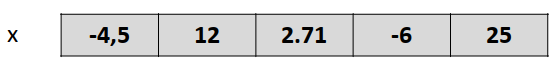
```

Cada uno de los elementos ocupa una posición determinada en el vector. Por ejemplo, el elemento 3 del vector `x` es el numéro 2.71. Se puede *acceder* o hacer referencia a cada elemento mediante el uso de *índices*, expresados entre corchetes al lado del nombre del vector. De esta forma, si escribimos `x[3]` hacemos referencia a la tercera posición del vector, que actualmente guarda al valor 2.71. Como podemos ver, sólo hace falta un índice para hacer referencia a cada elemento de un vector.

```{r, out.width='60%', fig.show='hold', fig.cap='Ejemplo de un vector numérico: índices para señalar cada posición.', echo=FALSE, fig.align="center"}
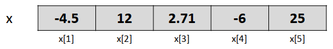
```

Los siguientes son ejemplos de vectores de tipo caracter y lógico, con distintas cantidades de elementos:

```{r, out.width='60%', fig.show='hold', fig.cap='Ejemplo de un vector caracter y un vector lógico', echo=FALSE, fig.align="center"}
knitr::include_graphics('images/05_estructuras/estr03.png')
```

Al igual que todas las variables que empleamos en nuestros algoritmos, los vectores que serán utilizados deben ser declarados en el pseudocódigo, eligiendo un *identificador* (nombre) e indicando su tipo y su tamaño, es decir, la cantidad de posiciones que contienen. Esto último se señala entre paréntesis al lado del nombre elegido. Por ejemplo, el vector `x` visto anteriomente puede ser creado de la siguiente forma:

```
VARIABLE numérica x(5)
x[1] <- -4.5
x[2] <- 12
x[3] <- 2.71
x[4] <- -6
x[5] <- 25
```

Si bien la declaración de un vector sólo tiene como objetivo permitirle a la computadora que reserve internamente el espacio necesario en memoria para el mismo, para escribir pseudocódigo de una manera sencilla estableceremos la siguiente **convención**. Cuando declaramos un vector de tipo numérico con la expresión `VARIABLE numérica x(5)` asumiremos que, además de reservar espacio en memoria para el vector, se le asigna un 0 (cero) en cada posición. Es decir, el vector `x` es iniciado con ceros, que más tarde pueden ser reemplazados por otros valores. Del mismo modo, asumiremos que cuando declaramos vectores de tipo caracter, todos sus elementos son iniciados con valores `""` (una cadena de texto vacía) y cuando declaramos vectores de tipo lógico, con el valor `FALSO`.

En R, los vectores se construyen de forma dinámica por lo cual no es necesario declararlos antes de comenzar a utilizarlos. La función `c()` (de *combinar*) permite crear vectores, por ejemplo, los mencionados anteriormente:

```{r}
x <- c(-4.5, 12, 2.71, -6, 25)
y <- c("ARG", "correo@gmail.com", "Ok", "chau")
z <- c(TRUE, TRUE, FALSE)
```

```{r, out.width='80%', fig.show='hold', fig.cap='Creación de vectores en R', echo=FALSE, fig.align="center"}
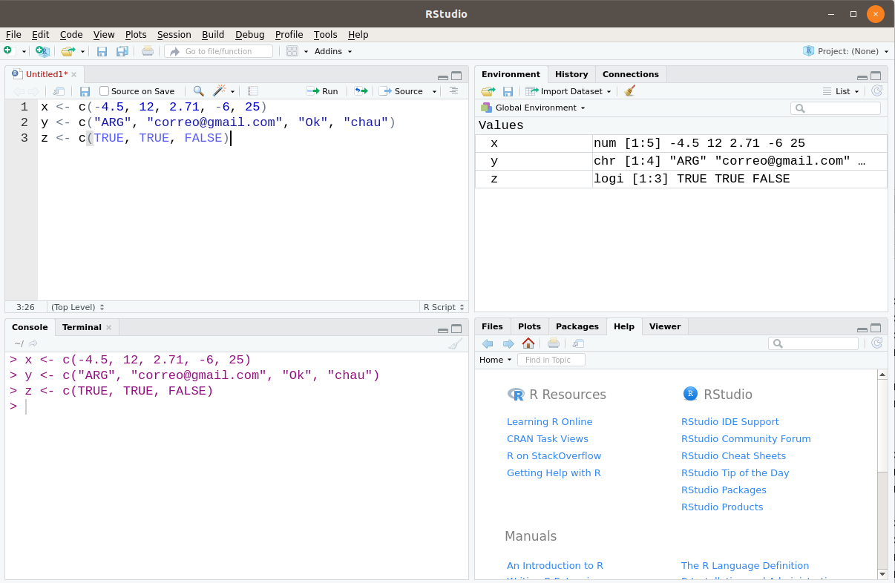
```

Cuando ejecutamos dichas líneas, se crean en el ambiente global los objetos `x`, `y` y `z`, como podemos notar en la pestaña `Environment` de RStudio. Es decir, los vectores, así como cualquier otro tipo de arreglo, son **objetos** que constituyen entidades en sí mismas y que pueden ser manipulados al hacer referencia a sus indicadores. Además, RStudio nos muestra en la pestaña mencionada qué tipo de vector es cada uno (`num`, `chr`, `logi`), cuántos elementos tiene (`[1:5]`, `[1:4]`, `[1:3]`) y una previsualización de sus primeros elementos.

Dado que la función `c()` resulta, en consecuencia, muy importante al programar en R, es recomendable que evitemos usar la letra `c` como nombre para otros objetos^[Aunque a veces me olvido de esta recomendación y por eso en algunos ejemplos de la asignatura hay variables llamadas `c`].

Podemos emplear estructuras iterativas para recorrer todas las posiciones de un vector y realizar operaciones con ellas, por ejemplo:

```
PARA i DESDE 1 HASTA 5 HACER
    ESCRIBIR "La posición " i "de x está ocupada por el valor " x[i]
FIN PARA
```

```{r, results="hold"}
for (i in 1:5) {
	cat("La posición", i, "de x está ocupada por el valor", x[i], "\n")
}
```

Todos los lenguajes de programación incluyen, además, alguna función para determinar cuántos elementos tiene un vector que ya fue creado. Para esto emplearemos la expresión `LARGO()` en el pseudocódigo y la función `length` de R:

```
ESCRIBIR "El vector x tiene " LARGO(x) " elementos."
ESCRIBIR "El vector y tiene " LARGO(y) " elementos."
ESCRIBIR "El vector z tiene " LARGO(z) " elementos."
```

```{r}
cat("El vector x tiene", length(x), "elementos.")
cat("El vector y tiene", length(y), "elementos.")
cat("El vector z tiene", length(z), "elementos.")
```

Entonces, para recorrer todos los elementos del vector podemos hacer también:

```
PARA i DESDE 1 HASTA LARGO(x) HACER
    ESCRIBIR "La posición " i "de x está ocupada por el valor " x[i]
FIN PARA
```

O bien:

```
tam <- LARGO(x)
PARA i DESDE 1 HASTA tam HACER
    ESCRIBIR "La posición " i "de x está ocupada por el valor " x[i]
FIN PARA
```

Antes comentamos que en R los vectores se crean con expresiones como `x <- c(-4.5, 12, 2.71, -6, 25)`, donde sus elementos están listados de forma literal. También podemos crear vectores de un largo determinado dejando que cada posición quede ocupada por un valor por default. Por ejemplo, el siguiente código crea un vector tipo numérico con 10 posiciones, uno caracter con 7 y otro lógico con 2. En cada caso, R rellena por defecto todas las posiciones con el mismo valor: un 0 para todas las posiciones del vector numérico, un caracter vacío `""` para las del vector caracter y el valor `FALSE` para el vector lógico:

```{r}
a <- numeric(10)
b <- character(7)
d <- logical(2)

a
b
d
```

Se pueden asignar valores a una, varias o todas las posiciones de un vector en cualquier parte del algoritmo. Además, en pseudocódigo emplearemos la palabra clave `MOSTRAR` cuando deseamos que se escriba en pantalla todo el contenido de un vector. Por ejemplo:

```
VARIABLE numérica a(10)
...algunas acciones...
PARA i DESDE 1 HASTA LARGO(a) HACER
  SI i %% 3 == 0 ENTONCES  
		a[i] <- i * 100
	FIN SI
FIN PARA
MOSTRAR a
```

```{r}
a <- numeric(10)
for (i in 1:length(a)) {
	if (i %% 3 == 0) {
		a[i] <- i * 100
	}
}
a 		# También: cat(a) o print(a)
```

En los ejemplos anteriores, declaramos los vectores explicitando su tamaño con un número: `VARIABLE numérica x(5)` o `VARIABLE numérica a(10)`. Sin embargo, el tamaño del vector podría estar guardado en otra variable, cuyo valor se determina en cada ejecución del programa mediante información externa o como resultado de algún cálculo anterior. En el siguiente ejemplo se deja que el usuario determine la dimensión del vector y que provea cada uno de los valores para el mismo. Antes de poder declarar la existencia del nuevo vector llamado `mi_vector`, se "lee" su tamaño:

```
VARIABLE numérica tam
LEER tam
VARIABLE numérica mi_vector(tam)
PARA i DESDE 1 HASTA tam HACER
	LEER mi_vector[i]
FIN PARA
```

Por ahora, toda instrucción de *leer* en el pseudocódigo será traducida en R mediante la asignación directa de valores. Por ejemplo, `LEER tam` se reemplaza por `tam <- 5` (o el número que necesitemos).

**Ejemplo: invertir los elementos de un vector**

Nos planteamos el problema de dar vuelta los elementos pertenecientes a un vector, de manera que el primer elemento pase a ser el último, el segundo pase al penúltimo lugar, etcétera. Por ejemplo, dado el vector de tipo caracter `v`:

```{r inv1, out.width='80%', fig.show='hold', fig.cap='Vector v original', echo=FALSE, fig.align="center"}
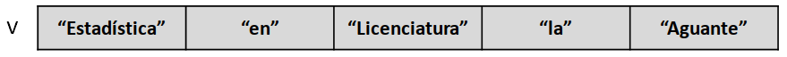
```

queremos modificarlo para obtener:

```{r inv2, out.width='80%', fig.show='hold', fig.cap='Vector v reordenado', echo=FALSE, fig.align="center"}
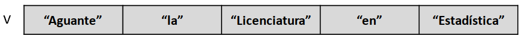
```

Si bien podemos pensar en distintas formas para resolver este problema, probablemente la más sencilla requiere que intercambiemos de a dos los valores en ciertas posiciones del vector, por ejemplo, empezando por intercambiar el primero con el último. Para esto podemos emplear una variable auxiliar que guarde el valor de alguna de las celdas temporariamente (por eso lo vamos a llamar `tmp`):

```{r inv3, out.width='80%', fig.show='hold', fig.cap='Pasos para intercambiar valores', echo=FALSE, fig.align="center"}
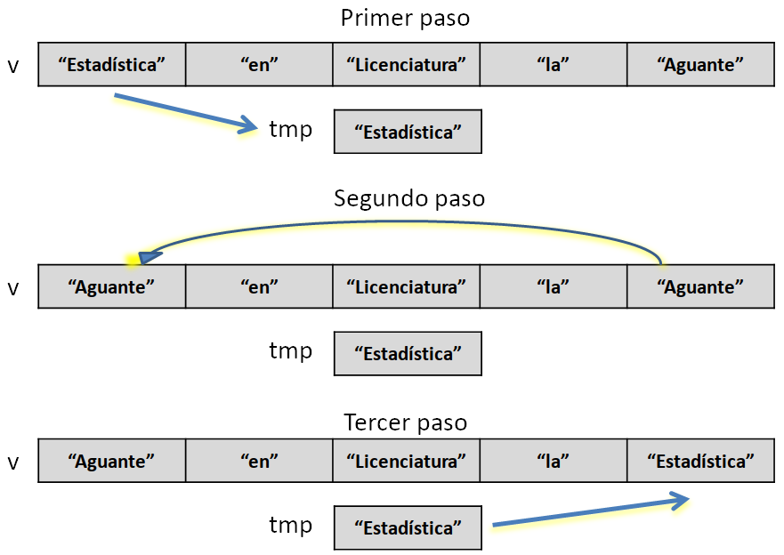
```

Ahora sólo resta realizar el mismo procedimiento para los valores de las posiciones 2 y 4. Como el número de elementos en el vector es impar, el valor en la posición central queda en su lugar. Podemos definir el siguiente algorimo para resolver este problema de manera general. En el siguiente pseudocódigo, primero declaramos una variable numérica `n` que puede tomar cualquier valor y que servirá para declarar cuántos espacios necesita el vector. Luego, se itera para leer cada elemento del vector. Finalmente, se implementa la estrategia de reordenamiento:

```
ALGORITMO: "Invertir (dar vuelta) los elementos de un vector"
COMENZAR
    
  # Declarar variables
  VARIABLE numérica n
  VARIABLE caracter tmp
  LEER n
  VARIABLE caracter v(n)
  
  # Asignar valores al vector
  PARA i DESDE 1 HASTA n HACER
      LEER v[i]
  FIN PARA
  
  # Reordenar
  PARA i DESDE 1 HASTA ENTERO(n / 2) HACER
      tmp <- v[i]                 # Paso 1
      v[i] <- v[n - i + 1]        # Paso 2
      v[n - i + 1] <- tmp         # Paso 3
  FIN PARA
  
  # Mostrar el vector reodenado
  MOSTRAR v
    
FIN
```

En el ejemplo anterior hemos incorporado el uso de comentarios en el pseudocódigo para describir el objetivo de cada parte. Imitando lo que hacemos en R, señalamos la presencia de comentarios con el caracter `#` (podríamos usar otra cosa, pero adheriremos a esta convención). Se usó la expresión `ENTERO()` para hacer referencia a la parte entera del número indicado entre paréntesis, lo cual se puede indicar en R con la función `floor()`. Además, en R reemplazamos todas las instrucciones `LEER` por una asignación directa de valores:

```{r}
v <- c("Estadística", "en", "Licenciatura", "la", "Aguante")
n <- length(v)
for (i in 1:floor(n / 2)) {
	tmp <- v[i]
	v[i] <- v[n - i + 1]
	v[n - i + 1] <- tmp
}
v
```

### Arreglos bidimensionales o matrices

Un **arreglo bidimensional** representa lo que habitualmente conocemos en matemática como **matriz** y por eso también lo llamamos de esa forma. Podemos *imaginar* que en una matriz los elementos están organizados en *filas* y *columnas* formando una tabla. Por ejemplo, la siguiente es una matriz llamada `x`:

```{r, out.width='60%', fig.show='hold', fig.cap='Ejemplo de una matriz numérica', echo=FALSE, fig.align="center"}
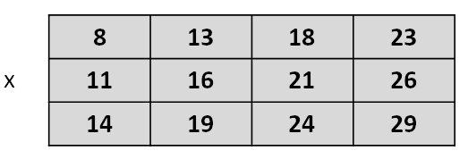
```

A diferencia de los vectores, las matrices requieren dos índices para señalar la posición de cada elemento, el primero para indicar la fila y el segundo para indicar la columna. Los mismos se colocan entre corchetes, separados por una coma, al lado del identificador de la matriz. De esta forma, si hablamos de `x[1, 3]` hacemos referencia a la posición ocupada por el valor 18, mientras que si mencionamos `x[3, 1]` nos referimos al valor 14.

```{r, out.width='80%', fig.show='hold', fig.cap='Ejemplo de una matriz numérica: índices para señalar cada posición', echo=FALSE, fig.align="center"}
knitr::include_graphics('images/05_estructuras/estr06.png')
```

Al *tamaño* de una matriz, es decir, cuántas filas y columnas tiene, se le dice **dimensión**. La matriz anterior es de dimension $3 \times 4$.

Como hicimos con los vectores, debemos declarar las matrices que vamos a usar en el pseudocódigo, indicando su identificador, tipo y dimensión: `VARIABLE numérica x(3, 4)`. También vamos a asumir que todas las posiciones de una matriz son iniciadas con el valor 0, `""` o `FALSO` si la misma es numérica, caracter o lógica, respectivamente. La matriz `x` puede ser generada en pseudocódigo de esta forma:

```
VARIABLE numérica x(3, 4)
x[1, 1] <- 8
x[1, 2] <- 13
x[1, 3] <- 18
x[1, 4] <- 23
x[2, 1] <- 11
x[2, 2] <- 16
x[2, 3] <- 21
x[2, 4] <- 26
x[3, 1] <- 14
x[3, 2] <- 19
x[3, 3] <- 24
x[3, 4] <- 29
```

En R, no es necesario declarar las matrices con anterioridad y las mismas pueden ser creadas de manera literal con la función `matrix()`. Su primer argumento, `data`, es un vector con todos los elementos que queremos guardar en la matriz. Luego, se indica la cantidad de filas para la misma con `nrow` y la cantidad de columnas con `ncol`:

```{r}
x <- matrix(data = c(8, 11, 14, 13, 16, 19, 18, 21, 24, 23, 26, 29), 
						nrow = 3, ncol = 4)
x
```

Notar que R ubicó a los valores provistos llenando primero la columna 1, luego la 2, etc. Ese comportamiento puede ser modificado con el argumento `byrow`, que por default es `FALSE`. Si lo cambiamos a `TRUE` los elementos son ubicados por fila. Además, podemos usar saltos de líneas (*enter*) para visualizar las diferentes filas de la matriz. Esto no tiene ningún impacto en R, sólo sirve para que el código sea más fácil de leer. Dado que hemos provisto 12 valores e indicamos que queremos 3 filas, el argumento `ncol` no es necesario (es obvio que quedarán 4 columnas). Por eso, las siguientes sentencias son equivalentes a la anterior:

```{r, eval=F}
x <- matrix(c( 8, 13, 18, 23, 
              11, 16, 21, 26, 
              14, 19, 24, 29), 
						nrow = 3, byrow = TRUE)

x <- matrix(c( 8, 13, 18, 23, 
              11, 16, 21, 26, 
              14, 19, 24, 29), 
						ncol = 4, byrow = TRUE)
```

Si colocamos un único valor como primer argumento en la función `matrix()`, el mismo se repetirá en todas las posiciones. En este caso sí o sí tenemos que indicar cuántas filas y columnas deseamos:

```{r}
y <- matrix(0, nrow = 2, ncol = 5)
y
```

Una vez que la matriz ya existe, en el pseudocódigo haremos referencia al número de filas y columnas de la misma con las expresiones `NFILA(x)` y `NCOL(x)`. En R tenemos las siguientes funciones para analizar el tamaño de las matrices:

```{r}
dim(x)
nrow(x)
ncol(x)
dim(y)
nrow(y)
ncol(y)
```

Podemos recorrer todas las posiciones de una matriz con una estructura iterativa doble: nos situamos en la primera fila y recorremos cada columna, luego en la segunda fila y recorremos todas las columnas y así sucesivamente:

```{r, out.width='80%', fig.show='hold', fig.cap='Recorrer una matriz por fila', echo=FALSE, fig.align="center"}
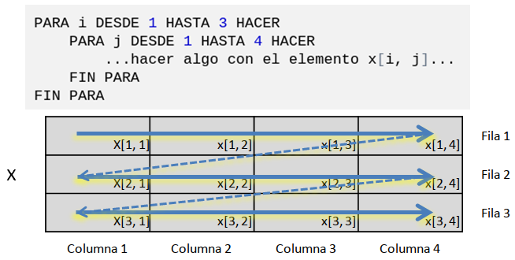
```

```{r, eval=FALSE,  echo=F}

	PARA i DESDE 1 HASTA 3 HACER
	    PARA j DESDE 1 HASTA 4 HACER
	        ...hacer algo con el elemento x[i, j]...
	    FIN PARA
	FIN PARA

	
	PARA j DESDE 1 HASTA 4 HACER
	    PARA i DESDE 1 HASTA 3 HACER
	        ...hacer algo con el elemento x[i, j]...
	    FIN PARA
	FIN PARA

```

También se puede recorrer la matriz por columna, si modificamos ligeramente las estructuras iterativas:

```{r, out.width='80%', fig.show='hold', fig.cap='Recorrer una matriz por columna', echo=FALSE, fig.align="center"}
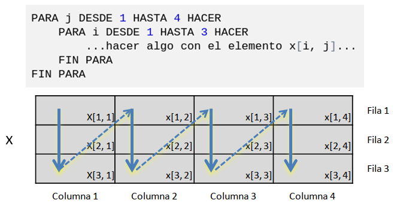
```

Se puede usar cualquier letra o palabra como variables iteradoras, pero el uso de `i` para las filas y de `j` para las columnas es bastante común.

También podemos asignar valores en cada celda mientras recorremos la matriz. De hecho, la matriz `x` del ejemplo puede ser generada así, donde los índices `i` y `j` no sólo señalan una posición en particular dentro de la matriz, sino que además se usan para hacer el cálculo del valor a asignar:

```
VARIABLE numérica x(3, 4)
PARA i DESDE 1 HASTA NFILA(x) HACER
	PARA j DESDE 1 HASTA NCOL(x) HACER
		x[i, j] <- 3 * i + 5 * j
	FIN PARA
FIN PARA
MOSTRAR x
```

```{r}
x <- matrix(0, nrow = 3, ncol = 4)
for (i in 1:nrow(x)) {
	for (j in 1:ncol(x)) {
		x[i, j] <- 3 * i + 5 * j
	}
}
x
```

Si queremos dejar que el valor en cada posición sea determinado por una fuente de información externa a la hora de correr el programa, empleamos la sentencia `LEER` en el pseudocódigo:

```
VARIABLE numérica x(3, 4)
PARA i DESDE 1 HASTA NFILA(x) HACER
  PARA j DESDE 1 HASTA NCOL(x) HACER
  	LEER x[i, j]
  FIN PARA
FIN PARA
```

#### Ejemplo: trasponer una matriz

En Álgebra, trasponer una matriz de dimensión $m \times n$ significa generar una nueva matriz de dimensión $n \times m$, donde los elementos se intercambian de este modo:

```{r, out.width='80%', fig.show='hold', fig.cap='Matriz traspuesta', echo=FALSE, fig.align="center"}
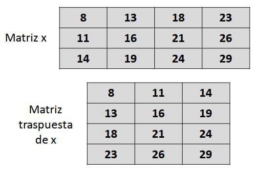
```

Podemos formalizar el algoritmo que permite generar la matriz traspuesta, teniendo en cuenta que cada elemento que originalmente ocupa la posición `[i, j]` en la matriz original, debe pasar a ocupar la posición `[j, i]` en la matriz traspuesta:

```
ALGORITMO: Trasponer matriz
COMENZAR
	
	# Declarar objetos
	VARIABLE numérica nf, nc
	LEER nf, nc
	VARIABLE numérica x(nf, nc), traspuesta(nc, nf)
	
	# Leer los valores de la matriz
	PARA i DESDE 1 HASTA nf HACER
		PARA j DESDE 1 HASTA nc HACER
			LEER x[i, j]
		FIN PARA
	FIN PARA
	
	# Trasponer
	PARA i DESDE 1 HASTA nf HACER
		PARA j DESDE 1 HASTA nc HACER
			traspuesta[j, i] <- x[i, j]
		FIN PARA
	FIN PARA
	
	# Mostrar ambas matrices
	ESCRIBIR "Matriz original"
	MOSTRAR x
	ESCRIBIR "Matriz traspuesta"
	MOSTRAR traspuesta
	
FIN
```

Dado que en R vamos a asignar valores en la matriz de manera literal, primero la creamos y luego usamos `nrow()` y `ncol()` para obtener los correspondientes valores de `nf` y `nc`. En el siguiente ejemplo, además, todas las posiciones de la matriz traspuesta son iniciadas con el valor `NA` (valor lógico que significa *Not Available* o "no disponible").

```{r, results="hold"}
x <- matrix(c( 8, 13, 18, 23, 
              11, 16, 21, 26, 
              14, 19, 24, 29), 
						nrow = 3, byrow = TRUE)
nf <- nrow(x)
nc <- ncol(x)
traspuesta <- matrix(NA, nc, nf)
for (i in 1:nf) {
	for (j in 1:nc) {
		traspuesta[j, i] <- x[i, j]
	}
}
cat("Matriz original")
x
cat("Matriz traspuesta")
traspuesta
```

### Arreglos multidimensionales

Un **arreglo multidimensional** contiene más de dos dimensiones, es decir, requiere más de dos índices para identificar a cada uno de sus elementos. La representación matemática o visual ya no es tan sencilla. Para interpretarlos o saber cuándo usarlos, pensamos que cada una de las dimensiones representa una característica de los elementos.

<!-- Por ejemplo, si se desea contar el número de autos que ingresaron a una playa de estacionamiento por hora a lo largo de varios años, podríamos utilizar un arreglo donde la primera dimensión indique el año, la segunda el mes, la tercera el día y la cuarta la hora. Si llamamos a este arreglo `numero_autos`, el elemento `numero_autos[2, 4, 23, 14]` contendrá el número de autos que ingresaron a la hora 14, del día 23, en el mes 4 del segundo año. -->

Por ejemplo, imaginemos que en un local comercial se quiere registrar cuántos clientes se atendieron en cada una de las tres cajas disponibles (primer dimensión del arreglo: caja 1, caja 2 o caja 3), ya sea en el turno mañana o tarde (segunda dimensión: 1 para la mañana o 2 para la tarde) en cada día hábil de una semana (tercera dimensión: 1 lunes, 2 martes, 3 miércoles, 4 jueves o 5 viernes). Si queremos registrar, por ejemplo, que la caja 1 en el turno tarde del día jueves atendió 12 clientes, tenemos que guardar el valor 12 en la posición [1, 2, 4] del arreglo.

Para situaciones como la anterior, resulta más útil guardar los valores en otros tipos de estructuras especializadas en conjuntos de datos, como veremos más adelante. Por esta razón, en esta asignatura no profundizaremos en el estudio de arreglos multidimensionales y nos bastaremos con vectores y matrices. Sin embargo, debemos saber de su existencia porque son estructuras útiles para ciertas tareas de programación. 

Por lo tanto, lo siguiente es de **lectura opcional**. El arreglo de 3 dimensiones que permite acomodar toda la información del ejemplo en una sola estructura puede definirse en pseudocódigo así:

```
VARIABLE numérica clientes(3, 2, 5)
```

Y en R:

```{r}
clientes <- array(0, dim = c(3, 2, 5))
clientes
```

Luego, si queremos registrar que la caja 1 en el turno tarde del día jueves atendió 12 clientes, hacemos, tanto en R como en pseudocódigo:

```{r}
clientes[1, 2, 4] <- 12
clientes
```

En R, podemos ponerle un nombre a cada una de las dimensiones del arreglo ("caja", "turno", "dia"), para poder identificar mejor a qué aspecto hace referencia y, a su vez, un nombre a cada una de sus modalidades (por ejemplo, "caja 1", "caja 2" o "caja 3"). Esto se logra de la siguiente forma:

```{r}
dimnames(clientes) <- list(caja = c("caja 1", "caja 2", "caja 3"),
                           turno = c("mañana", "tarde"),
                           dia = c("lun", "mar", "mie", "jue", "vie"))
clientes
```

En lo anterior hemos utilizado una **lista**, que se trata de otro tipo de estructura de datos definida a continuación.

## Listas

Una de las principales características de los **arreglos** es la **homegeneidad**: todos los elementos que contienen deben ser del mismo tipo. No se puede, por ejemplo, mezclar en una matriz valores numéricos y lógicos. Sin embargo, en muchos problemas resulta útil contar con alguna estructura de datos que permita agrupar objetos de diversos tipos. Esa es, justamente, la definición de una **lista**. Podemos imaginarla como una bolsa en la cual podemos meter todo tipo de objetos, incluyendo vectores, matrices y, por qué no, otras bolsas (es decir, bolsas dentro de una bolsa o listas dentro de una lista). Todos los lenguajes de programación proveen algún tipo de estructura con estas características, aunque no todos las llaman igual. Otros posibles nombres con los que se conocen pueden ser *tupla* o *agregado*. En R se llaman **listas** o **vectores recursivos**. El siguiente diagrama presenta una lista (recuadro con puntas redondeadas) que contiene:

1. Un vector numérico de largo 3.
2. Un vector caracter de largo 2.
3. Una matriz numérica de dimensión 2x2.
4. Un valor lógico.

```{r, out.width='50%', fig.show='hold', fig.cap='Ejemplo de una lista', echo=FALSE, fig.align="center"}
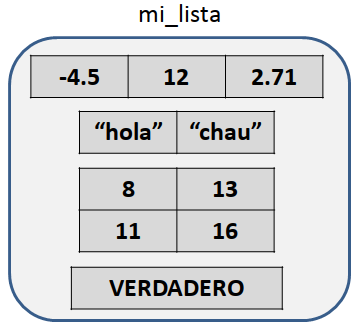
```

En R la creación de esta lista se realiza mediante la función `list()`, cuyos argumentos son los elementos que queremos guardar en la lista, separados por comas:

```{r}
mi_lista <- list(
	c(-4.5, 12, 2.71),
	c("hola", "chau"),
	matrix(c(8, 11, 13, 16), nrow = 2),
	TRUE
)
mi_lista
```

Luego de correr la sentencia anterior, podemos ver que `mi_lista` es un nuevo objeto disponible en el  ambiente global y como tal está listado en el panel *Environment*. Allí se nos indica que se trata de una lista y, además, podemos previsualizar su contenido al hacer clic en el círculo celeste que antecede a su nombre:

```{r, out.width='50%', fig.show='hold', fig.cap='La lista en la pestaña Environment de RStudio', echo=FALSE, fig.align="center"}

```

Usamos dobles corchetes `[[ ]]` para referenciar a cada objeto que forma parte de la lista. Además, si queremos indicar un elemento dentro de un objeto que forma parte de la lista, agregamos otro conjunto de corchetes como hacemos con vectores y matrices. Por ejemplo:

```{r, out.width='50%', fig.show='hold', fig.cap='Ejemplo de una lista', echo=FALSE, fig.align="center"}
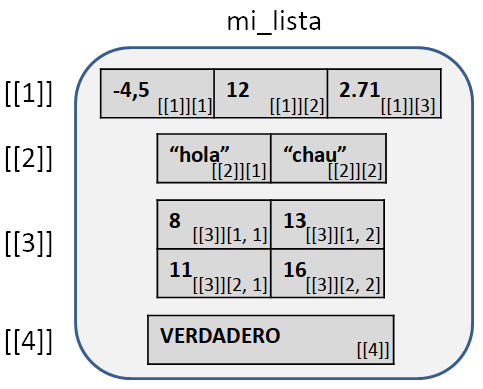
```

```{r}
mi_lista[[1]]
mi_lista[[1]][3]
mi_lista[[2]]
mi_lista[[2]][2]
mi_lista[[3]]
mi_lista[[3]][2, 1]
mi_lista[[4]]
mi_lista[[4]][1]
```

Podemos asignar valor a algún elemento usando los índices de esa misma forma:

```{r}
mi_lista[[1]][3] <- 0
mi_lista
```

A medida que las estructuras de datos se hacen más complejas, existen menos convenciones para su representación en pseudocódigo, siendo admisible cualquier expresión que logre comunicar sin ambigüedad las acciones que se deben realizar, incluso la descripción en palabras. La creación de la lista anterior podría ser expresada como:

```
VARIABLE numérica w(3), y(2, 2)
VARIABLE caracter x(2)
VARIABLE lógica z
VARIABLE LISTA mi_lista
mi_lista <- LISTA(x, w, y, z)
```

Para asignar valores, podemos usar en pseudocódigo el mismo tipo de notación que en R:

```
mi_lista[[1]][1] <- -4.5
mi_lista[[1]][2] <- 12
mi_lista[[1]][3] <- 2.71
mi_lista[[2]][1] <- "hola"
...
mi_lista[[4]] <- VERDADERO
```

**Ejemplo: función que devuelve una lista**

En el capítulo anterior, dijimos que las funciones son subalgoritmos que podían devolver exactamente un objeto como resultado. Esto puede ser una limitación, ya que en algunos casos tal vez necesitemos devolver varios elementos de distinto tipo
^[Si fuesen elementos del mismo tipo, los podríamos devolver dentro de un vector, por ejemplo, las dos soluciones reales distintas de una ecuación cuadrática.]
.
La solución consiste en devolver una lista que englobe a todos los objetos que nos interese que la función le entregue como resultado al algoritmo principal que la invocó. Como una lista es un único objeto, ¡la función puede devolverla sin ningún problema!

Para ejemplificar, recordemos el siguiente ejercicio de la práctica 3: escribir el algoritmo y el programa en R para la creación de la función `triangulos(a, b, c)` que a partir de la longitud de los tres lados de un triángulo `a`, `b` y `c` (valores positivos) lo clasifica con los siguientes resultados posibles: no forman un triángulo (un lado mayor que la suma de los otros dos), triángulo equilátero, isósceles o escaleno. Vamos a modificar la función para que tenga el siguiente comportamiento: la función debe devolver el tipo de triángulo como cadena de texto y el valor numérico del perímetro del mismo (o un 0 si no es triángulo). Es decir, la función debe devolver tanto un objeto de tipo caracter y otro de tipo numérico. Para lograrlo los encerraremos en una lista:

Algoritmo: 

```
#-----------------------------------------------------
# Función triangulos
# Clasifica un triángulo según la longitud de sus lados
# Entrada:
#		- a, b, c, números reales positivos
# Salida:
#		- una lista cuyo primer elemento es un caracter que indica el tipo de
#		triángulo y el segundo elemento es el perímetro del triángulo o el valor 0 si
#		no los lados provistos no corresponden a un triángulo
#-----------------------------------------------------
FUNCIÓN triangulos(a: numérico, b: numérico, c: numérico): lista
COMENZAR
	VARIABLE caracter tipo
	VARIABLE numérica perimetro
	SI a > b + c O b > a + c O c > a + b ENTONCES
		tipo <- "no es triángulo"
		perimetro <- 0
	SI NO
		perimetro <- a + b + c
		SI a == b Y a == c ENTONCES
			tipo <- "equilátero"
		SI NO
			SI a == b O a == c O b == c ENTONCES
				tipo <- "isósceles"
			SI NO
				tipo <- "escaleno"
			FIN SI
		FIN SI
	FIN SI
	DEVOLVER LISTA(tipo, perimetro)
FIN FUNCIÓN
```

Código en R:

```{r}
#-----------------------------------------------------
# Función triangulos
# Clasifica un triángulo según la longitud de sus lados
# Entrada:
#		- a, b, c, números reales positivos
# Salida:
#		- una lista cuyo primer elemento es un caracter que indica el tipo de
#		triángulo y el segundo elemento es el perímetro del triángulo o el valor 0 si
#		no los lados provistos no corresponden a un triángulo
#-----------------------------------------------------
triangulos <- function(a, b, c) {
	perimetro <- a + b + c
	if (a > b + c || b > a + c || c > a + b) {
		tipo <- "no es triángulo"
		perimetro <- 0
	} else if (a == b & a == c) {
		tipo <- "equilátero"
	} else if (a == b || a == c || b == c) {
		tipo <- "isósceles"
	} else {
		tipo <- "escaleno"
	}
	return(list(tipo, perimetro))
}
```

Ejemplos del uso de esta función:

```{r}
# Guardamos el resultado devuelto (una lista) en el objeto resultado
resultado <- triangulos(2, 3, 4)
# Miramos el primer elemento de la lista (caracter que indica el tipo)
resultado[[1]]
# Miramos el primer elemento de la lista (perímetro)
resultado[[2]]
# Miramos todo junto
resultado
# Otro ejemplo:
resultado2 <- triangulos(2, 3, 10)
resultado2[[1]]
resultado2[[2]]
```

## Elementos con nombre (lectura opcional)

La presente sección es de lectura opcional, lo cual significa que no será necesaria para la resolución de la práctica ni será tenida en cuenta en las evaluaciones.

Además de guardar información, los objetos de R pueden poseer ciertos **atributos**, que consisten en información adicional sobre el objeto. Uno de ellos es el atributo `names`, que permite que cada elemento dentro de un vector o una lista pueda tener su propio nombre, así como también que cada fila o columna de una matriz tenga su propio nombre, independientemente del nombre general del objeto.

### Vectores

A cada elemento de un vector se le puede, opcionalmente, asignar un nombre. Esto se realiza de alguna de estas formas:

- Opción 1: después de crear el vector

	```{r}
	# El vector se llama "frutas" y tiene 4 elementos
	frutas <- c(3, 7, 2, 1)
	frutas
	# Cada uno de estos elementos no tienen nombres
	names(frutas)
	# Le doy un nombre a cada elemento
	names(frutas) <- c("manzanas", "naranjas", "bananas", "peras")
	frutas
	```

- Opción 2: en el momento de crear el vector

	```{r}
	frutas <- c(manzanas = 3, naranjas = 7, bananas = 2, peras = 1)
	frutas
	```

Los nombres son útiles porque permiten indexar al vector, sin necesidad de usar como índice la posición del elemento:

```{r}
frutas[2]
frutas["naranjas"]
```

No todos los elementos de un vector tienen que tener nombre:

```{r}
frutas <- c(manzanas = 3, 7, bananas = 2, 1)
frutas
names(frutas)
```

### Matrices

En el caso de las matrices, se le puede asignar nombres a sus filas y columnas:

- Opción 1: después de crear la matriz
	
	```{r}
	x <- matrix(c( 8, 13, 18, 23, 
	              11, 16, 21, 26, 
	              14, 19, 24, 29), 
							nrow = 3, byrow = TRUE)
	rownames(x) <- c("A", "B", "C")
	colnames(x) <- c("col1", "grupo2", "grupo3", "grupo4")
	x
	```

- Opción 2: al crear la matriz

```{r}
x <- matrix(c( 8, 13, 18, 23, 
              11, 16, 21, 26, 
              14, 19, 24, 29), 
						nrow = 3, byrow = TRUE,
						dimnames = list(Categorias = c("A", "B", "C"), 
														Grupos = c("grupo1", "grupo2", "grupo3", "grupo4")))
x
```
	
	En este último ejemplo, se han elegido arbitrariamente los nombres `Categorias` y `Grupos` para llamar al conjunto completo de las filas y de las columnas, respectivamente. Esos nombres pueden ser cambiados por otros.

Al igual que con los vectores, podemos usar los nombres de filas y columnas para indexar:

```{r}
x["B", "grupo2"]
```

En el caso de los arreglos multidimensionales, ya se indicó en el ejemplo del local comercial el uso de nombres para las distintas dimensiones.

### Listas

Podemos asignarle un nombre a uno, algunos o todos los integrantes en una lista:

```{r}
mi_lista <- list(
	w = c(-4.5, 12, 2.71),
	x = c("hola", "chau"),
	y = matrix(c(8, 11, 13, 16), nrow = 2),
	z = TRUE
)
mi_lista
```

Esto amplía las opciones para hacer referencia a cada objeto y elemento allí contenido. Las siguientes sentencias son todas equivalentes y sirven para acceder al tercer elemento de la lista, cuyo nombre es `y`:

```{r}
mi_lista[[3]]
mi_lista[["y"]]
mi_lista$y
```

## Otras consideraciones (lectura opcional)

Dependiendo de cómo se almacenan los datos que componen a una estructura en el hardware de la computadora, las mismas se pueden clasificar en **contiguas** o **enlazadas**. En las estructuras contiguas, los datos se sitúan en áreas adyacentes de memoria y cada uno de ellos se puede localizar partiendo de la posición en memoria del primer elemento de la estructura. En las estructuras enlazadas, los datos no se sitúan necesariamente de forma continua en la memoria sino que existen *punteros* (otro tipo de dato que *apunta* hacia determinada posición de memoria) que permite identificar cuál es el orden de los elementos dentro de la estructura.

Por otro lado, las estructuras también se pueden clasificar en **dinámicas** o **estáticas**, según si su tamaño puede cambiar o no durante la ejecución de un programa, respectivamente. Cuando se emplea una estructura estática, se declara con anterioridad el tamaño que ocupará en memoria y su dimensión no podrá variar, aún cuando no se ocupen todas las posiciones reservadas. En contraposición, una estructura dinámica puede cambiar en tamaño.

Antes se mencionó que las listas de R pueden contener objetos de distintos tipos. Para ser más rigurosos, una lista es un tipo especial de vector que agrupa punteros hacia distintos objetos. Técnicamente, todos los elementos de una lista son del mismo tipo (punteros), pero hacen referencia a distintos objetos, dándonos la impresión de que en una lista de R, sencillamente, podemos meter cualquier tipo de objeto.
