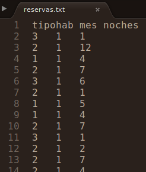

# Uso de archivos de datos

Como hemos visto, los programas usan variables para guardar información: datos de entrada, resultados calculados, valores intermedios, etc. Sin embargo, la información guardada en las variables es efímera. Cuando los programas paran de correr, el valor almacenado en las variables se pierde. En muchas ocasiones, es necesario guardar información de una forma más permanente.

En estos casos, el enfoque usual es recolectar la información en un todo lógicamente cohesivo y guardarlo en un medio permanente que generalmente se graba en el disco rígido de la máquina, es decir, en un archivo. Un **archivo** o **fichero** es un conjunto de información sobre un mismo tema tratado como una unidad de almacenamiento y organizado de forma estructurada para la búsqueda de un dato individual. Los archivos pueden contener instrucciones de programas o información creada o usada por un programa. Todos los objetos de datos permanentes que guardamos en nuestra computadora (documentos, juegos, programas ejecutables, código, etc.) son guardados en la forma de archivos.

Un archivo se identifica con un **nombre**, seguido por un *punto* y una **extensión**, la cual es un sufijo empleado para indicar características de su contenido, el uso pretendido o el software con el cual puede ser empleado. Por ejemplo, un archivo que se llama *planilla.xlsx* es una hoja de cálculo de Excel o un archivo llamado *codigo.R* es un script de código de R.

## Registros, campos, claves y bases de datos

En esta asignatura nos limitaremos a trabajar con archivos que guardan información de forma tabular, en los que la unidad elemental que los compone es un **registro**, es decir, una colección de información relativa a una misma entidad. En general, cada registro de un mismo archivo tiene la misma estructura que los demás. Los datos individuales sobre dicha entidad se organizan en **campos**. Un **campo** es la mínima unidad de información de un registro. Por ejemplo:

```
ARCHIVO: Pasajeros
Campo 1 - Pasaporte: número de pasaporte del pasajero, tipo caracter
Campo 2 - Nombre: nombre del pasajero, tipo caracter
Campo 3 - NroVuelo: número del vuelo, tipo caracter
Campo 4 - FechaVuelo: fecha del vuelo, tipo caracter
Campo 5 - NroAsiento: número del asiento, tipo caracter
Campo 6 - Origen: ciudad de origen, tipo caracter
Campo 7 - Destino: ciudad de destino, tipo caracter
Campo 8 - Precio: precio del pasaje, tipo numérico
```

|Pasaporte|      Nombre     | NroVuelo | FechaVuelo | NroAsiento |  Origen | Destino      | Precio  |
|:---------------:|:---------------:|:--------:|:----------:|:----------:|:-------:|--------------|---------|
| AAA235687|  Pamela Suárez  |  AR6071  |  12/09/17  |     17A    | Rosario | Córdoba      | 7532.23 |
| BCA587681| Gonzalo Echarri |  AR5423  |  14/09/17  |     31B    | Rosario | Buenos Aires | 6424.10 |
|...|       ...       |    ...   |     ...    |     ...    |   ...   | ...          | ...     |

<br>

Un campo está caracterizado por el tipo de datos que almacena (caracter, numérico, lógico) y en algunos contextos es necesario precisar su longitud (por ejemplo, cantidad de caracteres admitidos como máximo en los datos del campo). Algunos lenguajes, como R, admiten trabajar con campos de longitud variable (sin necesidad de que sea especificada con anticipación).

En el contexto del análisis de datos, cada columna o *campo* en este tipo de archivos puede representar una variable observada sobre los individuos o unidades de interés, los cuales se encuentran dispuestos en las sucesivas filas. 

Generalmente suele ser necesario identificar de manera única a cada registro de un archivo. Para esto suele considerarse a uno de los campos del archivo como el **campo clave** o, más sencillamente, **clave**. La **clave** o *key* es el campo que identifica inequívocamente a cada registro, permitiendo diferenciarlo del resto, como podría ser el número de pasaporte en el ejemplo anterior. En ocasiones donde no hay un campo *clave* es posible identificar un registro a través de la combinación de los valores presentes en más de uno de los campos.

Por último, cabe mencionar que llamamos **base de datos** a un conjunto de archivos que contienen datos relacionados entre sí, vinculados mediante sistemas complejos que enlazan las claves de uno y otro archivo y que pueden ser consultados mediante el uso de software especializado. Por eso, cuando trabajamos con los datos almacenados en un único archivo, es conveniente referirse a los mismos como "conjunto de datos" y no como "base de datos".

## Organización de archivos

Existen distintos tipos de organización de los archivos según la forma en la que se pueda acceder a cada uno de sus registros:

- **Organización secuencial**

  Los registros se encuentran en cierto orden que debe ser respetado para la lectura de los mismos. Para leer el registro situado en la posición *n*, el programa previamente tiene que pasar por los *n-1* registros que ocupan las posiciones anteriores. 
  
   Los archivos de tipo secuencial en general ocupan menos memoria y suelen ser utilizados para guardar contenidos que sufren pocas modificaciones. Los registros se graban consecutivamente en el soporte que los aloja (por ejemplo, en el disco). El orden físico con el que fueron escritos los registros coincide con el orden de lectura de los mismos.
   
   Los registros pueden leerse uno por uno hasta llegar al final del archivo, donde se indica de alguna manera el fin del mismo, muchas veces a través de un caracter especial como un asterisco o de una línea en blanco. Esta marca generalmente se conoce como *EOF* (*end of file*). La mayoría de los lenguajes de programación disponen de una función lógica que devuelve un valor `VERDADERO` cuando se alcanza el final del archivo. 
   
  <!-- Los archivos de tipo secuencial en general ocupan menos memoria, su uso no requiere establecer con anterioridad la cantidad de registros a almacenar y suelen ser utilizados para guardar contenidos que sufren pocas modificaciones. -->

- **Organización directa**

  Son archivos que están organizados de manera que se pueda acceder de forma directa a cada registro mediante su posición en el soporte físico que lo contiene, sin tener que pasar secuencialmente por los registros anteriores. Poseen la ventaja de brindar un acceso rápido a la información y la posibilidad de leer y escribir registros en cualquier posición y orden.
  
  Se puede mencionar como desventaja de este tipo de organización el hecho de que requiere la programación de la forma de identificar la posición de un registro a partir de alguno de los valores de sus campos, generalmente, la *clave*. Esto se hace mediante un algoritmo de transformación de la clave (llamado *hash function*) que a partir de la misma devuelve la dirección del registro en el soporte físico. El archivo debe diseñarse teniendo en cuenta de antemano una cantidad total de registros fija.
  
- **Organización indexada**

  Los archivos están estructurados de manera que los registros se pueden localizar sin pasar por los anteriores, consultando en una tabla adicional de índices la zona del archivo donde se encuentra el registro buscado. Esto permite localizar un registro por medio de su clave o del valor de algún campo en particular.
  
  Para imaginarnos esto, podemos pensar que un diccionario es un ejemplo de un archivo indexado, ya que podemos encontrar la región donde se encuentra un registro (palabra) mediante el índice de letras. Si queremos buscar el término "programación" en un diccionario, no recorremos todas las palabras del mismo desde la "A" hasta encontrar el término de interés, sino que buscamos en el índice en qué página del diccionario se encuentra la "P" y comenzamos una búsqueda secuencial desde la misma.
  
  Un archivo indexado, entonces, cuenta en realidad con dos archivos, uno de índices (que se recorre de forma secuencial) y otro con los registros propiamente dichos. Posee la ventaja de brindar un rápido acceso a los registros, pero con el costo de utilizar espacio adicional para la tabla de índices.

La organización más sencilla y más comúnmente empleada es la **secuencial**, aunque en algunos casos puede no ser la más eficiente. Si bien no todos los lenguajes de programación permiten el trabajo con archivos indexados o de organización directa, todos pueden manejar archivos secuenciales. 

En este curso trabajaremos solamente con archivos cuyos registros estén organizados de forma secuencial y que puedan ser registrados como documentos de Excel (extensión *.xlsx*) o archivos de texto (extensión *.txt* o *.csv*). 

Un **archivo de texto** (también conocido como *texto llano* o *texto simple*) es un archivo informático que contiene únicamente texto formado por una secuencia ordenada de caracteres. El texto almacenado en este tipo de archivo carece de cualquier tipo de formato tipográfico (negrita, cursiva, colores, subrayado, fuente, etc.), lo cual permite que una gran variedad de programas pueda leer y editar el contenido. Cada renglón en el archivo de texto es un registro y los distintos campos suelen estar señalizados con tabulaciones (archivos *.txt*) o separados por comas o punto y comas (archivos *.csv*).

Los archivos de texto están compuestos por caracteres ordinarios, como las letras, números y signos de puntuación, y por caracteres especiales que indican, por ejemplo, saltos de línea (`\n`) y tabulaciones (`\t`). Pero como en realidad las computadoras solamente entienden números, cada caracter es codificado internamente con una representación numérica binaria, que nosotros nunca llegamos a ver. Distintas maneras de hacer esta representación dan lugar a diferentes formatos de codificación de caracteres (como *ASCII*, *ISO-8859-1* o *UTF-8*). Si en alguna oportunidad abrimos un archivo y nos percatamos que caracteres como la "ñ" o las tildes han sido reemplazadas por otros produciendo un aspecto "raro", significa que el archivo ha sido abierto empleando una codificación diferente de la que se utilizó al crear el archivo. La solución para este problema es muy sencilla, sólo hay que cambiar la opción de codificación a la hora de guardar o de abrir el archivo.

## Operaciones sobre archivos

El uso de archivos en programación es muy importante ya que nos permite leer datos para hacer algún tipo de procesamiento y también guardar resultados obtenidos. El sistema operativo de la computadora es el que se encarga de manipular los archivos para que podamos leerlos o escribir en ellos, pero debemos aprender las sentencias que el lenguaje de programación elegido utiliza para encargarle esas tareas al sistema operativo. Además, necesitamos elegir una forma clara para comunicar estas acciones mediante pseudocódigo en los algoritmos.

Los procedimientos básicos que los programas pueden llevar a cabo sobre los distintos tipos de archivos son:

- **Creación de un archivo**

  Para que un archivo pueda ser utilizado, antes tiene que exister, obviamente. Si bien la creación de un nuevo archivo es una tarea propia del sistema operativo, la representaremos en el pseudocódigo de la siguiente forma, donde `nombre` puede ser reemplazado por cualquier nombre que deseemos darle al archivo:
    
  ```{r, tidy=F, eval=FALSE, highlight=FALSE, echo=TRUE}
	CREAR ARCHIVO (nombre)
	```
    
  Una vez que el archivo fue creado y existe, se pueden hacer con él las restantes operaciones. En la mayoría de las aplicaciones que veremos, tendremos archivos que han sido creados con anterioridad y ya tienen registros, por lo cual usaremos pocas veces esta acción.

- **Apertura de un archivo**

	Para que un programa pueda operar sobre un archivo, la primera acción que debe realizar es la **apertura** del mismo, que incluye la identificación del archivo a utilizar y el modo (lectura o escritura). Esto hace que el sistema operativo establezca una *conexión* con el archivo que mientras se mantenga activa permitirá la lectura y escritura de registros en el mismo. En pseudocódigo lo indicaremos así:
	
	```{r, tidy=F, eval=FALSE, highlight=FALSE, echo=TRUE}
	ABRIR ARCHIVO (nombre) secuencial, lectura
	ABRIR ARCHIVO (nombre) secuencial, escritura
	```

- **Lectura de registros en un archivo**

  La **lectura** consiste en transferir información del archivo a la memoria principal usada por el programa. En los archivos de organización secuencial, los registros se leen uno por uno, es decir, línea por línea, hasta llegar al final del archivo. Veremos dos formas de indicar en nuestro pseudocódigo la lectura de todos los registros de un archivo.
  
  *Opción A: registro por registro*
  
  Por ejemplo, si deseamos realizar alguna o algunas acciones con los valores que forman parte de cada registro mientras el archivo es recorrido secuencialmente línea por línea, podemos emplear una estructura iterativa:
  
	```
	MIENTRAS FIN DE ARCHIVO (nombre) == FALSO ENTONCES
	  LEER SIGUIENTE REGISTRO (nombre) campo1, campo2, ...  
	  ... realizar operaciones con las variables campo1, campo2, ...
	FIN MIENTRAS
	```
	
	En cada iteración se lee un registro con la expresión `LEER SIGUIENTE REGISTRO (nombre)`. `campo1` y `campo2` son variables que se definen para representar a los valores leídos de cada uno de los campos (columnas) en el registro que está siendo analizado. Luego de ser leídos, con esos valores se pueden realizar distintas acciones, antes de proseguir con la lectura del siguiente registro.
	
	Al ir recorriendo cada línea del archivo, la expresión `FIN DE ARCHIVO (nombre)` devuelve el valor `FALSO`, pero después de haber leído el último registro, devolverá `VERDADERO`. Esto indica que se ha llegado al final, no quedan registros por leer y se debe detener la estructura iterativa. `FIN DE ARCHIVO (nombre)` también suele indicarse con `EOF (nombre)`. 
	
	*Opción B: lectura completa*
	
	Otra opción es leer automáticamente todos los registros y almacenarlos en alguna estructura de datos especializada que definamos en el ambiente de trabajo. Para esto, vamos a introducir la noción de **dataset**: una estructura de datos bidimensional (como una matriz) en la cual cada fila representa a un registro y cada columna representa a uno de los campos del archivo, pudiendo entonces almacenar valores de distinto tipo en cada una de ellas (numérico, lógico, caracter). Para indicar que todo el contenido del archivo (llamado `nombre`) debe ser leído y almacenado en un dataset llamado, por ejemplo, *datos*, emplearemos la siguiente expresión:
	
	```
	LEER REGISTROS (nombre) A DATASET (datos)
	```

	Una vez que los registros fueron leídos y almacenados en el dataset, podemos hacer referencia a cada uno de ellos utilizando *índices* como lo hacemos con las matrices. Por ejemplo, `datos[3, 4]` hace referencia al valor correspondiente al cuarto campo en el tercer registro. Así, podemos recorrer todos los registros del dataset con una estructura iterativa para realizar distintas operaciones con ellos:
	
	```
	LEER REGISTROS (nombre) A DATASET (datos)
	
	PARA i DESDE 1 HASTA NFILA(datos) HACER
		...realizar operaciones con  datos[i, 1], datos[i, 2], etc. ...
	FIN PARA
	```

- **Escritura en un archivo**

  La **escritura** es la transferencia de información guardada en las variables del programa al archivo. Si el archivo fue abierto en modo de escritura, con la siguiente expresión representamos el agregado de un nuevo registro al final del mismo, donde `valor1`, `valor2`, etc. son los valores que se guardarán en los respectivos campos del archivo, respetando el orden.
  
  ```
	ESCRIBIR REGISTRO (nombre) valor1, valor2, ...
	```

- **Cierre de un archivo**

  Cuando un programa no vaya a acceder más a un archivo, es necesario indicarlo a través del **cierre** del mismo, para que se interrumpa la conexión establecida por el sistema operativo. Esto hace que se liberen memoria y recursos del sistema, se prevenga la corrupción de los datos y se exprese explícitamente que ya no se hará más uso del mismo. En pseudocódigo lo indicaremos así:

	```
	CERRAR ARCHIVO (nombre)
	```

- **Otras operaciones**

	Otras operaciones que se pueden realizar sobre los archivos, en base a combinaciones de las anteriores, incluyen a las acciones de:

	- *Actualización*: añadir (dar de alta), modificar o eliminar (dar de baja) algún registro.
	- *Clasificación*: reubicar los registros de tal forma que queden ordenados por algún campo determinado.
	- *Fusión o mezcla*: combinar dos o más archivos para formar uno nuevo.
	- *Partición*: subdividir los registros por el valor que toman en algún campo para generar más de un archivo.

## Ejemplo

El archivo `reservas.txt` cuenta con los registros de reservas en un famoso hotel de la ciudad de Rosario durante el año 2019. Cada registro del archivo dispone de información acerca del mes de la reserva, tipo de habitación reservada y cantidad de noches de la estadía:

* Archivo: `reservas.txt`
* Campos:

  - `tipohab`: tipo de habitación, numérico (1 = habitación simple, 2 = habitación doble, 3 = habitación triple)^[El campo es de tipo numérico porque contiene valores de ese tipo, sin embargo el tipo de habitación es una variable categórica. No debemos confundir estos aspectos.].
  - `mes`: mes en el que se realizó la reserva, numérico (1 = enero, ..., 12 = diciembre).
  - `noches`: cantidad de noches reservadas, numérico.

Como ilustración, se muestran los primeros registros del archivo:

```{r, out.width='30%', fig.show='hold', fig.cap='Primeros registros del archivo reservas.txt', echo=FALSE, fig.align="center"}

```

La primera línea de este archivo de texto contiene los nombres de los campos. La segunda línea contiene los datos correspondientes al registro, que se trata de una reserva para una habitación triple (`tipohab` es igual a 3), en el mes de enero (`mes` es igual a 1) y por 12 noches (`noches` es igual a 12).

Se necesita crear un programa que permita obtener los siguientes resultados:

a) Generar la siguiente tabla de contingencia que presenta el número de reservas durante el año 2019 según mes y tipo de habitación:

	|           | Hab. simple | Hab. doble | Hab. triple | Total |
	|:---------:|:-----------:|:----------:|:-----------:|:-----:|
	|   Enero   |             |            |             |       |
	|    ...    |             |            |             |       |
	| Diciembre |             |            |             |       |
	|   Total   |             |            |             |       |

b) Determinar el total de pernoctaciones en el hotel durante el 2019. Las pernoctaciones son las cantidades de noches que los pasajeros se alojan en el establecimiento y es algo que cada hotel debe informar a la secretaría de turismo de la municipalidad.
c) Determinar cuál fue el mes de mayor cantidad de reservas.
d) Determinar para cada tipo de habitación el mes con menor número de reservas.

En [este link](https://github.com/mpru/introprog/tree/master/archivos) o en el aula virtual podrás encontrar el archivo de datos. Al final de esta sección se presenta el algoritmo y el programa en R que resuelven este problema, pero antes iremos explicando cada parte por separado.

### Lectura de los registros del archivo

En el pseudocódigo, la lectura de los registros comienza con la apertura del archivo. Luego, se recurre a la estrategia de leer todos los registros automáticamente, almacenándolos en una estructura de datos de tipo *dataset*, a la que se le da el nombre `datos`. Una vez que la lectura es realizada, se cierra el archivo y exploramos cuántos registros (filas) y campos (columnas o variables) tiene el dataset:

```
ABRIR ARCHIVO (reservas) secuencial, lectura
LEER REGISTROS (reservas) A DATASET (datos)
CERRAR ARCHIVO (reservas)
ESCRIBIR "El archivo cuenta con" NFILA(datos) "registros de" NCOL(datos) "campos." 
```

En R, podemos leer todos los registros de un archivo de texto con campos separados por tabulaciones con la función `read.delim()`, informando la ruta completa hasta la ubicación del archivo en la computadora. Por ejemplo:

```{r}
datos <- read.delim("/home/marcos/GitProjects/introprog/archivos/reservas.txt")
```

<!-- Si tenemos que importar otro tipo de archivo (por ejemplo, de Excel o de texto separado con comas) y no nos acordamos cuál es la función que permite hacerlo, podemos recurrir al menú de importación de datos mediante el botón `Import Dataset` en el panel `Environment` de RStudio (arriba a la derecha). Ahí podremos elegir distintas opciones para la importación y automáticamente se generará y correrá el código de R necesario, el cual debemos copiar y pegar en nuestro script para dejar sentado cómo se realizó la importación. -->

RStudio provee asistencia para la importación de datos mediante el botón `Import Dataset` en el panel `Environment`. Sin embargo, para este curso es importante que dichas opciones no sea utilizadas y los datos sean leídos mediante el código propuesto anteriormente. Esto se debe a que algunas de las opciones provistas por RStudio producen estructuras para almacenar datos con ciertas propiedades que imposibilitan la indexación con corchetes tal como la hemos implementado hasta el momento.

Una vez completo este paso, en el ambiente podremos ver listado un nuevo objeto llamado `datos`, junto con una breve descripción del mismo que nos dice que tiene 3853 observaciones (registros) de 3 variables (campos). Si hacemos clic sobre el nombre del objeto se abrirá una pestaña para que podamos explorar su contenido.

Si bien a simple vista parece una matriz numérica como las que ya habíamos utilizado, no lo es. Este objeto es un *dataset*, lo cual significa que sus columnas pueden tener distintos tipos de datos (numérico, caracter, lógico). Más específicamente, si le preguntamos a R de qué tipo de objeto se trata, nos indicará que es un `data.frame`, que es el término que utiliza R para referirse a los conjuntos de datos. Así como tenemos objetos que pueden ser numéricos, lógicos o caracter, vectores, matrices o listas, hay de estos otros objetos que son de tipo `data.frame`:

```{r}
class(datos)
```

Existen algunas funciones de R que nos permiten explorar el contenido de un dataset:

```{r}
# Muestra los nombres de las columnas (campos del archivo)
names(datos)

# Muestra la "estructura" interna del dataset
str(datos)

# Muestra la cantidad de filas y columnas
dim(datos)

# Muestra la cantidad de filas
nrow(datos)

# Muestra la cantidad de columnas
ncol(datos)

# Muestra los primeros registros
head(datos)

# Muestra los últimos registros
tail(datos)

# Muestra un resumen de cada campo
# No siempre tiene sentido (por ejemplo, calcula la media de "tipohab")
summary(datos)
```

Detalles de lectura opcional:

- Internamente, un `data.frame` es sencillamente una lista, compuesta por vectores de distinto tipo que tienen todos el mismo largo y que se organizan como columnas. Además, esta lista es almacenada junto con cierta información adicional (*atributos*) que nos permiten manipularla como una estructura tabular.

- Importar un archivo no es la única forma de crear un `data.frame`, también se puede crear uno de forma "manual", por ejemplo:

	```{r}
	mis_datos <- data.frame(
		nombre = c("Ale", "Marti", "Edu"),
		edad = c(21, 20, 22)
	)
	mis_datos
	```

### Recorrer todos los registros para obtener la info necesaria

Una vez leído el archivo, vamos a continuar con los puntos pedidos. El primero de ellos pedía generar un cuadro con el conteo de la cantidad de reservas en cada mes y según el tipo de habitación, incluyendo los totales marginales y el total general. Por otro lado, para el punto b necesitamos sumar el número de noches en cada reserva. Será necesario, entonces, recorrer todos los registros guardados en el dataset `datos` e ir realizando los conteos correspondientes.

El paso más importante es diseñar todas las estructuras de datos que necesitaremos para almacenar esta información. Una buena idea es agarrar papel y lápiz y hacer un bosquejo, por ejemplo, como el que sigue:

```{r, out.width='100%', fig.show='hold', fig.cap='Bosquejo de las estructuras de datos necesarias', echo=FALSE, fig.align="center"}
knitr::include_graphics('images/06_archivos/arch01.png')
```

En la figura anterior se señalan los vectores y matrices necesarios para cumplir con el objetivo. Por ahora, nos concentraremos en obtener los conteos y acumular la cantidad de noches. Más adelante, veremos cómo unir todos los resultados y poner nombres de filas y columnas.

Vamos a declarar la existencia de una matriz numérica llamada `tabla` con 12 filas (para los meses) y 3 columnas (tipos de habitación) para almacenar los conteos; dos vectores `total_fila` y `total_col` para los totales marginales; y una variable `pernoc` para ir sumando el número de noches:

```
# Pseudocódigo
VARIABLE numérica pernoc, tabla(12, 3), total_fila(12), total_col(3)
pernoc <- 0
```

```{r}
# En R
tabla <- matrix(0, 12, 3)
total_fila <- numeric(12)
total_col <- numeric(3)
pernoc <- 0
```

Analicemos ahora el primer registro. En la primera fila del dataset tenemos que el tipo de habitación es triple (`tipohab` es 3), que la reserva se hizo en enero (`mes` es 1) y que sólo consistió de una noche (`noches` es 1), como lo podemos verificar a continuación:

```{r}
# La columna 1 corresponde al tipo de habitación
datos[1, 1]

# La columna 2 corresponde al mes de la reserva
datos[1, 2]

# La columna 3 corresponde a la cantidad de noches
datos[1, 3]
```

Entonces, para completar la tabla de conteos, debemos sumar un 1 para contar este caso en la celda que corresponde a la fila 1 (enero) y columna 3 (habitación triple). Además, debemos ir sumando la cantidad de noches:

```
# +1 en [1, 3] porque es una reserva en enero y habitación triple
tabla[1, 3] <- tabla[1, 3] + 1		

# +1 en pernoc porque la reserva consistió de una sola noche
pernoc <- pernoc + 1
```

Si al inicio del algoritmo declaramos las variables numéricas `tipohab`, `mes` y `noches`, lo anterior puede ser escrito de manera un poco más general así:

```
# Pseudocódigo y R:
tipohab <- datos[1, 1]		# El tipo de habitación es triple (3)
mes <- datos[1, 2]			# El mes es enero (1)
noches <- datos[1, 3]		# La reserva fue por una noche

tabla[mes, tipohab] <- tabla[mes, tipohab] + 1
pernoc <- pernoc + noches
```

Si hacemos lo anterior con cada uno de los registros, podremos obtener los conteos y la suma deseada. Eso lo podemos automatizar con una estructura iterativa. Además, no debemos olvidarnos de que también tenemos que calcular los totales marginales:

```
# Pseudocódigo
PARA i DESDE 1 HASTA NFILA(datos) HACER
  
  tipohab <- datos[i, 1]
  mes <- datos[i, 2]
  noches <- datos[1, 3]
  
  tabla[mes, tipohab] <- tabla[mes, tipohab] + 1
  pernoc <- pernoc + noches
  total_fila[mes] <- total_fila[mes] + 1
  total_col[tipohab] <- total_col[tipohab] + 1
  
FIN PARA
```

```{r}
# En R
for (i in 1:nrow(datos)) {
	
	tipohab <- datos[i, 1]
	mes <- datos[i, 2]
	noches <- datos[1, 3]
	
	tabla[mes, tipohab] <- tabla[mes, tipohab] + 1
	pernoc <- pernoc + datos[i, 3]
	total_fila[mes] <- total_fila[mes] + 1
	total_col[tipohab] <- total_col[tipohab] + 1
	
}

# Resultados: 
tabla
total_fila
total_col
pernoc
```

Ya casi tenemos la tabla pedida, sólo queda acomodar todas estas cositas para formar un lindo cuadro.

### a) Mostrar el cuadro

Tenemos que anexarle a `tabla` los totales fila, los totales columna, el total general y los nombres de fila y columna para poder completar el pedido. Vamos a empezar por definir vectores de tipo caracter que tengan todos los meses del año y los tipos de habitación, para usarlos como nombres de filas y columnas más adelante:

```{r, tidy=F, eval=FALSE, highlight=FALSE, echo=TRUE}
# Pseudocódigo
VARIABLE caracter tipos(3), meses(12)
tipos[1] <- "Simple"
tipos[2] <- "Doble"
tipos[3] <- "Triple"
meses[1] <- "Enero"
meses[2] <- "Febrero"
...
meses[12] <- "Diciembre"
```

```{r}
# En R
# Crear un vector caracter con todos los nombres de los meses
meses <- c("Enero", "Febrero", "Marzo", "Abril",
           "Mayo", "Junio", "Julio", "Agosto",
           "Septiembre", "Octubre", "Noviembre", "Diciembre")
# Crear un vector caracter con los tipos de habitación
tipos <- c("Simple", "Doble", "Triple")
```

Siendo que el número total de reservas que se debe colocar en la última celda del cuadro coincide con el total de filas en `datos`, ya tenemos todos los elementos necesarios para mostrar el cuadro pedido, cuya construcción será indicada con el siguiente bloque de pseudocódigo:

```
# Pseudocódigo
MOSTRAR CUADRO
  CUERPO tabla
  ANEXAR FILA total_col
  ANEXAR COLUMNA total_fila NFILA(datos)
  NOMBRES FILAS meses "Total"
  NOMBRES COLUMNAS  tipos "Total"
FIN MOSTRAR CUADRO
```

Comenzando por el cuerpo principal del cuadro que es la matriz `tabla`, la sentencia `ANEXAR FILA total_col` implica que hay que agregarle una fila por debajo, con los valores guardados en `total_col`. Luego, indicamos que esto debe ser concatenado agregándole una columna a la derecha con la sentencia `ANEXAR COLUMNA total_fila NFILA(datos)`. Esta nueva columna estará formada por los valores de `total_fila`, seguido por el valor guardado en `NFILA(datos)`. De esta manera, todas las dimensiones de los elementos que estamos uniendo coinciden.

Finalmente, indicamos que el cuadro así construido debe ser mostrado con ciertos nombres o etiquetas para sus filas y columnas. Por ejemplo, `NOMBRES FILAS meses "Total"` señala que los nombres de las filas están determinados por los valores guardados en el vector `meses` y el valor de tipo caracter `"Total"`.

Lo anterior es suficiente como para expresar la idea de cómo tiene que ser el cuadro, pero al traducirlo a R tendremos que ser más específicos. Por ejemplo, la acción de anexar se puede realizar uniendo vectores y/o marices con las funciones `rbind()` (*row bind*, unir filas) o `cbind()` (*column bind*, unir columnas). Veamos el siguiente ejemplo pequeño:

```{r}
# Concatenar verticalmente, es decir, unir por columnas:
X <- matrix(1:4, 2)
X
Y <- 5:6
Y
W <- cbind(X, Y)
W

# Concatenar horizontalmente, es decir, unir por fila. 
# A W se le agrega una fila compuesta por los elementos de Z y el número 9:
Z <- 7:8
Z
rbind(W, c(Z, 9))
```

Entonces, para unir los conteos que están en `tabla` con los totales marginales y el total general, tenemos que hacer:

```{r}
# Concatenar la tabla con los totales por fila y llamarlo "cuadro"
cuadro <- cbind(tabla, total_fila)
cuadro

# Concatenar el cuadro con los totales por columna y el total general
cuadro <- rbind(cuadro, c(total_col, nrow(datos)))
cuadro
```

Ahora podemos agregarle nombres a las columnas y a las filas. Para esto debemos definir una *lista*, que se le asigna al objeto `cuadro` como atributo mediante la función `dimnames()`:

```{r}
dimnames(cuadro) <- list("Mes" = c(meses, "Total"), 
                         "Tipo de habitación" = c(tipos, "Total") )
cuadro
```

### b) Determinar el total de pernoctaciones en el hotel durante el 2019

Como dijimos antes, el total de pernoctaciones es la suma de las cantidades de noches de cada reserva y a esto ya lo calculamos en la variable `pernoc` mientras recorrimos todos los registros del dataset. Solamente tenemos que mostrar el resultado:

```{r, tidy=F, eval=FALSE, highlight=FALSE, echo=TRUE}
# Pseudocódigo
ESCRIBIR "El número total de pernoctaciones en el hotel durante el 2019 fue", pernoc
```

```{r}
# En R
cat("El número total de pernoctaciones en el hotel durante el 2019 fue", pernoc, "\n")
```

### c) Determinar cuál fue el mes de mayor cantidad de reservas

Para lograr este objetivo tenemos que ver cuál es el valor máximo en el vector `total_fila`. Dado que el mismo tiene la cantidad total de reservas hecha en cada mes, saber en qué posición de este vector se encuentra el máximo nos permitirá determinar de qué mes se trata.

Si prestamos atención nos daremos cuenta que este tipo de problema ya lo hemos resuelto en la práctica 4, en la cual hemos escrito una función llamada `maximo()` que devolvía como resultado tanto el valor máximo en un vector como su posición en el mismo. Entonces, podemos invocar a dicho subalgoritmo:

```{r, tidy=F, eval=FALSE, highlight=FALSE, echo=TRUE}
# Pseudocódigo
res <- maximo(total_fila)
ESCRIBIR "El mes de mayor cantidad de reservas fue", meses[res[2]], "con", res[1], "reservas."
```

Si recordamos la definición de la función `maximo()`, veremos que el resultado arrojado, `res`, es un vector de 2 elementos: el primero, `res[1]`, tiene el valor del máximo, mientras que el segundo, `res[2]`, tiene el valor de su posición. Por ejemplo, si `res[2]` vale 7, significa que el máximo está en la posición 7, es decir, en el mes de julio. Como `meses` es un vector que guarda todos los nombres de los meses, indicar `meses[res[2]]` sería equivalente a hacer `meses[7]` que devuelve el valor `Julio`. De esta manera se pudo construir el mensaje mostrado.

En R tenemos que recordar que la función `maximo()` debe existir en nuestro ambiente de trabajo para poder utilizarla. Para esto, tenemos que agregarla a nuestro script y correrla con anterioridad de ejecutar el resto del código, aunque sería más recomendable guardar esta y cualquier otra función que necesitemos en un archivo auxiliar de código de R. De esta forma, el script en el que estamos escribiendo nuestro programa principal queda más limpio y ordenado. Para ejecutar el archivo de código adicional con las funciones que deben ser creadas, podemos hacer uso desde nuestro script principal de la función `source()`, indicando entre los paréntesis el camino hacia dicho archivo de funciones auxiliares:

```{r}
source("/home/marcos/GitProjects/introprog/archivos/funciones.R")
```

En el archivo `funciones.R` se encuentra la definición de la función `maximo()`, la cual ahora está lista para ser usada:

```{r}
res <- maximo(total_fila)

# Ver el contenido de res: valor del máximo
res[1]

# Ver el contenido de res: posición del máximo
res[2]

# Mes que le corresponde al máximo
meses[res[2]]

# Generar el mensaje
cat("El mes de mayor cantidad de reservas fue", meses[res[2]], "con", 
    res[1], "reservas.\n")
```

### d) Determinar para cada tipo de habitación el mes con menor número de reservas

Para resolver este último punto tenemos que identificar que lo que se pide es buscar el mínimo valor en cada columna de la matriz `tabla`. La fila en la que se encuentra el mínimo corresponde al mes en el cual se ha presentado el menor número de reservas en cada tipo de habitación. Nuevamente, debemos recordar que en la Práctica 4 hemos escrito un subalgoritmo que se encarga justamente de esto. La función `minimo_matriz_col` identifica el mínimo en una columna en particular de una matriz e informa también en qué fila se encuentra, justo lo que necesitamos. Como lo tenemos que hacer una vez para cada tipo de habitación, es decir, una vez para cada columna, podemos encerrar esto en una estructura iterativa:

```
PARA j DESDE 1 HASTA 3 HACER
  res <- minimo_matriz_col(tabla, j)
  ESCRIBIR "Para las habitaciones de tipo", tipos[j], 
           "el mes con menor número de reservas fue", meses[res[2]], 
           "con", res[1], "reservas."
FIN PARA
```

```{r}
for (j in 1:3) {
	res <- minimo_matriz_col(tabla, j)
	cat("Para las habitaciones de tipo", tipos[j], 
	    "el mes con menor \n    número de reservas fue", 
	    meses[res[2]], "con", res[1], "reservas.\n")
}
```

### Solución completa

Ahora estamos en condiciones de juntar las piezas de este gran rompecabezas y presentar la solución completa al problema, tanto su algortimo como su código en R:

```{r, tidy=F, eval=FALSE, highlight=FALSE, echo=TRUE, results='hold'}
ALGORITMO: "Análisis de las reservas en un famoso hotel de Rosario durante el año 2019"
COMENZAR
    
  VARIABLE numérica pernoc, tipohab, mes,tabla(12, 3), total_fila(12), total_col(3), res(2)
  VARIABLE caracter tipos(3), meses(12)

  # Lectura de registros en el archivo
  ABRIR ARCHIVO (reservas) secuencial, lectura
  LEER REGISTROS (reservas) A DATASET (datos)
  CERRAR ARCHIVO (reservas)
  ESCRIBIR "El archivo cuenta con" NFILA(datos) "registros de" NCOL(datos) "campos." 

  # Recorrer todos los registros para obtener la info necesaria
  pernoc <- 0
  PARA i DESDE 1 HASTA NFILA(datos) HACER
    
  tipohab <- datos[i, 1]
    mes <- datos[i, 2]
    noches <- datos[i, 3]
    
    tabla[mes, tipohab] <- tabla[mes, tipohab] + 1
    pernoc <- pernoc + noches
    total_fila[mes] <- total_fila[mes] + 1
    total_col[tipohab] <- total_col[tipohab] + 1
    
  FIN PARA

  # a) Mostrar la tabla
  tipos[1] <- "Simple"
  tipos[2] <- "Doble"
  tipos[3] <- "Triple"
  meses[1] <- "Enero"
  ...
  meses[12] <- "Diciembre"
  MOSTRAR CUADRO
    CUERPO tabla
    ANEXAR FILA total_col
    ANEXAR COLUMNA total_fila NFILA(datos)
    NOMBRES FILAS meses "Total"
    NOMBRES COLUMNAS  tipos "Total"
  FIN MOSTRAR CUADRO

  # b) Determinar el total de pernoctaciones en el hotel durante el 2019
  ESCRIBIR "El número total de pernoctaciones en el hotel durante el 2019 fue", pernoc

  # c) Determinar cuál fue el mes de mayor cantidad de reservas
  res <- maximo(total_fila)
  ESCRIBIR "El mes de mayor cantidad de reservas fue", meses[res[2]], "con", res[1], "reservas."

  # d) Determinar para cada tipo de habitación el mes con menor número de reservas
  PARA j DESDE 1 HASTA 3 HACER
    res <- minimo_matriz_col(tabla, j)
    ESCRIBIR "Para las habitaciones de tipo", tipos[j], "el mes con menor número de reservas fue", meses[res[2]], "con", res[1], "reservas."
  FIN PARA
   
FIN
```

```{r, results="hold"}
# Correr archivo con funciones creadas anteriormente
source("/home/marcos/GitProjects/introprog/archivos/funciones.R")

# Leer archivo
datos <- read.delim("/home/marcos/GitProjects/introprog/archivos/reservas.txt")

# Programa: "Análisis de las reservas en un famoso hotel de Rosario durante el año 2019"
tabla <- matrix(0, 12, 3)
total_fila <- numeric(12)
total_col <- numeric(3)
pernoc <- 0
for (i in 1:nrow(datos)) {
	tipohab <- datos[i, 1]
	mes <- datos[i, 2]
	noches <- datos[i, 3]
	
	tabla[mes, tipohab] <- tabla[mes, tipohab] + 1
	pernoc <- pernoc + noches
	total_fila[mes] <- total_fila[mes] + 1
	total_col[tipohab] <- total_col[tipohab] + 1
	
}

# a) Mostrar la tabla
# Crear un vector caracter con todos los nombres de los meses
meses <- c("Enero", "Febrero", "Marzo", "Abril",
           "Mayo", "Junio", "Julio", "Agosto",
           "Septiembre", "Octubre", "Noviembre", "Diciembre")
# Crear un vector caracter con los tipos de habitación
tipos <- c("Simple", "Doble", "Triple")
# Concatenar la tabla con los totales por fila y llamarlo "cuadro"
cuadro <- cbind(tabla, total_fila)
# Concatenar el cuadro con los totales por columna y el total general
cuadro <- rbind(cuadro, c(total_col, nrow(datos)))
dimnames(cuadro) <- list(Mes = c(meses, "Total"), 
                         "Tipo de habitación" = c(tipos, "Total") )
# Mostrar el resultado
"Número de reservas durante el 2019 según mes y tipo de habitación"
cuadro

# b) Determinar el total de pernoctaciones en el hotel durante el 2019
cat("El número total de pernoctaciones en el hotel durante el 2019 fue", pernoc, "\n")

# c) Determinar cuál fue el mes de mayor cantidad de reservas
res <- maximo(total_fila)
cat("El mes de mayor cantidad de reservas fue", meses[res[2]], "con", 
    res[1], "reservas.\n")

# d) Determinar para cada tipo de habitación el mes con menor número de reservas
for (j in 1:3) {
	res <- minimo_matriz_col(tabla, j)
	cat("Para las habitaciones de tipo", tipos[j], 
	    "el mes con menor\n     número de reservas fue", 
	    meses[res[2]], "con", res[1], "reservas.\n")
}
```
