# Uso de archivos de datos

## Introducción

Como hemos visto, los programas usan variables para guardar información: datos de entrada, resultados calculados, valores intermedios, etc. Sin embargo, la información guardada en las variables es efímera. Cuando los programas paran de correr, el valor almacenado en las variables se pierde. En muchas ocasiones, es necesario guardar información de una forma más permanente.

En estos casos, el enfoque usual es recolectar la información en un todo lógicamente cohesivo y guardarlo en un medio permanente que generalmente se graba en el disco rígido de la máquina, es decir, en un archivo. Un **archivo** o **fichero** es un conjunto de información sobre un mismo tema tratado como una unidad de almacenamiento y organizado de forma estructurada para la búsqueda de un dato individual. Los archivos pueden contener instrucciones de programas o información creada o usada por un programa. Todos los objetos de datos permanentes que guardamos en nuestra computadora (documentos, juegos, programas ejecutables, código, etc.) son guardados en la forma de archivos.

Un archivo se identifica con un **nombre**, seguido por un *punto* y una **extensión**, la cual es un sufijo empleado para indicar características de su contenido, el uso pretendido o el software con el cual puede ser empleado. Por ejemplo, un archivo que se llama *planilla.xlsx* es una hoja de cálculo de Excel o un archivo llamado *codigo.R* es un script de código de R.

### Registros, campos, claves y bases de datos

En esta asignatura nos limitaremos a trabajar con archivos que guardan información de forma tabular, en los que la unidad elemental que los compone es un **registro**, es decir, una colección de información relativa a una misma entidad. En general, cada registro de un mismo archivo tiene la misma estructura que los demás. Los datos individuales sobre dicha entidad se organizan en **campos**. Un **campo** es la mínima unidad de información de un registro. 

Para ejemplificar, trabajaremos con un archivo llamado *mundiales.txt* que tiene datos sobre todos los mundiales de fútbol de la FIFA, incluyendo el del año 2022, en el cual nuestra selección argentina conquistó su tercer título. Cada fila del conjunto de datos corresponde a un país y cada columna hace referencia a las siguientes variables^[Los partidos definidos en tiempo complementario se cuentan como victorias y derrotas, mientras que los partidos definidos por tandas de penales se cuentan como empates.]: 

```
ARCHIVO: mundiales.txt
Campo 1 - seleccion: nombre del país, tipo carácter
Campo 2 - continente: continente al que pertenece el país, tipo carácter
Campo 3 - participaciones: cantidad de mundiales jugados, tipo numérico
Campo 4 - pg: cantidad de partidos ganados, tipo numérico
Campo 5 - pe: cantidad de partidos empatados, tipo numérico
Campo 6 - pp: cantidad de partidos perdidos, tipo numérico
Campo 7 - gf: cantidad de goles a favor, tipo numérico
Campo 8 - gf: cantidad de goles en contra, tipo numérico
Campo 9 - titulo: cantidad de mundiales ganados, tipo numérico
```

Este archivo tiene 80 registros, ya que son 80 países los que han disputado algún mundial a lo largo de la historia. Los primeros registros lucen así:

| seleccion | continente | participaciones | pg | pe | pp |  gf |  gc | titulos |
|:---------:|:----------:|:---------------:|:--:|:--:|:--:|:---:|:---:|:-------:|
| Brasil    | América    |              22 | 76 | 19 | 19 | 237 | 108 |       5 |
| Alemania  | Europa     |              20 | 68 | 21 | 23 | 232 | 130 |       4 |
| Argentina | América    |              18 | 47 | 17 | 24 | 152 | 101 |       3 |
| Italia    | Europa     |              18 | 45 | 21 | 17 | 128 |  77 |       4 |
| Francia   | Europe     |              16 | 39 | 14 | 20 | 136 |  85 |       2 |

<br>

Un campo está caracterizado por el tipo de datos que almacena (carácter, numérico, lógico) y en algunos contextos es necesario precisar su longitud (por ejemplo, cantidad de caracteres admitidos como máximo en los datos del campo). Algunos lenguajes, como R, admiten trabajar con campos de longitud variable (sin necesidad de que sea especificada con anticipación).

En el contexto del análisis de datos, cada columna o *campo* en este tipo de archivos puede representar una variable observada sobre los individuos o unidades de interés, los cuales se encuentran dispuestos en las sucesivas filas. 

Generalmente suele ser necesario identificar de manera única a cada registro de un archivo. Para esto suele considerarse a uno de los campos del archivo como el **campo clave** o, más sencillamente, **clave**. La **clave** o *key* es el campo que identifica inequívocamente a cada registro, permitiendo diferenciarlo del resto, como podría ser el nombre de la selección en el ejemplo anterior. En ocasiones donde no hay un campo *clave* es posible identificar un registro a través de la combinación de los valores presentes en más de uno de los campos.

Por último, cabe mencionar que llamamos **base de datos** a un conjunto de archivos que contienen datos relacionados entre sí, vinculados mediante sistemas complejos que enlazan las claves de uno y otro archivo y que pueden ser consultados mediante el uso de software especializado. Por eso, cuando trabajamos con los datos almacenados en un único archivo, es conveniente referirse a los mismos como "conjunto de datos" y no como "base de datos".

### Organización de archivos

Existen distintos tipos de organización de los archivos según la forma en la que se pueda acceder a cada uno de sus registros:

- **Organización secuencial**

  Los registros se encuentran en cierto orden que debe ser respetado para la lectura de los mismos. Para leer el registro situado en la posición *n*, el programa previamente tiene que pasar por los *n-1* registros que ocupan las posiciones anteriores. 
  
   Los archivos de tipo secuencial en general ocupan menos memoria y suelen ser utilizados para guardar contenidos que sufren pocas modificaciones. Los registros se graban consecutivamente en el soporte que los aloja (por ejemplo, en el disco). El orden físico con el que fueron escritos los registros coincide con el orden de lectura de los mismos.
   
   Los registros pueden leerse uno por uno hasta llegar al final del archivo, donde se indica de alguna manera el fin del mismo, muchas veces a través de un caracter especial como un asterisco o de una línea en blanco. Esta marca generalmente se conoce como *EOF* (*end of file*). La mayoría de los lenguajes de programación disponen de una función lógica que devuelve un valor `VERDADERO` cuando se alcanza el final del archivo. 
   
  <!-- Los archivos de tipo secuencial en general ocupan menos memoria, su uso no requiere establecer con anterioridad la cantidad de registros a almacenar y suelen ser utilizados para guardar contenidos que sufren pocas modificaciones. -->

- **Organización directa**

  Son archivos que están organizados de manera que se pueda acceder de forma directa a cada registro mediante su posición en el soporte físico que lo contiene, sin tener que pasar secuencialmente por los registros anteriores. Poseen la ventaja de brindar un acceso rápido a la información y la posibilidad de leer y escribir registros en cualquier posición y orden.
  
  Se puede mencionar como desventaja de este tipo de organización el hecho de que requiere la programación de la forma de identificar la posición de un registro a partir de alguno de los valores de sus campos, generalmente, la *clave*. Esto se hace mediante un algoritmo de transformación de la clave (llamado *hash function*) que a partir de la misma devuelve la dirección del registro en el soporte físico. El archivo debe diseñarse teniendo en cuenta de antemano una cantidad total de registros fija.
  
- **Organización indexada**

  Los archivos están estructurados de manera que los registros se pueden localizar sin pasar por los anteriores, consultando en una tabla adicional de índices la zona del archivo donde se encuentra el registro buscado. Esto permite localizar un registro por medio de su clave o del valor de algún campo en particular.
  
  Para imaginarnos esto, podemos pensar que un diccionario es un ejemplo de un archivo indexado, ya que podemos encontrar la región donde se encuentra un registro (palabra) mediante el índice de letras. Si queremos buscar el término "programación" en un diccionario, no recorremos todas las palabras del mismo desde la "A" hasta encontrar el término de interés, sino que buscamos en el índice en qué página del diccionario se encuentra la "P" y comenzamos una búsqueda secuencial desde la misma.
  
  Un archivo indexado, entonces, cuenta en realidad con dos archivos, uno de índices (que se recorre de forma secuencial) y otro con los registros propiamente dichos. Posee la ventaja de brindar un rápido acceso a los registros, pero con el costo de utilizar espacio adicional para la tabla de índices.

La organización más sencilla y más comúnmente empleada es la **secuencial**, aunque en algunos casos puede no ser la más eficiente. Si bien no todos los lenguajes de programación permiten el trabajo con archivos indexados o de organización directa, todos pueden manejar archivos secuenciales. 

En este curso no profundizaremos en esta distinción y trabajaremos  con archivos guardados como documentos de Excel (extensión *.xlsx*) o archivos de texto (extensión *.txt* o *.csv*), los cuales siguen una organización secuencial.

Un **archivo de texto** (también conocido como *texto llano* o *texto simple*) es un archivo informático que contiene únicamente texto formado por una secuencia ordenada de caracteres. El texto almacenado en este tipo de archivo carece de cualquier tipo de formato tipográfico (negrita, cursiva, colores, subrayado, fuente, etc.), lo cual permite que una gran variedad de programas pueda leer y editar el contenido. Cada renglón en el archivo de texto es un registro y los distintos campos suelen estar señalizados con tabulaciones (archivos *.txt*, como el que usaremos de ejemplo, *mundiales.txt*) o separados por comas o punto y comas (archivos *.csv*).

Los archivos de texto están compuestos por caracteres ordinarios, como las letras, números y signos de puntuación, y por caracteres especiales que indican, por ejemplo, saltos de línea (`\n`) y tabulaciones (`\t`). Pero como en realidad las computadoras solamente entienden números, cada carácter es codificado internamente con una representación numérica binaria, que nosotros nunca llegamos a ver. Distintas maneras de hacer esta representación dan lugar a diferentes formatos de codificación de caracteres (como *ASCII*, *ISO-8859-1* o *UTF-8*). Si en alguna oportunidad abrimos un archivo y nos percatamos que caracteres como la "ñ" o las tildes han sido reemplazadas por otros produciendo un aspecto "raro", significa que el archivo ha sido abierto empleando una codificación diferente de la que se utilizó al crear el archivo. La solución para este problema es muy sencilla, sólo hay que cambiar la opción de codificación a la hora de guardar o de abrir el archivo.

### Operaciones sobre archivos

El uso de archivos en programación es muy importante ya que nos permite leer datos para hacer algún tipo de procesamiento y también guardar resultados obtenidos. El sistema operativo de la computadora es el que se encarga de manipular los archivos para que podamos leerlos o escribir en ellos, pero debemos aprender las sentencias que el lenguaje de programación elegido utiliza para encargarle esas tareas al sistema operativo. Los procedimientos básicos que los programas pueden llevar a cabo sobre los distintos tipos de archivos son:

- **Creación de un archivo**: para que un archivo pueda ser utilizado, antes tiene que existir, obviamente. Una vez que el archivo de datos fue creado y existe, se pueden hacer con él las restantes operaciones. En la mayoría de las aplicaciones que veremos, tendremos archivos que han sido creados con anterioridad y ya tienen registros, por lo cual usaremos pocas veces esta acción, pero eventualmente crearemos nuevos archivos para guardar nuevas versiones del conjunto de datos o para guardar resultados en otro tipo de documento. 

- **Apertura de un archivo**: para que un programa pueda operar sobre un archivo, la primera acción que debe realizar es la **apertura** del mismo, que incluye la identificación del archivo a utilizar y el modo (lectura o escritura). Esto hace que el sistema operativo establezca una *conexión* con el archivo que mientras se mantenga activa permitirá la lectura y escritura de registros en el mismo. Dependiendo del lenguaje de programación o de las subsiguientes operaciones a realizar, en algunos casos la apertura tiene que ser indicada con alguna instrucción de manera explícita y en otros, no.
	
- **Lectura de registros en un archivo**: la **lectura** consiste en transferir información del archivo a la memoria principal usada por el programa. En los archivos de organización secuencial, los registros se leen uno por uno, es decir, línea por línea, hasta llegar al final del archivo. Sin embargo, en la aplicaciones que nos interesan, el software se encarga de leer automáticamente todos los registros y almacenarlos en alguna estructura de datos especializada que definamos en el ambiente de trabajo.

- **Escritura en un archivo**: la **escritura** es la transferencia de información guardada en las variables del programa al archivo.

- **Cierre de un archivo**: cuando un programa no vaya a acceder más a un archivo, es necesario indicarlo a través del **cierre** del mismo, para que se interrumpa la conexión establecida por el sistema operativo. Esto hace que se liberen memoria y recursos del sistema, se prevenga la corrupción de los datos y se exprese explícitamente que ya no se hará más uso del mismo. En algunos lenguajes o para determinadas tareas, esto puede no ser necesario.

- **Otras operaciones**: ptras operaciones que se pueden realizar sobre los archivos, en base a combinaciones de las anteriores, incluyen a las acciones de:

	- *Actualización*: añadir (dar de alta), modificar o eliminar (dar de baja) algún registro.
	- *Clasificación*: reubicar los registros de tal forma que queden ordenados por algún campo determinado.
	- *Fusión o mezcla*: combinar dos o más archivos para formar uno nuevo.
	- *Partición*: subdividir los registros por el valor que toman en algún campo para generar más de un archivo.

## Lectura de los registros del archivo

Ya hemos mencionado que R se organiza mediante un sistema de paquetes, algunos de los cuales vienen instalados con la distribución básica de R, mientras que otros deben ser instalados si tenés el particular interés de usarlos. R Base trae muchas funciones útiles para la importación de datos, así como para las subsiguientes tareas de manejo, transformación y resumen. Sin embargo, en este curso aprenderemos a emplear una familia de paquetes conocida como [**tidyverse**](https://www.tidyverse.org), creados para la manipulación, exploración y visualización de datos con un diseño, estructuras y reglas de uso en común, que resultan muy amigables para programar. 
  
```{r, echo=FALSE, out.width = "70%"}

```

Instalamos esta colección de paquetes con:

```{r, eval=FALSE}
install.packages("tidyverse")
```

Lo anterior se realiza una sola vez. Luego, cada vez que queramos usar este sistema, usamos `library()` para que queden a nuestra disposición las funciones provistas por los paquetes más importantes de esta gran familia:

```{r}
library(tidyverse)
```

El *tidyverse* provee una función de uso muy sencillo para leer datos guardados en un archivo de texto con campos separados por tabulaciones, como es el caso de `mundiales.txt`. En [este enlace](https://github.com/mpru/introprog/tree/master/archivos) o en el aula virtual podrás encontrar el archivo de datos. 

```{r, eval=FALSE}
datos <- read_delim("mundiales.txt")
```

```{r EVAL = TRUE, echo = FALSE}
datos <- read_delim("archivos/mundiales.txt")
```

Si tenemos que importar otro tipo de archivo (por ejemplo, de Excel o de texto separado con comas) y no nos acordamos cuál es la función que permite hacerlo, podemos recurrir al menú de importación de datos mediante el botón `Import Dataset` en el panel `Environment` de RStudio (arriba a la derecha). Ahí podremos elegir distintas opciones para la importación y automáticamente se generará y ejecutará el código de R necesario, el cual debemos copiar y pegar en nuestro *script* para dejar sentado cómo se realizó la importación.

```{r, fig.show='hold', echo=FALSE, fig.align="center", out.width='30%'}
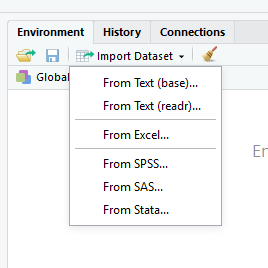
```

Una vez completado este paso, en el ambiente podremos ver listado un nuevo objeto llamado `datos`, ya que ese es el nombre que elegimos como identificador para el conjunto de datos devuelto por la función `read_delim()`. Allí también vemos una breve descripción que nos dice que `datos` tiene 80 observaciones (registros) de 9 variables (campos). Si hacemos clic sobre el nombre del objeto se abrirá una pestaña para que podamos explorar su contenido. Entonces... ¿qué tipo de objeto es `datos`?:

```{r}
class(datos)
```

Hasta ahora habíamos trabajado con tres tipos de datos básicos: numérico, carácter y lógico, y habíamos visto que con los mismos podíamos crear estructuras de datos como vectores, matrices o listas. Como indica la salida anterior, el objeto `datos` es de tipo `data.frame`, lo cual significa que es una estructura de datos bidimensional (como una matriz) en la cual cada fila representa a un registro y cada columna representa a uno de los campos del archivo, pudiendo entonces almacenar valores de distinto tipo en cada una de ellas (a diferencia de los arreglos, cuyos valores son todos homogéneos)^[Internamente, un `data.frame` es sencillamente una lista, compuesta por vectores de distinto tipo que tienen todos el mismo largo y que se organizan como columnas. Además, esta lista es almacenada junto con cierta información adicional (*atributos*) que nos permiten manipularla como una estructura tabular.].

Existen algunas funciones de R que nos permiten explorar el contenido de un `data.frame`:

```{r}
# Muestra los nombres de las columnas (campos del archivo)
names(datos)

# Muestra la "estructura" interna del dataset
str(datos)

# Muestra la cantidad de filas y columnas
dim(datos)

# Muestra la cantidad de filas
nrow(datos)

# Muestra la cantidad de columnas
ncol(datos)

# Muestra los primeros registros
head(datos)

# Muestra los últimos registros
tail(datos)

# Muestra un resumen de cada campo
summary(datos)
```

Un `data.frame` puede ser indexado de la misma forma empleada con matrices, por ejemplo:

```{r}
# Mostrar las filas 3 y 4, columnas 1 y 3
datos[3:4, c(1, 3)]
# Mostrar las filas 3 y 4, columnas "seleccion" y "participaciones"
datos[3:4, c("seleccion", "participaciones")]
```

Para hacer referencia exclusivamente a una variable dentro del `data.frame`, usamos el nombre del conjunto de datos, seguido por el operador `$` y el nombre de la variable, por ejemplo:

```{r}
datos$titulos
```

Lo anterior resulta en un vector, con el que se pueden hacer operaciones como buscar el valor máximo si queremos saber cuál es la cantidad máxima de títulos alcanzada:

```{r}
max(datos$titulos)
```

Si bien en los ejemplos anteriores vemos que en muchos aspectos los `data.frame`s son similares a las matrices, a partir de ahora vamos a ver cómo utilizar funciones que fueron especialmente pensadas para ayudarnos a transformar y explorar los conjuntos de datos que están guardados en objetos de tipo `data.frame` y que simplifican muchas tareas relacionadas al análisis de datos.

## Manejo de datos

### Editar o crear nuevas variables

Es muy común tener que modificar una variable existente o añadir una nueva, la cual puede depender de algún cálculo realizado a partir de otras columnas presentes en el dataset. Para cualquiera de estas actividades que implican *modificar* o *mutar* el dataset, emplearemos la función `mutate()`. Vamos a calcular la cantitad total que cada selección ha jugado en los mundiales a lo largo de toda la historia (`pj`), sumando la cantidad de partidos que ha ganado, empatado y perdido:

```{r}
datos <- mutate(datos, pj = pg + pe + pp)
```

¿Qué sucedió al correr esa instrucción?:

  - Como primer argumento de la función proveemos el dataset con el que vamos a operar, `datos`.
  - Elegimos en segundo lugar un nombre para una nueva variable, `pj` y la definimos como la suma de otras variables ya existentes.
  - El resultado es el dataset original con esta modificación y lo guardamos con el mismo nombre. Si hubiésemos elegido otro nombre, generaríamos una copia del dataset con la modificación, mientras conservamos el original sin cambios.

Al editar variables, podemos elegir entre sobrescribir o no una columna existente, así como también entre sobrescribir o no el conjunto de datos de partida. Para pensar... sin ejecutarlas, responder: ¿cuál es la diferencia entre las siguientes instrucciones?

```{r, eval=F}
# Sentencia (a)
datos <- mutate(datos, pj = pg + pe + pp)

# Sentencia (b)
datos_modif <- mutate(datos, pj = pg + pe + pp)

# Sentencia (c)
datos <- mutate(datos, pg = pg + pe + pp)
```

Otras situaciones requieren que en lugar de *mutar* de la misma forma toda una columna, los cambios dependan de alguna condición que los registros verifiquen o no. Por ejemplo, agreguemos una nueva variable que indique si cada país es o no campeón del mundo, en función de los valores disponibles en la variable `titulos`. Vamos a crear una nueva columna que se llame `campeon` y tenga el valor `si` cuando `titulos > 0` y `no` en caso contrario, ayudándonos con la función `ifelse()`, la cual nos permite establecer una evaluación lógica y dos cursos de acción, en base a que esta resulte verdadera (`TRUE`) o falsa (`FALSE`).

```{r}
datos <- mutate(datos, campeon = ifelse(titulos > 0, "si", "no"))
```

Inspeccionamos la nueva columna, sumando una nueva función del `tidyverse`, `count()`. Sólo 8 países han ganado el mundial alguna vez (¡y Argentina es uno de ellos!):

```{r}
count(datos, campeon)
```

La función anterior es muy útil para chequear los valores guardados en atributos de tipo texto. Usémosla para inspeccionar la variable `continente`. ¿Hay algo que nos llame la atención?

```{r}
count(datos, continente)
```

Detectamos inconsistencias en la forma de registrar los nombres de los continentes: Europa aparece en inglés y en español, Asia aparece con mayúscula y con minúscula. Debemos homogeneizar la nomenclatura para poder hacer cualquier análisis válido. En este caso, en el cual la corrección implica sólo "recodificar" categorías, podemos usar la función `recode()` de forma muy sencilla. Aquellos registros con `"Europe"` en `continente` son reemplazados por `"Europa"`, y lo mismo ocurre con `"asia"`, que será reemplazado por `"Asia"`. Los otros valores quedan como estaban:
  
```{r}
datos <- mutate(datos, continente = recode(continente, "Europe" = "Europa", "asia" = "Asia"))
count(datos, continente)
```

Ediciones que requieran evaluaciones lógicas más complejas pueden realizarse con la función `case_when()`, que para cada fila del dataset realiza una evaluación lógica. Si resulta `TRUE`, devuelve el valor mencionado al lado del `~`. Si resulta `FALSE`, continúa evaluando la siguiente operación lógica.

```{r, eval = F}
datos <- mutate(
	datos, 
	continente = case_when(
		continente == "Europe" ~ "Europa",
		continente == "asia" ~ "Asia",
		TRUE ~ continente # opción por defecto
		)
	)
```

<div class="alert alert-warning">
**Ejercicio**: agregar nuevas columnas en las que se muestre:

a) Crear una nueva variable llamada `puntos` que indique cuál es el puntaje total obtenido por cada selección a lo largo del tiempo, teniendo en cuenta que cada partido ganado aporta 3 puntos, cada partido empatado aporta 1 punto y cada partido perdido aporta 0 puntos.

b) Crear una nueva variable llamada `dg`, diferencia de goles, definida como la resta entre los goles a favor y los goles en contra. 

*Tip*: en `mutate()` podemos poner muchas modificaciones juntas, separándolas con coma.
</div>

```{r, echo=FALSE}
datos <- mutate(
	datos,
	puntos = 3 * pg + pe,
	dg = gf - gc
)
```

### Renombrar atributos

Para cambiar los nombres de una o más variables usamos la función `rename()`, listando los cambios con la estructura `nombre_nuevo = nombre_viejo`. Por ejemplo:
    
```{r}
datos
datos <- rename(datos, goles_favor = gf, goles_contra = gc)
datos
```

### Unir o separar columnas

En ocasiones puede ser necesario generar una nueva variable "pegando" o uniendo los datos presentes en otras. Imaginemos que tal vez necesitamos contar con una única variable textual que contenga tanto el nombre del país como el continente al que pertenece. Para esto recurrimos a la función `unite()`:
    
```{r}
datos <- unite(datos, col = "pais_continente", seleccion, continente, sep = " - ", remove = FALSE)
datos
```

La opción `remove = FALSE` hace que las columnas que se usaron para unir permanezcan en el dataset luego de este cambio. El comportamiento por defecto es eliminarlas. Si lo que nos interesa es separar en dos columnas información que esté concatenada en una sola, usamos la contrapartida, `separate()`:

```{r, eval=FALSE}
separate(datos, col = pais_continente, into = c("seleccion", "continente"), sep = " - ")
```

Por defecto estas funciones utilizan como separador cualquier carácter no alfanumérico que figure en ese campo, incluidos los espacios. El argumento `sep` se utiliza para indicar el separador adecuado cuando el establecido por defecto no es adecuado. La separación se podría hacer en más de dos columnas, de ser necesario, cuando el separador elegido aparece más de una vez.
  
### Filtrar y ordenar registros

Podemos quedarnos sólo con los registros que cumplan con ciertas condiciones utilizando la función `filter()`:

```{r, eval=F}
# Una condición
datos_america <- filter(datos, continente == "América")
nrow(datos_america)

# Dos condiciones
datos_campeones_america <- filter(datos, continente == "América", campeon == "si")
nrow(datos_campeones_america)
# Alternativa equivalente: filter(datos, continente == "América" & campeon == "si")

# Al menos una de las primeras condiciones ("o") y la segunda
datos_filtro <- filter(datos, continente == "América" | campeon == "si", participaciones > 10)
nrow(datos_filtro)
```

Para ordenar los registros según el orden creciente o decreciente en una columna, podemos usar la función `arrange()`:
  
```{r, eval=F}
# Orden creciente:
arrange(datos, puntos)

# Orden decreciente:
arrange(datos, desc(puntos))

# Ordenar según más de una variable:
arrange(datos, america, desc(titulos))
```

<div class="alert alert-warning">
**Ejercicio**: filtrar el conjunto de datos original para quedarse con los países que tengan una diferencia de goles positiva y guardar estos registros en un nuevo `data.frame` llamado `datos_dg_positiva`.
</div>

```{r, echo=FALSE, eval=FALSE}
datos_dg_positiva <- filter(datos, dg > 0)
```

### Seleccionar y reordenar columnas

Podemos elegir quedarnos sólo con algunas columnas del dataset con la función **select()**:

```{r, eval=F}
# Elegir cuáles quedan
select(datos, seleccion, participaciones)

# Elegir cuáles se van
select(datos, -goles_favor, -goles_contra)

# Reordenar las columnas
select(datos, seleccion, campeon, puntos, everything())
```

## Tuberías o *pipes*

Hasta ahora, esto es parte de lo que hicimos con los datos de los mundiales:

```{r, eval=FALSE}
# Lectura del archivo
datos <- read_delim("mundiales.txt")

# Calcular la cantidad total de partidos jugados en mundiales
datos <- mutate(datos, pj = pg + pe + pp)

# Indicar si cada país es o no campeón del mundo
datos <- mutate(datos, campeon = ifelse(titulos > 0, "si", "no"))

# Corregir los nombres de los continentes
datos <- mutate(datos, continente = recode(continente, "Europe" = "Europa", "asia" = "Asia"))

# Calcular los puntos ganados por cada país y la diferencia de goles
datos <- mutate(datos, puntos = 3 * pg + pe, dg = gf - gc)

# Cambiar los nombres de algunas columnas
datos <- rename(datos, goles_favor = gf, goles_contra = gc)

# Crear una nueva variable con el nombre del país y del continente
datos <- unite(datos, col = "pais_continente", seleccion, continente, sep = " - ", remove = FALSE)
```

En todas las instrucciones anteriores se repite la misma estructura: cada función toma el dataset, lo modifica y lo guarda, y esto se convierte en el input para la próxima función. Se puede escribir todo junto de manera más cómoda usando una **tubería** o **pipeline**. En una **tubería** el resultado de cada línea es el input para la línea siguiente (por eso eliminamos en cada función el primer argumento, el nombre del dataset). El símbolo `%>%`, conocido como *pipe*, es la unión entre las partes de la tubería^[También podemos usar el operador `%>%`.]. El atajo para escribir este operador de forma rápida con el teclado es `CTRL + Shift + M`. El `data.frame` devuelto por la última función de la tubería es guardado en el objeto cuyo nombre se indica al comienzo.

```{r, eval=FALSE}
datos <- 
	read_delim("mundiales.txt") %>% 
	mutate(
		pj = pg + pe + pp,
		campeon = ifelse(titulos > 0, "si", "no"),
		continente = recode(continente, "Europe" = "Europa", "asia" = "Asia"),
		puntos = 3 * pg + pe, 
		dg = gf - gc
	) %>% 
	rename(goles_favor = gf, goles_contra = gc) %>% 
	unite(col = "pais_continente", seleccion, continente, sep = " - ", remove = FALSE)
```

```{r, eval=FALSE, echo=FALSE}
datos <- 
	read_delim("archivos/mundiales.txt") %>% 
	mutate(
		pj = pg + pe + pp,
		campeon = ifelse(titulos > 0, "si", "no"),
		continente = recode(continente, "Europe" = "Europa", "asia" = "Asia"),
		puntos = 3 * pg + pe, 
		dg = gf - gc
	) %>% 
	rename(goles_favor = gf, goles_contra = gc) %>% 
	unite(col = "pais_continente", seleccion, continente, sep = " - ", remove = FALSE)

write.table(datos, "archivos/mundiales_procesado.txt", quote = FALSE, row.names = FALSE, sep = "\t")
```

## Escritura de conjuntos de datos en archivos

Todas las modificaciones que hicimos del `data.frame` con los ejemplos anteriores no modificaron el archivo original `mundiales.txt` que reside en el disco rígido de nuestra computadora, sino que sirvieron para modificar al objeto `datos` que reside en la memoria temporal durante la ejecución de la sesión de R. Si al terminar con el procesamiento de los datos queremos generar un nuevo archivo permanente con la nueva versión del dataset, tenemos que hacer algo específico para eso. R provee una gran variedad de funciones para guardar todo el contenido de un objeto de tipo `data.frame` en un archivo, como se muestra en los ejemplos que siguen, en los que plasmamos la versión actual del `data.frame` en un nuevo archivo llamado `mundiales_procesado`. En cada ocasión, generamos un tipo de archivo distinto:

```{r, eval=FALSE}
# Guardarlo en un archivo de texto separado por tabulaciones
write.table(datos, "mundiales_procesado.txt", quote = FALSE, row.names = FALSE, sep = "\t")

# Guardarlo en un archivo de texto separado por comas
write.csv(datos, "mundiales_procesado.txt", quote = FALSE, row.names = FALSE)

# Guardarlo en un archivo de Excel
# install.packages("writexl")
library(writexl)
write_xlsx(datos, "mundiales_procesado.xlsx")
```

## Resumen de datos

Una vez que los datos han sido organizados y limpiados según corresponda, el siguiente paso de cualquier análisis es hacer un breve análisis exploratorio. En esta sección veremos cómo calcular algunas estadísticas y realizar tablas de distribuciones de frecuencias, ya sea para variables categóricas o cuantitativas.

### Cálculo de estadísticas

Imaginemos ahora que queremos saber cuántas veces en promedio han participado estas 80 selecciones del mundial. Esto se puede lograr de manera muy sencilla con `mean()`:

```{r}
mean(datos$participaciones)
```

Otra alternativa es utilizar la función `summarise()` del `tidyverse`:

```{r}
summarise(datos, total = mean(participaciones))
```

Si bien ésta última forma parece ser más compleja, tiene algunas ventajas:

- Devuelve el resultado como un objeto de tipo `data.frame`, que puede ser usado como "materia prima" en otros análisis.
- Permite resumir muchas variables a la vez, en general o por grupos, aplicando uno o varios cálculos de resumen.

Por ejemplo, si queremos obtener el puntaje promedio obtenido por las selecciones de cada continente utilizamos `summarise()` en conjunto con `group_by()`, relacionando ambas funciones en una tubería:

```{r}
datos %>% 
	group_by(continente) %>% 
	summarise(prom_puntos = mean(puntos))
```

Podemos seguir alargando la tubería, para pedir que el resultado anterior se presente de forma descendente, de modo que veamos rápidamente cuál es el continente con mayor promedio de puntos obtenidos:

```{r}
datos %>% 
	group_by(continente) %>% 
	summarise(prom_puntos = mean(puntos)) %>% 
	arrange(desc(prom_puntos))
```

Dentro de `summarise()` podemos pedir más de un resumen:

```{r}
datos %>% 
	group_by(continente) %>% 
	summarise(
		prom_puntos = mean(puntos),      # promedio de los puntos de los países
		min_puntos = min(puntos),        # mínimo puntaje en ese continente
		max_puntos = max(puntos),        # máximo puntaje en ese continente
		total_titulos = sum(titulos),    # mundiales ganados por países del continente
		total_pj = sum(pj),              # cantidad total de partidos jugados
		prom_dg = mean(dg),              # promedio de la diferencia de goles
		n = n()                          # cantidad de registros en cada continente
	) 
```

### Distribuciones de frecuencias

* Cuando trabajamos con variables categóricas, una herramienta indispensable son las **tablas de frecuencias**.

* En una tabla de este tipo representamos la cantidad de unidades que poseen cierta característica, haciendo mucho más fácil la comparación entre categorías de una misma variable.

* Supongamos que nos interesa estudiar las ganancias obtenidas en cada operación, dividiendo sus valores según las consideremos "altas, "medias" o "bajas".

- Para esto podemos *recategorizar* la variable `profit` y luego usar la ya conocida función `table()`:

```{r}
datos <- datos %>% 
	mutate(
		nivel = case_when(
			profit < 0 ~ "Negativo",
			profit < 10 ~ "Bajo",
			profit < 100 ~ "Medio",
			TRUE ~ "Alto"
		)
	)

tabla1 <- table(datos$nivel)
tabla1
```

* A estos valores se los denomina la **Frecuencia Absoluta** de cada categoría.

* Para darles un orden adecuado a las categorías usamos la función `factor()`:

```{r}
datos <- datos %>% 
	mutate(
		nivel = factor(nivel, levels = c("Negativo", "Bajo", "Medio", "Alto"))
	)

tabla1 <- table(datos$nivel)
tabla1
```

* Podemos calcular **frecuencias relativas** (proporciones) dividiendo las absolutas por el total para facilitar la interpretación:

```{r}
prop.table(tabla1)
```

* Las tablas de frecuencia también son útiles para estudiar la relación entre dos variables categóricas al mismo tiempo.

* Una pregunta que puede surgir es: **¿qué categoría de productos produce mayor cantidad de ganancias catalogadas como altas?**

* Observemos ahora cómo se distribuyen de forma conjunta las variables `category` y `nivel` en una **tabla a doble entrada**, también llamada *tabla de contingencia*:

```{r}
tabla2 <- table(datos$category, datos$nivel)
tabla2
```

* Analizar las frecuencias absolutas en una tabla a doble entrada no es la única manera posible de interpretar los datos.

* Una de las opciones que tenemos es dividir cada valor por el total de unidades, obteniendo así una tabla de frecuencias relativas:

```{r}
prop.table(tabla2)
```

* Tal vez sea más interesante dividir cada frecuencia por el total de su respectiva categoría, para saber cómo se distribuyen las ganancias dentro de cada una.

* De esta manera obtenemos la **distribución condicional del nivel de ganancias en cada categoría**. Cada fila suma "100%":

```{r}
prop.table(tabla2, margin = 1)
```


* Usando `margin = 2` la división se hace con los totales por columna y obtenemos la **distribución condicional de categoría en cada nivel de ganancia**:

```{r}
prop.table(tabla2, margin = 2)
```

**Paquete janitor**

- `janitor` es un paquete que trae funciones muy útiles para examinar y limpiar "datos sucios" que vale la pena [explorar](https://github.com/sfirke/janitor). No forma parte del `tidyverse` pero está creado con el mismo diseño.

- Vamos a tomar de este paquete algunas funciones útiles para generar tablas de frecuencias.

```{r, fig.show='hold', echo=FALSE, fig.align="center", out.width='20%'}
knitr::include_graphics('Plots/janitor.png')
```

- Si analizamos una única variable categórica, la función `tabyl()` nos presenta tanto las frecuencias absolutas como las relativas y además si hay `NA`s, agrega una columna adicional (`valid_percent`) con las frecuencias calculadas sin contemplarlos.

```{r}
library(janitor)
tabyl(datos, nivel)
```

- Cuando la usamos con dos variables, nos provee un tabla de contingencia con frecuencias absolutas.

```{r}
tabyl(datos, category, nivel)
```

- Lo interesante es que podemos cambiar la apariencia y la información mostrada con la familia de funciones `adorn_`:

  - Con `adorn_totals()` elegimos agregar totales marginales por fila, por columna o por ambos.
  - Con `adorn_percentages()` podemos pedir frecuencias relativas en lugar de absolutas, ya sea de la distribución conjunta (`all`), condicionada a la fila (`row`) o a la columna (`col`).
  - Con `adorn_pct_formatting()` elegimos el formato para mostrar los porcentajes.
  - Con `ns()` le agregamos los conteos entre paréntesis.
  - Con `adorn_title()` configuramos la apariencia de los nombres de las filas y columnas.

```{r}
datos %>% 
  tabyl(category, nivel) %>% 
  adorn_totals(c("row", "col")) %>% 
  adorn_percentages("row") %>%
  adorn_pct_formatting(digits = 1) %>%
  adorn_ns() %>% 
  adorn_title(placement = "combined", "Categoría", "Nivel")
```

- El `tidyverse` también nos permite hacer conteos como los anteriores mediante la función `count()`, ya sea para una sola variable o para las combinaciones de categorías de más de una, pero ofrece los resultados como un data.frame en el que cada fila se corresponde con una celda de la tabla.

- Si bien para presentación de resultados este formato no es lo más cómodo, es sumamente útil para ser utilizado como *input* en otros análisis, por ejemplo, para hacer gráficos.

```{r}
count(datos, nivel)
count(datos, nivel, sort = TRUE)
count(datos, category, nivel)

# Análogo a tabyl(), pero una fila por celda:
datos %>%
  group_by(category, nivel) %>%
  summarise(n = n()) %>%
  mutate(frec_rel = prop.table(n))
```

* En ciertas ocasiones puede ser que nos interese agregar en el dataset una columna que diga cuántas observaciones hay en el grupo al que pertenece cada observación, de acuerdo con algún criterio de agrupación. Esto lo podemos hacer con la función `add_count()`:

```{r, eval=FALSE}
add_count(datos, nivel) #Ver en RStudio
```


## Creación de archivos y escritura de resultados

Anteriormente hemos mencionado que cuando trabajamos con archivos podemos realizar acciones tanto de lectura como de escritura, aunque hasta el momento nos hemos limitado a leer registros de un archivo. En este apartado presentamos cómo crear un archivo de texto desde R, de manera que pueda utilizarse para escribir y guardar allí los resultados obtenidos.

### Crear un archivo para guardar resultados

Imaginemos que en el problema del hotel, en lugar de mostrar los resultados en la consola, queremos volcarlos en un archivo de texto llamado `resultados.txt`.

En R, la función `sink()` permite escribir en un archivo de texto todos los resultados que habitualmente vemos en la consola. Sus argumentos son:

- `file`: nombre del archivo, si no existe será creado. Se guarda en el directorio de trabajo actual, a menos que indiquemos aquí la ruta completa hacia otra carpeta.
- `append`: si el archivo ya existía, por default lo sobreescribe (borra lo anterior), a menos que indiquemos `append = TRUE` para que agregue nuevas línea sin borrar nada.
- `split`: por default mientras la conexión al archivo está activa, los resultados que enviamos al mismo no se muestran en la consola de R, a menos que indiquemos `split = TRUE`, en cuyo caso sucederán ambas cosas: los resultados serán escritos en el archivo y se verán en la consola.

Cuando se desea cerrar la conexión al archivo, se debe correr `sink()` sin ningún argumento. Todo lo que *imprimamos* con `cat()` entre ambos llamados a `sink()` se guardará en el archivo. La última parte del código en el problema anterior debe ser:

```{r, eval=FALSE}
# Crear conexión al archivo de resultados y poner un encabezado
sink(file = "salida.txt", append = TRUE, split = TRUE)
cat("==========================================\n")
cat("            ARCHIVO DE RESULTADOS         \n")
cat("==========================================\n\n")

# a) Mostrar la tabla
cat("Número de reservas durante el 2021 según mes y tipo de habitación\n")
cuadro

# b) Determinar el total de pernoctaciones en el hotel durante el 2021
cat("\nEl número total de pernoctaciones en el hotel durante el 2021 fue", pernoc, "\n\n")

# c) Determinar cuál fue el mes de mayor cantidad de reservas
res <- maximo(total_fila)
cat("El mes de mayor cantidad de reservas fue", meses[res[2]], "con", 
    res[1], "reservas.\n\n")

# d) Determinar para cada tipo de habitación el mes con menor número de reservas
for (j in 1:3) {
	res <- minimo_matriz_col(tabla, j)
	cat("Para las habitaciones de tipo", tipos[j], 
	    "el mes con menor\n     número de reservas fue", 
	    meses[res[2]], "con", res[1], "reservas.\n")
}

# Cerrar conexión al archivo
sink()
```


## Lectura opcional

### Otros ejemplos para obtener resúmenes

Cuando aplicamos el mismo tipo de resumen a varias variables (en este caso, la media), podemos usar `across`:

```{r}
datos %>% 
	group_by(continente) %>% 
	summarise(across(c(goles_favor, goles_contra), mean))
```

Podemos aplicar el mismo tipo de resumen para todas las variables que tengan alguna característica en particular, por ejemplo, ser numéricas:

```{r, eval=FALSE}
datos %>% 
	group_by(continente) %>% 
	summarise(across(where(is.numeric), mean))
```

### Cambiar el formato de un `data.frame`

Dependiendo de los requerimientos de los análisis que estemos realizando, es muy frecuente necesitar cambiar el formato que tienen los datos. Por ejemplo, puede ser necesario apilar columnas una debajo de otra, resultando en un dataset con más filas (más largo) y menos columnas (más angosto). La situación contraria también se puede presentar y consiste en desacoplar información concatenada en una sola columna para ubicarla en varias columnas adyacentes, resultando en una dataset con más columnas (más ancho) y menos filas (más corto). Por supuesto, estas transformaciones tienen que hacerse sin mezclar los registros:

```{r, fig.show='hold', echo=FALSE, fig.align="center", out.width="60%"}
knitr::include_graphics('images/06_archivos/tidyr-longer-wider.gif')
```

**Formato ancho a largo**

Armemos un pequeño ejemplo de juguete para imaginar bien de qué se trata esto. Supongamos que tenemos datos con la cantidad vendida de 3 productos en distintos meses. De la siguiente forma se puede crear un `data.frame` "a mano", sin leer los datos desde un archivo:

```{r}
ejemplo1 <- data.frame(
  producto = 1:3,
  septiembre = c(234, 657, 989),
  octubre = c(841, 621, 589),
  noviembre = c(521, 147, 258)
)
ejemplo1
```

A ese formato le decimos "ancho" porque una misma variable (cantidad de ventas) se ubica en muchas columnas, cuyos nombres se confunden con lo que en realidad debe ser otra variable, el mes. Queremos pasarlo a un formato largo para que se vea así:

```{r, echo=FALSE}
pivot_longer(data = ejemplo1, cols = c(septiembre, octubre, noviembre), names_to = "mes", values_to = "ventas")
```

Lo logramos con la función `pivot_longer()`, cuyos argumentos son:

  - **data**: el dataset que vamos a modificar
  - **cols**: columnas que queremos apilar (o las que no queremos apilar, si es más fácil de indicar)
  - **names_to**: cómo queremos que se llame la nueva columna que contendrá los nombres de las columnas apiladas.
  - **values_to**: cómo queremos que se llame la nueva columna que contendrá los valores de las columnas apiladas.

```{r, fig.show='hold', echo=FALSE, fig.align="center", out.width="60%"}
knitr::include_graphics('images/06_archivos/original-dfs-tidy.png')
```

```{r}
ejemplo2 <- pivot_longer(
  data = ejemplo1, 
  cols = c(septiembre, octubre, noviembre), 
  names_to = "mes", 
  values_to = "ventas"
)
ejemplo2
```

**Formato largo a ancho**

A su vez, la función `pivot_wider()` permite pasar de **formatos largos** a **formatos anchos** (al revés de `pivot_longer()`):

```{r, out.width="60%", echo=F}
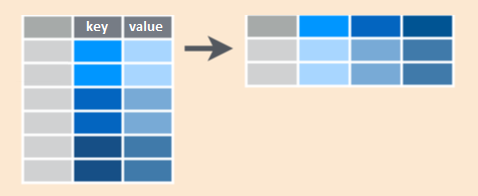
```
  
Podríamos usarlo si queremos volver a la versión original de la base. Para ello necesitamos usar estos argumentos:

  - **data**: el dataset
  - **names_from**: columna que tiene los nombres de las nuevas columnas
  - **values_from**: columna que tiene los valores que se distribuirán en las nuevas columnas

```{r}
pivot_wider(
  data = ejemplo2, 
  names_from = mes, 
  values_from = ventas
)
```

### Fusionar varios `data.frames`

Muchas veces, los análisis de datos involucran múltiples tablas o conjuntos de datos, los cuales deben combinarse para dar respuesta a las preguntas de interés.. En estos casos importan las **relaciones** que se establecen entre las bases, más allá de los datos individuales que contenga cada uno de ellas. `R` nos ofrece diversas alternativas, las cuales dependen del tipo de relación que deseemos establecer entre los conjuntos de datos. Para definir estas relaciones debemos establecer qué variable funcionará como `key` o clave identificadora de los casos. Esta `key` debe figurar en ambos conjuntos de datos y representar lo mismo para que tenga sentido la relación. Las fusiones pueden clasificarse en dos grupos: las que producen modificaciones en uno de los conjuntos (*mutating joins*) y las que actúan como filtros (*filtering joins*).

**Mutating Joins**

Son funciones que permiten unir conjuntos de datos, agregando en uno de ellos nuevas variables que provienen del otro, a partir las filas con `key` coincidente:

    - `left_join()`
    - `right_join()`
    - `inner_join()`
    - `full_join()`

Hacen una *mutación* en el sentido de que añaden columnas a uno de los conjuntos. Consideremos los siguientes conjuntos de datos, donde *X1* será la clave:

```{r, warning=F, eval=T}
Datos1 <- data.frame(X1 = c("A", "B", "C"), X2 = c(1, 2, 3))
Datos2 <- data.frame(X1 = c("D", "B", "A"), X3 = c(9, 7, 5))
```

```{r, fig.show='hold', echo=FALSE, fig.align="center", out.width='40%'}
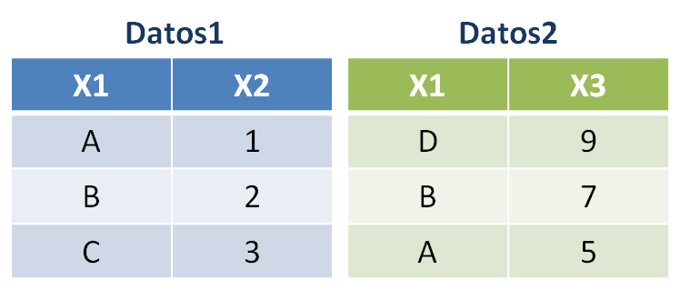
```

Veamos los distintos tipos de *mutating joins*:

- `left_join()`: esta opción devuelve un conjunto de datos que contiene todas las filas de la tabla de la izquierda, agregando las columnas de la tabla de la derecha.
	
	```{r, warning=F, eval=T}
	DatosUnidos <- left_join(Datos1, Datos2, by = "X1")
	```
	
	```{r, fig.show='hold', echo=FALSE, fig.align="center", out.width='70%'}
	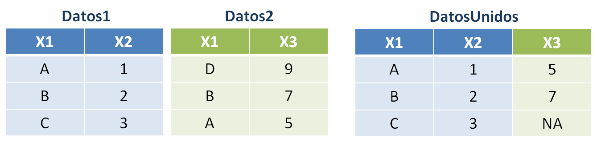
	```

- `right_join()`: devuelve un conjunto de datos que contiene todas las filas de la tabla de la derecha y agrega columnas de la tabla izquierda.
	
	```{r, warning=F, eval=T}
	DatosUnidos <- right_join(Datos1, Datos2, by = "X1")
	```
	
	```{r, fig.show='hold', echo=FALSE, fig.align="center", out.width='70%'}
	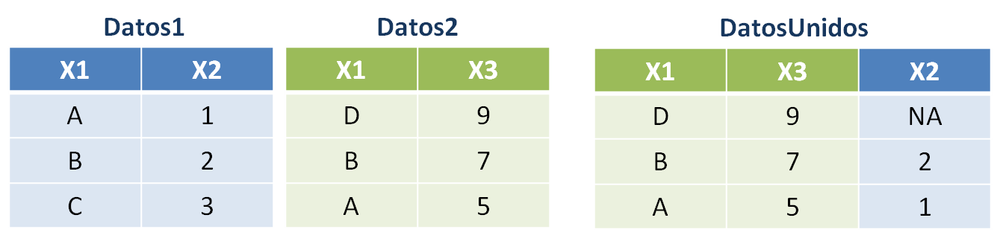
	```

- `inner_join()`: devuelve un conjunto de datos con todas las columnas pero sólo para las observaciones (filas) cuyos identificadores se repiten en ambos conjuntos de datos.
	
	```{r, warning=F, eval=T}
	DatosUnidos <- inner_join(Datos1, Datos2, by = "X1")
	```
	
	```{r, fig.show='hold', echo=FALSE, fig.align="center", out.width='70%'}
	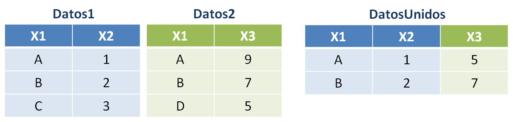
	```

- `full_join()`: devuelve un conjunto de datos con todas las filas y columnas, fusionando a través de la `key` para las filas coincidentes entre ambos conjuntos.

	```{r, warning=F, eval=T}
	DatosUnidos <- full_join(Datos1, Datos2, by = "X1")
	```
	
	```{r, fig.show='hold', echo=FALSE, fig.align="center", out.width='70%'}
	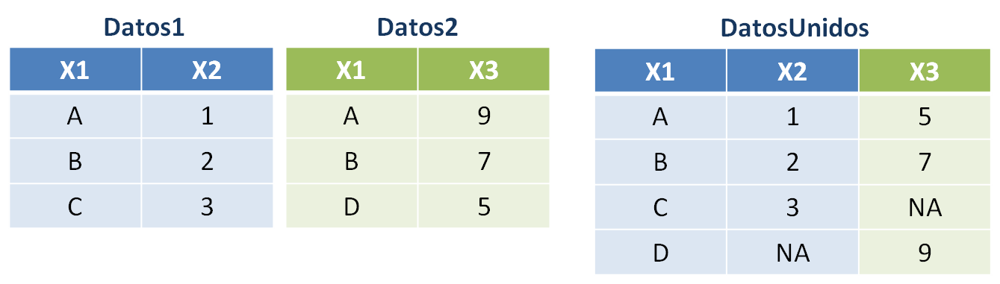
	```

**Filtering Joins**

Son funciones que permiten unir las observaciones de dos datasets, pero sólo afectan a las filas sin alterar las columnas o variables. Funcionan como un **filtro** para las observaciones de una base de datos, de acuerdo a si *están* o *no están* (según el sentido que se elija) en otra base de datos:

- `semi_join()`: devuelve todas las observaciones que están en `Datos1` que también están en `Datos2`, manteniendo sólo las columnas de `Datos1`. La relación se piensa como en `inner_join()`, pero el resultado es sólo la base `Datos1` filtrada. 
	
	```{r, warning=F, eval=T}
	DatosFiltrados <- semi_join(Datos1, Datos2, by = "X1")
	```
	
	```{r, fig.show='hold', echo=FALSE, fig.align="center", out.width='70%'}
	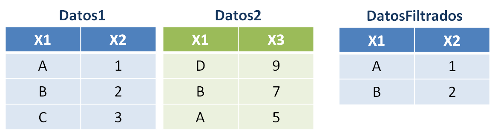
	```

- `anti_join()`: devuelve aquellas observaciones que están en `Datos1` pero **no están** en `Datos2`, manteniendo las columnas de `Datos1`. Es el filtro contrario a `semi_join()`.
	
	```{r, warning=F, eval=T}
	DatosFiltrados <- anti_join(Datos1, Datos2, by = "X1")
	```
	
	```{r, fig.show='hold', echo=FALSE, fig.align="center", out.width='70%'}
	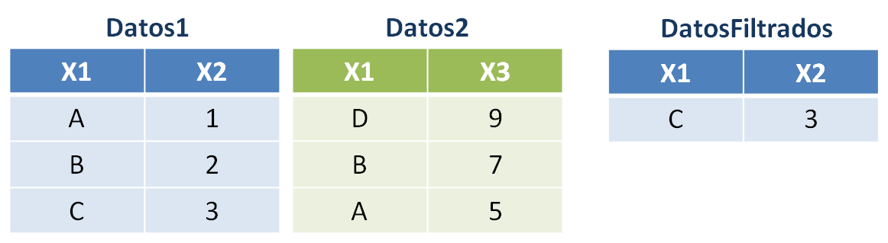
	```

**Otros detalles sobre las keys**

Hasta ahora hemos visto ejemplos donde las columnas que se usaron como claves identificadoras tenían valores únicos, sin repetir. Si la clave identificadora está duplicada en una de las bases de datos, la relación que `R` brindará con las funciones `*_join()` será del tipo "uno a varios":
    
```{r, eval=F, size="tiny"}
d1 <- data.frame(
  val_x = c("x1", "x2", "x3", "x4"), 
  key = c(1, 2, 2, 1)
)

d2 <- data.frame(
  key = c(1, 2), 
  val_y = c("y1", "y2")
)

full_join(d1, d2)
```

```{r, fig.show='hold', echo=FALSE, fig.align="center", out.width='50%', size="tiny"}
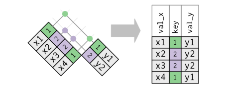
```

Si ambas bases de datos tienen claves duplicadas, las funciones `*_join()` devuelven todas las combinaciones posibles: 
    
```{r, eval=F, size="tiny"}
d1 <- data.frame(
  val_x = c("x1", "x2", "x3", "x4"),
  key = c(1, 2, 2, 3)
)

d2 <- data.frame(
  key = c(1, 2, 2, 3),
  val_y = c("y1", "y2", "y3", "y4")
)

full_join(d1, d2)
```

```{r, fig.show='hold', echo=FALSE, fig.align="center", out.width='50%', size="tiny"}
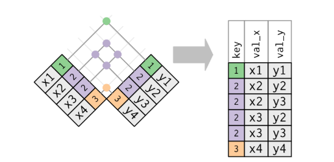
```

Muchas veces nos interesa que las observaciones de los conjuntos de datos se relacionen a través de más de una variable, es decir, queremos identificar a cada registro a través de más de una columna. En este caso tenemos 2 opciones:
    
1. Inventar una nueva variable identificadora (`key`) que de algún modo contenga la información de esas variables e identifique a cada observación de manera única (por ejemplo, pegar ambas columnas en una sola).

2. Indicarle directamente en `R` que la relación entre las bases de datos debe hacerse a través de varias variables. En el argumento `by` de las funciones `*_join()` ponemos el vector de variables `by = c(Vble1, Vble2, Vble3)` mediante las cuales queremos que se relacionen las bases.

Por defecto, los conjuntos de datos se unen a través de todas las variables que llevan el mismo nombre en ambos conjuntos, lo que suele denominarse **unión natural**. Si usamos `by` para indicar qué columnas vinculan ambas bases, y entre las columnas no mencionadas quedan variables con el mismo nombre en los dos conjuntos, entonces estas aparecerán repetidas en el dataset resultante, con una extensión en su nombre para identificar su origen (*nombre_columna.x, nombre_columna.y*).

Las variables usadas como `key` podrían no tener el mismo nombre en ambos conjuntos de datos. Por ejemplo, si en Datos1 tenemos *DNI* y en Datos2 tenemos *Documento*, no es necesario renombrar estas columnas: al indicar **`by = c("DNI" = "Documento")`**, R las reconoce como la misma variable, las utilizará como clave y conservará el primer nombre (*DNI* en este ejemplo). 

<!-- PENDIENTE: para ejemplificar fusiones, podria preparar un archivo que tenga un lsitado de todos los paises que fueron sede del mundial, dos columnas, seleccion y cantidad de veces que fue sede, y hacer la fusion con el conjunto original -->
