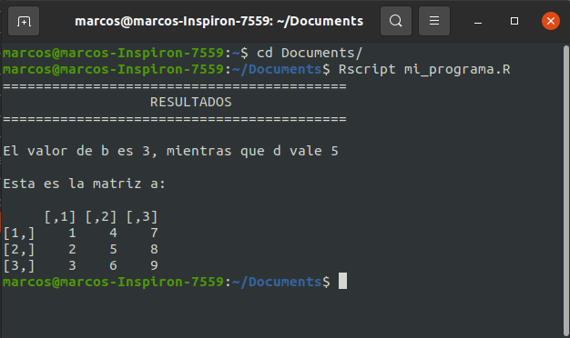
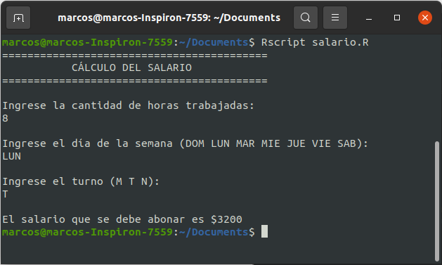
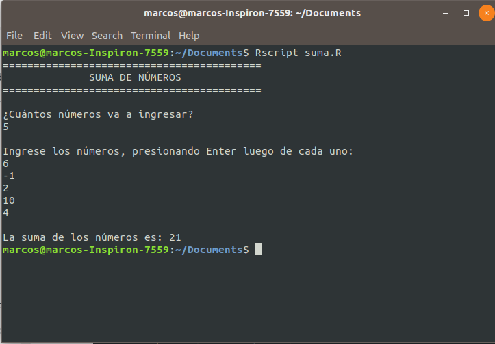

# Otros tópicos

Las reglas que aprendimos para escribir el pseudocódigo nos permiten traducir nuestros algoritmos a cualquier lenguaje de computación de manera muy general y sencilla. Sin embargo, cada lenguaje de programación tiene diseñado su propio conjunto de funciones y estructuras de datos que facilitan algunas tareas. Una vez que hemos incorporado los conceptos básicos de la programación, podemos dedicarnos a aprender las profundidades de un lenguaje en particular.

En este capítulo vamos mencionar algunas cosas útiles sobre R.

## La consola

Cuando prendemos nuestra computadora nos encontramos con una interfaz gráfica implementada por el sistema operativo para que podamos hacer lo que necesitemos de manera sencilla usando ventanas y menúes, interactuando con el sistema a través del mouse, teclado, micrófono o pantalla táctil. Sin embargo, es posible usar la compu de otra forma, escribiendo comandos especiales en una ventanita, llamada **consola** que es capaz de interpretarlos para hacer cualquier tipo de actividad, sin utilizar la interfaz gráfica. Años atrás, esta era la única manera disponible de usar la computadora (por ejemplo, con sistema operativo MS-DOS de Windows).

Saber usar la consola es muy útil para automatizar actividades, realizar tareas administrativas, manipular varios archivos u objetos en simultáneo, lanzar a correr proyectos grandes, conectarse de manera remota a un servidor, etc. La primera vez que uno se mete en esto puede ser intimidante, pero no hay que olvidar que ya estamos acostumbrados a usar la consola de R, con lo cual esto de escribir comandos e interpretar respuestas es algo familiar.

Los términos *terminal*, *consola*, *shell* y *línea de comandos* son términos que a veces se usan como sinónimos sin demasiada preocupación, como si fuesen distintas formas de llamar a lo mismo: una ventanita donde puedo escribir comandos y hacer que sucedan cosas en la computadora. Sin embargo, hay pequeñas diferencias entre estos conceptos, que acá tratamos de resumir (aunque ni siquiera entre informáticos hay mucho acuerdo en las definiciones):

- **Shell** (intérprete de línea de comandos): es software, es un programa que corre otros programas, procesa los comandos que recibe y devuelve resultados Ejemplo: Bash (la más común en sistemas Linux), sh, PowerShell, etc.
- **Terminal**: un programa que propicia la transferencia de input/output entre el usuario y la shell. No ejecuta comandos, pero recibe los comandos que el shell va a procesar. Ejemplos: Command prompt, guake, gnome-terminal, etc. Antiguamente, se trataba de las múltiples estaciones con un monitor y un teclado que una gran computadora tenía para ser usada por varias personas.
- **Consola**: un tipo particular de terminal, con una ventana escribir inputs y leer outputs. Históricamente, se trataba de un panel físico (consola) con controles. Siri o Cortana podrían considerarse terminales, pero no son consolas, ya que no hay que escribir para mandar comandos. Terminal y consola se usan prácticamente como sinónimos.

Para abrir una terminal en Linux se puede usar el atajo `ctrl + alt + t` y en Windows se puede escribir `cmd` en Inicio. Si bien hay muchísimos comandos para utilizar, acá vamos a mencionar algunos como ejemplo:

- Mostrar en qué carpeta (directorio) de la compu estamos situados: *pwd* en Linux o *cd* en Windows
- Listar todos los archivos y carpetas que tenemos en el directorio actual: *ls*
- Entrar a una subcarpeta desde el directorio en el que estamos: *cd nombresubcarpeta*
- Ver la ayuda de los comandos: *help*
- Limpiar la consola: *cls* en Windows o *clear* en Linux
- Cerrar la consola: *exit*

Desde la consola podemos correr nuestros programas de R. Hacer esto es necesario cuando tenemos que programar alguna tarea de gran escala que se ejecutará de manera remota en algún servidor o cuando necesitamos encapsular nuestro programa para que otros lo puedan correr sin siquiera saber nada de R.

Veamos un ejemplo. En mi carpeta *Documents* tengo guardado el siguiente script, en un archivo llamado *mi_programa.R* que tiene este contenido:

```{r, eval=FALSE}
a <- matrix(1:9, nrow = 3)
b <- 3
d <- 5
cat("==========================================\n")
cat("                  RESULTADOS              \n")
cat("==========================================\n\n")
cat("El valor de b es ", b, ", mientras que d vale ", d, "\n\n", sep = "")
cat("Esta es la matriz a:\n\n")
a
```

Para ejecutar este programa desde la terminal, sin abrir RStudio o R, primero me dirijo hasta dicha carpeta con el comando *cd* y luego ejecuto el programa con el comando *Rscript*, que le indica a la computadora que el contenido del archivo *mi_programa.R* debe ser evaluado por R. Esto es lo que se observa en la consola

```{r, out.width='80%', fig.show='hold', fig.cap='Correr el programa de R desde la consola en Linux', echo=FALSE, fig.align="center"}

```

Todo lo que en el programa estaba encerrado en una llamada a la función `cat()` es lo que se mostrará como mensajes en la consola.

Para que lo anterior funcione en Windows, hay que indicarle al sistema operativo que `Rscript` es un comando que se instaló con R y que lo puede encontrar en la carpeta de los archivos del programa R. Esto hay que hacerlo una sola vez editando las **variables de entorno** de Windows, que son cadenas de texto que contienen información acerca del entorno para determinar, por ejemplo, dónde buscar algunos archivos. Para hacerlo hay que seguir estos pasos:

1. Fijarse en qué carpeta de la compu está instaldo R. Abriendo el explorador de archivos, seguramente lo encontrás si hacés clic en "Este equipo > Windows (C:) > Archivos de programa > R > R-version > bin". En esta carpeta tiene que haber dos archivos, llamados "R" y "Rscript". Si es así, hacé clic en la barra de navegación y copia todo ese camino. Por ejemplo, deberías copiar algo como "C:\\Program Files\\R\\R-3.6.0\\bin".
1. En Inicio, escribir "Entorno" y hacer clic en la opción "Editar las variables de entorno del sistema (panel de control)".
2. Hacer clic en el botón "Variables de entorno".
3. En el cuadro "Variables del sistema", hacer clic en la variable "Path" y luego en "Editar".
4. Hacer clic en "Nuevo", pegar la dirección "C:\\Program Files\\R\\R-3.6.0\\bin" y dar Enter. Luego, hacer clic en "Aceptar" tres veces para cerrar todo.
5. ¡Listo! Ya podés correr tus programas desde la consola con el comando *Rscript*.

Lo bueno de esto es que si corremos nuestros programas desde la consola, podemos hacer cosas más interactivas. Por ejemplo, para todo lo que pusimos `LEER` en nuestros pseudocódigo, ahora podemos hacer verdaderamente que la persona usuaria del programa provea los valores correspondientes.

Veamos algunos ejemplos.

**Práctica 2, Ejercicio 1: paridad de un número**

La función `scan()` es la que permite *escanear* o *leer* valores que los usuarios ingresen por la consola. Entre sus argumentos tenemos a uno llamado `file`, que si lo seteamos como `file = "stdin"` indica que vamos a leer información desde la consola. Otros argumentos que podemos elegir son `n = 1`, que indica que sólo leeremos un valor y `quite = TRUE` que le pide a esta función que no emita ningún mensaje. Por ejemplo, si el siguiente código se guarda en el archivo ´paridad.R´ y es ejecutado desde la consola, le va a pedir a la persona que lo esté usando que indique cualquier número y luego le va a comunicar si es par o impar:

```{r, eval=FALSE}
cat("==========================================\n")
cat("           PARIDAD DE UN NÚMERO           \n")
cat("==========================================\n\n")
cat("Ingrese un número entero y presione enter:\n")
n <- scan(file = "stdin", n = 1, quiet = TRUE)
if (n %% 2 == 0) {
	cat(n, "es par\n")
} else {
	cat(n, "es impar\n")
}
```

Esto es lo que ocurre en la terminal:

```{r, out.width='80%', fig.show='hold', fig.cap='Programa paridad.R', echo=FALSE, fig.align="center"}
knitr::include_graphics('images/07_otros/consola2.png')
```

**Práctica 2, Ejercicio 3: salario**

En este ejemplo, tenemos que leer tres valores, dos de lo cuales son de tipo caracter. Para poder leer desde la consola un valor de tipo caracter tenemos que indicárselo a la función `scan()` con el argumento `what = ""`. Si no agregamos este argumento, sólo se aceptan números. Si el siguiente código se guarda en el archivo ´salario.R´ y se lo ejecuta desde la consola, produce el resultado que se muestra en la imagen.

```{r, eval=FALSE}
cat("==========================================\n")
cat("           CÁLCULO DEL SALARIO            \n")
cat("==========================================\n\n")
cat("Ingrese la cantidad de horas trabajadas:\n")
horas <- scan("stdin", n = 1, quiet = TRUE)
cat("\nIngrese el día de la semana (DOM LUN MAR MIE JUE VIE SAB):\n")
dia <- scan("stdin", what = "", n = 1, quiet = TRUE)
cat("\nIngrese el turno (M T N):\n")
turno <- scan("stdin", what = "", n = 1, quiet = TRUE)

salario <- horas * 400
if (turno == "N") {
	salario <- salario + horas * 200
}
if (turno == "DOM") {
	salario <- salario + horas * 100
}
cat("\nEl salario que se debe abonar es $", salario, "\n", sep = "")
```

```{r, out.width='80%', fig.show='hold', fig.cap='Programa salario.R', echo=FALSE, fig.align="center"}

```

**Práctica 4, Ejercicio 1: suma de elementos de un vector**

En este ejercicio escribimos una función para sumar los elementos de un vector. 
<!-- Ahora ya sabemos que tal función no es necesaria, puesto podemos usar `sum()` de R.  -->
Vamos a ver cómo hacer para que un usuario nos diga cuáles son los valores que quiere sumar desde la consola. Primero preguntamos cuántos números se desean sumar y luego los recibimos en el vector `v`. Si el siguiente código queda guardado en el archivo ´suma.R´ y se lo corre desde la consola, produce el resultado que se muestra en la imagen.

<!-- 
```{r, eval=FALSE}
cat("==========================================\n")
cat("              SUMA DE NÚMEROS             \n")
cat("==========================================\n\n")
cat("¿Cuántos números va a ingresar?\n")
n <- scan("stdin", n = 1, quiet = TRUE)
cat("\nIngrese los números, presionando Enter luego de cada uno:\n")
v <- scan("stdin", n = n, quiet = TRUE)
cat("\nLa suma de los números es:", sum(v), "\n")
```
-->

```{r, eval = F}
cat("==========================================\n")
cat("              SUMA DE NÚMEROS             \n")
cat("==========================================\n\n")
cat("¿Cuántos números va a ingresar?\n")
n <- scan("stdin", n = 1, quiet = TRUE)
cat("\nIngrese los números, presionando Enter luego de cada uno:\n")
v <- scan("stdin", n = n, quiet = TRUE)
suma <- 0
for (i in 1:length(v)) {
	suma <- suma + v[i]
}
cat("\nLa suma de los números es:", suma, "\n")
```


```{r, out.width='80%', fig.show='hold', fig.cap='Programa suma.R', echo=FALSE, fig.align="center"}

```

## Otros

Otros tópicos serán agregados aquí.