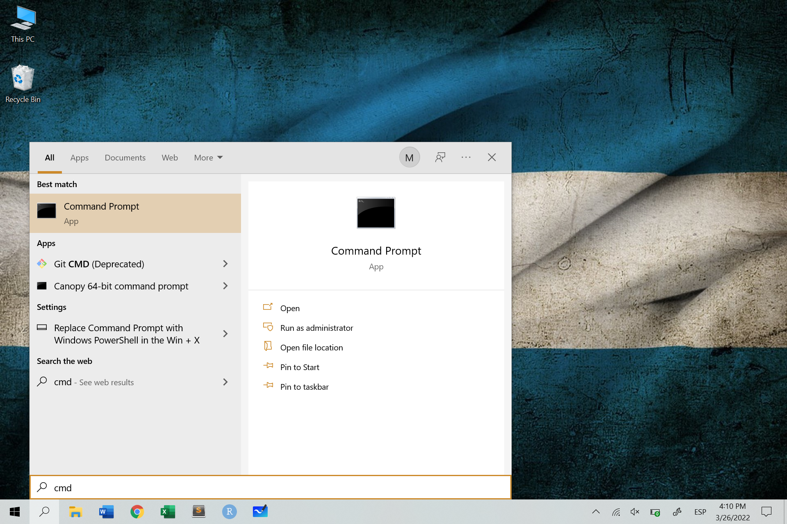
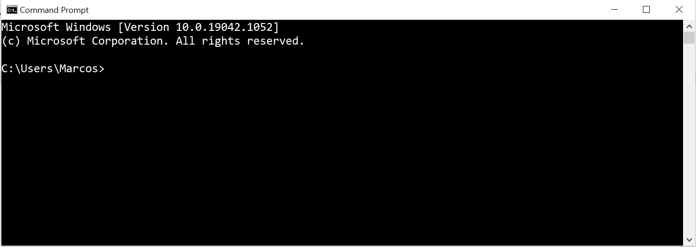
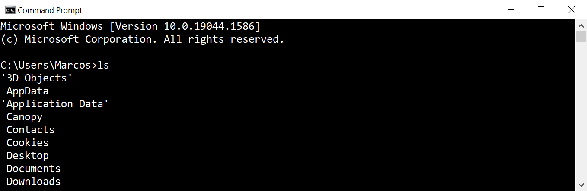
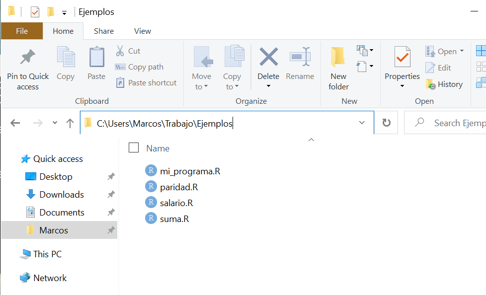
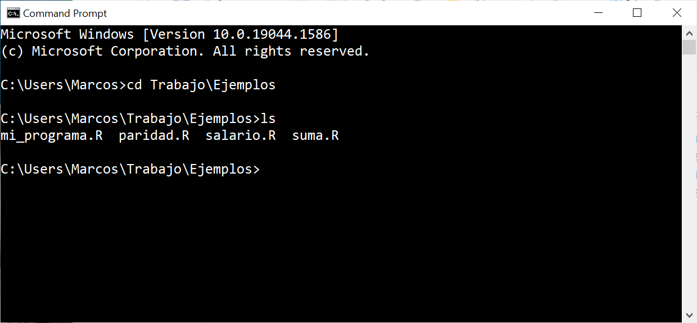
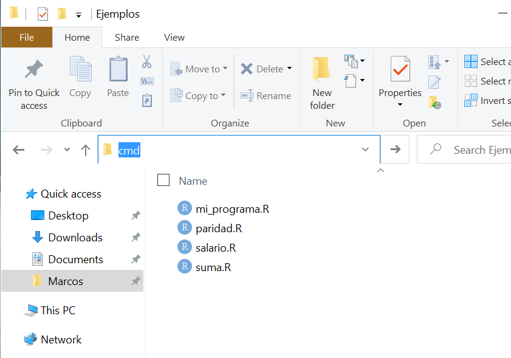
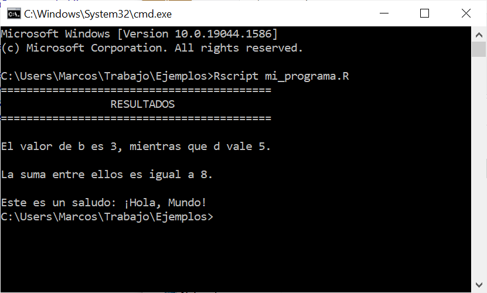
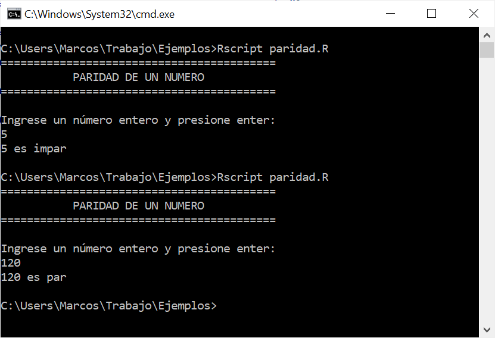
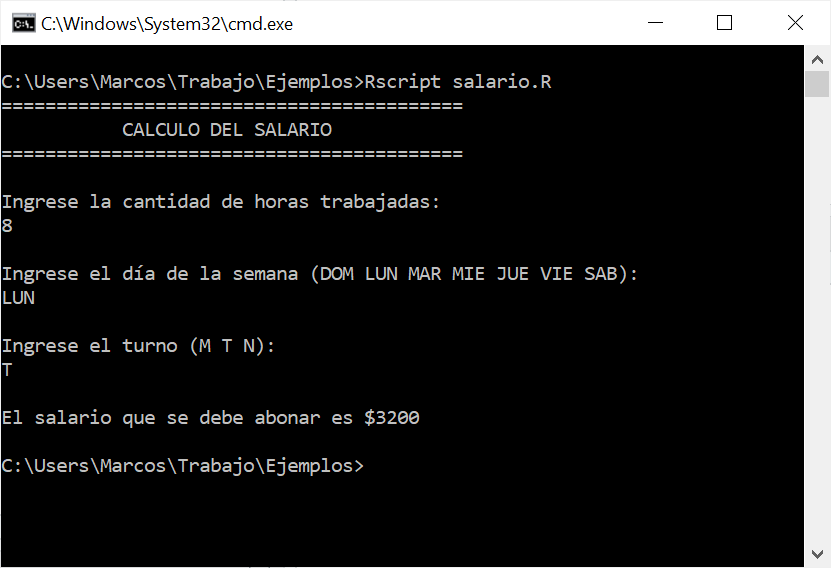
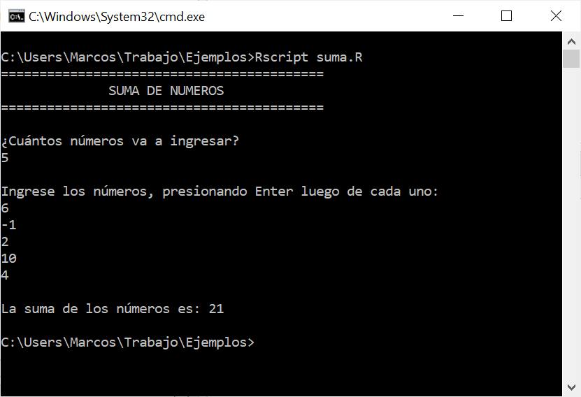

# Otros tópicos

Las reglas que aprendimos para escribir el pseudocódigo nos permiten traducir nuestros algoritmos a cualquier lenguaje de computación de manera muy general y sencilla. Sin embargo, cada lenguaje de programación tiene diseñado su propio conjunto de funciones y estructuras de datos que facilitan algunas tareas. Una vez que hemos incorporado los conceptos básicos de la programación, podemos dedicarnos a aprender las profundidades de un lenguaje en particular.

En este capítulo vamos mencionar algunas cosas útiles sobre R y otras cuestiones.

## La consola

Cuando prendemos nuestra computadora nos encontramos con una interfaz gráfica implementada por el sistema operativo para que podamos hacer lo que necesitemos de manera sencilla usando ventanas y menúes, interactuando con el sistema a través del mouse, teclado, micrófono o pantalla táctil. Sin embargo, es posible usar la compu de otra forma, escribiendo comandos especiales en una ventanita, llamada **consola** que es capaz de interpretarlos para hacer cualquier tipo de actividad, sin utilizar la interfaz gráfica. Años atrás, esta era la única manera disponible de usar la computadora (por ejemplo, con sistema operativo MS-DOS de Windows).

Saber usar la consola es muy útil para automatizar actividades, realizar tareas administrativas, manipular varios archivos u objetos en simultáneo, lanzar a correr proyectos grandes, conectarse de manera remota a un servidor, etc. La primera vez que uno se mete en esto puede ser intimidante, pero no hay que olvidar que ya estamos acostumbrados a usar la consola de R, con lo cual esto de escribir comandos e interpretar respuestas es algo familiar.

Los términos *terminal*, *consola*, *shell* y *línea de comandos* son términos que a veces se usan como sinónimos sin demasiada preocupación, como si fuesen distintas formas de llamar a lo mismo: una ventanita donde puedo escribir comandos y hacer que sucedan cosas en la computadora. Sin embargo, hay pequeñas diferencias entre estos conceptos, que acá tratamos de resumir (aunque ni siquiera entre informáticos hay mucho acuerdo en las definiciones):

- **Shell** (intérprete de línea de comandos): es software, es un programa que corre otros programas, procesa los comandos que recibe y devuelve resultados Ejemplo: Bash (la más común en sistemas Linux), sh, PowerShell, etc.
- **Terminal**: un programa que propicia la transferencia de input/output entre el usuario y la shell. No ejecuta comandos, pero recibe los comandos que el shell va a procesar. Ejemplos: Command prompt, guake, gnome-terminal, etc. Antiguamente, se trataba de las múltiples estaciones con un monitor y un teclado que una gran computadora tenía para ser usada por varias personas.
- **Consola**: un tipo particular de terminal, con una ventana escribir inputs y leer outputs. Históricamente, se trataba de un panel físico (consola) con controles. Siri o Cortana podrían considerarse terminales, pero no son consolas, ya que no hay que escribir para mandar comandos. Terminal y consola se usan prácticamente como sinónimos.

Para abrir una terminal en Linux se puede usar el atajo `ctrl + alt + t` y en Windows se puede escribir `cmd` en Inicio.

```{r, out.width='80%', fig.show='hold', fig.cap='Abrir la terminal en Windows. En computadoras con Windows en español, en lugar de Command Prompt dice Símbolo del sistema.', echo=FALSE, fig.align="center"}

```

Así luce la línea de comandos de Windows:


```{r, out.width='80%', fig.show='hold', fig.cap='Línea de comandos de Windows.', echo=FALSE, fig.align="center"}

```

Los comandos se escriben en la última línea a continuación del símbolo `>`, que a su vez está precedido por la ruta a la carpeta que es el directorio de trabajo actual de la terminal, en este caso, `C:\Users\Marcos` (carpeta `Marcos`, dentro de la carpeta `Users`, en el disco `C`).

Si bien hay muchísimos comandos para utilizar en la terminal, acá vamos a mencionar algunos como ejemplo:

- Mostrar en qué carpeta (directorio) de la compu estamos situados: *pwd* en Linux o *cd* en Windows
- Listar todos los archivos y carpetas que tenemos en el directorio actual: *ls*
- Entrar a una subcarpeta desde el directorio en el que estamos: *cd nombresubcarpeta*
- Ver la ayuda de los comandos: *help*
- Limpiar la consola: *cls* en Windows o *clear* en Linux
- Cerrar la consola: *exit*

Por ejemplo, podemos ver todos los archivos que existen en el directorio actual con `ls`:

```{r, out.width='80%', fig.show='hold', fig.cap='Contenido del directorio actual (Windows).', echo=FALSE, fig.align="center"}

```

Para los siguientes ejemplos, trabajaremos en una carpeta llamada `Ejemplos`, cuyo *path* es `C:\Users\Marcos\Trabajo\Ejemplos` que tiene la siguiente composición:

```{r, out.width='80%', fig.show='hold', fig.cap='Carpeta en la cual deseamos trabajar.', echo=FALSE, fig.align="center"}

```

Podemos convertir a dicha carpeta como nuestro nuevo directorio de trabajo con el comando `cd` (*change directory*):

```{r, out.width='80%', fig.show='hold', fig.cap='Cambio de directorio de trabajo y listado de archivos en el mismo.', echo=FALSE, fig.align="center"}

```

En Windows hay una forma más directa de abrir la terminal y que ya tenga seteada como directorio de trabajo a una carpeta deseada. Antes de abrir la terminal, vamos con el *Explorador de archivos* a la carpeta en cuestión, nos posicionamos en la barra del explorador, escribimos `cmd` y le damos `ENTER`. Automáticamente se abrirá la terminal, con esta carpeta como directorio de referencia.

```{r, out.width='80%', fig.show='hold', fig.cap='Abrir la terminal desde una carpeta en particular en Windows.', echo=FALSE, fig.align="center"}

```

Desde la terminal podemos correr nuestros programas de R. Hacer esto es necesario cuando tenemos que programar alguna tarea de gran escala que se ejecutará de manera remota en algún servidor o cuando necesitamos encapsular nuestro programa para que otros lo puedan correr sin siquiera saber nada de R.

Veamos un ejemplo. En la carpeta `C:\Users\Marcos\Trabajo\Ejemplos` tengo guardado el siguiente script, en un archivo llamado `mi_programa.R` que tiene este contenido:

```{r, eval=FALSE}
a <- "¡Hola, Mundo!"
b <- 3
d <- 5
cat("==========================================\n")
cat("                 RESULTADOS               \n")
cat("==========================================\n\n")
cat("El valor de b es ", b, ", mientras que d vale ", d, ".\n\n", sep = "")
cat("La suma entre ellos es igual a ", b + d, ".\n\n", sep = "")
cat("Este es un saludo:", a)
```

Para ejecutar este programa desde la terminal, sin abrir RStudio o R, utilizo el comando `Rscript`, que le indica a la computadora que el contenido del archivo `mi_programa.R` debe ser evaluado por R. Esto es lo que se observa en la consola:

```{r, out.width='80%', fig.show='hold', fig.cap='Correr el programa de R desde la consola en Windows.', echo=FALSE, fig.align="center"}

```

Todo lo que en el programa estaba encerrado en una llamada a la función `cat()` es lo que se muestra como mensajes en la terminal. Notar que la instrucción `RScript mi_programa.R` funcione, debemos tener como directorio de trabajo aquella carpeta que aloja al archivo `mi_programa.R`, en caso contrario el sistema nos alertará que el mismo no está disponible.

Para que lo anterior funcione en Windows, hay que indicarle al sistema operativo que `Rscript` es un comando que se instaló con R y que lo puede encontrar en la carpeta de los archivos del programa R. Esto hay que hacerlo una sola vez editando las **variables de entorno** de Windows, que son cadenas de texto que contienen información acerca del sistema para determinar, por ejemplo, dónde buscar algunos archivos. Esto se logra siguiendo estos pasos:

1. Fijarse en qué carpeta de la compu está instalado R. Seguramente lo encuentres si, abriendo el explorador de archivo, vas siguiendo este camino: `Este equipo > Windows (C:) > Archivos de programa > R > R-version > bin`. En esta carpeta tiene que haber dos archivos, llamados `R.exe` y `Rscript.exe`. Si es así, hacé clic con el botón derecho del mouse sobre cualquiera de ellos, luego en "Propiedades" y copiá el path que aparece en "Ubicación" (deberías copiar algo como `C:\Program Files\R\R-3.6.0\bin`).
1. En Inicio, escribir "Entorno" y hacer clic en la opción "Editar las variables de entorno del sistema (panel de control)".
2. Hacer clic en el botón "Variables de entorno".
3. En el cuadro "Variables del sistema", hacer clic en la variable "Path" y luego en "Editar".
4. Hacer clic en "Nuevo", pegar la dirección `C:\Program Files\R\R-3.6.0\bin` y dar Enter. Luego, hacer clic en "Aceptar" tres veces para cerrar todo.
5. ¡Listo! Ya podés correr tus programas desde la consola con el comando *Rscript*.

Lo bueno de esto es que si corremos nuestros programas desde la terminal, podemos hacer cosas interactivas. Por ejemplo, para todo lo que pusimos `LEER` en nuestros pseudocódigos, ahora podemos hacer verdaderamente que la persona usuaria del programa provea los valores correspondientes.

Veamos algunos ejemplos.

**Práctica 2, Ejercicio 1: paridad de un número**

La función `scan()` es la que permite *escanear* o *leer* valores que los usuarios ingresen por la terminal. Entre sus argumentos tenemos a `file`, que si lo seteamos como `file = "stdin"` indica que vamos a leer información desde la consola. Otros argumentos que son de utilidad incluyen a `n = 1`, que indica que sólo leeremos un valor y `quite = TRUE` que le pide a esta función que no emita ningún mensaje. Por ejemplo, si el siguiente código se guarda en el archivo `paridad.R` y es ejecutado desde la consola, le va a pedir a la persona que lo esté usando que indique cualquier número y luego le va a comunicar si es par o impar:

```{r, eval=FALSE}
cat("==========================================\n")
cat("           PARIDAD DE UN NÚMERO           \n")
cat("==========================================\n\n")
cat("Ingrese un número entero y presione enter:\n")
n <- scan(file = "stdin", n = 1, quiet = TRUE)
if (n %% 2 == 0) {
	cat(n, "es par\n")
} else {
	cat(n, "es impar\n")
}
```

Esto es lo que ocurre en la terminal:

```{r, out.width='80%', fig.show='hold', fig.cap='Programa paridad.R.', echo=FALSE, fig.align="center"}

```

**Práctica 2, Ejercicio 3: salario**

En este ejemplo, tenemos que leer tres valores, dos de lo cuales son de tipo carácter. Para esto tenemos que agregar en la función `scan()` el argumento `what = ""`, que admite el ingreso de caracteres alfanuméricos (por default `scan()` sòlo espera recibir valores numéricos). Si el siguiente código se guarda en el archivo `salario.R` y se lo ejecuta desde la consola, produce el resultado que se muestra en la imagen:

```{r, eval=FALSE}
cat("==========================================\n")
cat("           CÁLCULO DEL SALARIO            \n")
cat("==========================================\n\n")
cat("Ingrese la cantidad de horas trabajadas:\n")
horas <- scan("stdin", n = 1, quiet = TRUE)
cat("\nIngrese el día de la semana (DOM LUN MAR MIE JUE VIE SAB):\n")
dia <- scan("stdin", what = "", n = 1, quiet = TRUE)
cat("\nIngrese el turno (M T N):\n")
turno <- scan("stdin", what = "", n = 1, quiet = TRUE)

salario <- horas * 400
if (turno == "N") {
	salario <- salario + horas * 200
}
if (turno == "DOM") {
	salario <- salario + horas * 100
}
cat("\nEl salario que se debe abonar es $", salario, "\n", sep = "")
```

```{r, out.width='80%', fig.show='hold', fig.cap='Programa salario.R.', echo=FALSE, fig.align="center"}

```

**Práctica 4, Ejercicio 1: suma de elementos de un vector**^[Si estás leyendo esto antes de que hayamos visto en clase la Unidad 5, podés omitir este último ejemplo y retomarlo más adelante en el cursado.]

En este ejercicio escribimos una función para sumar los elementos de un vector. Vamos a ver cómo hacer para que un usuario nos diga cuáles son los valores que quiere sumar desde la consola. Primero preguntamos cuántos números se desean sumar y luego los recibimos en el vector `v`. Si el siguiente código queda guardado en el archivo `suma.R` y se lo corre desde la terminal, produce el resultado que se muestra en la imagen.

```{r, eval = F}
cat("==========================================\n")
cat("              SUMA DE NÚMEROS             \n")
cat("==========================================\n\n")
cat("¿Cuántos números va a ingresar?\n")
n <- scan("stdin", n = 1, quiet = TRUE)
cat("\nIngrese los números, presionando Enter luego de cada uno:\n")
v <- scan("stdin", n = n, quiet = TRUE)
suma <- 0
for (i in 1:length(v)) {
	suma <- suma + v[i]
}
cat("\nLa suma de los números es:", suma, "\n")
```


```{r, out.width='80%', fig.show='hold', fig.cap='Programa suma.R.', echo=FALSE, fig.align="center"}

```

## Más funciones predefinidas

En este proceso de aprendizaje sobre programación hemos encarado la tarea de escribir muchas funciones que, por lo general, ya forman parte de la sintaxis básica de cualquier lenguaje de programación. Sí... hemos trabajado de más, ¡pero fue para poder aprender! Ahora vamos a mencionar algunos ejemplos de funciones que fuimos capaces de programar por nuestros propios medios, pero que ya estaban disponibles en R. De hecho, en la sección \@ref(funcpredef) vimos que R tiene funciones predefinidas para que podamos cumplir muchas tareas con facilidad.

Recordemos algunos ejercicios:

- En la sección \@ref(funcpredef) vimos la definición de una función para el cálculo de factoriales, que a su vez usamos en el ejercicio 1 de la **Práctica 3** para crear una función que calcule números combinatorios. R ya trae funciones que cumplen ese rol:

	```{r}
	# Cálculo de factoriales
	factorial(5)
	# Cálculo de números combinatorios
	choose(10, 2)
	```

- En el **ejercicio 1** de la **Práctica 4** definimos la siguiente función para sumar los elementos de un vector:

	```{r}
	suma <- function(v) {
		rtdo <- 0
		for (i in 1:length(v)) {
			rtdo <- rtdo + v[i]
		}
		return(rtdo)
	}
	
	mi_vector <- c(60, -5, 0, 12, 1)
	suma(mi_vector)
	```

	Sin embargo, podríamos usar directamente la función `sum()` de R:
		
	```{r}
	sum(mi_vector)
	```

- En el **ejercicio 3** de la **Práctica 4** creamos las funciones `ordenar_asc()` y `ordenar_des()` para ordenar los elementos de un vector. Esto se puede hacer así:

	```{r}
	sort(mi_vector)
	sort(mi_vector, decreasing = TRUE)
	```

- En el **ejercicio 4** de la **Práctica 4**, escribimos funciones para encontrar el mínimo o el máximo en un vector, al igual que su posición. R nos facilita estas funciones para lograr lo mismo:

	```{r}
	# Valor mínimo
	min(mi_vector)
	# Posición del mínimo en el vector
	which.min(mi_vector)
	# Valor máximo
	max(mi_vector)
	# Posición del máximo en el vector
	which.max(mi_vector)
	# Al igual que nuestra función, si el valor se repite nos da la posición de su
	# primera ocurrencia
	w <- c(0, 5, 2, 3, 5, 4)
	max(w)
	which.max(w)
	# Pero podemos obtener todas las posiciones así:
	which(w == max(w))
	```

- También podemos aplicar esto a la búsqueda de mínimos y máximos en una matriz:
	
	```{r}
	A <- matrix(sample(100, 20), nrow = 5)
	A
	# Valor máximo
	max(A)
	# Posición (arr.ind = TRUE para que nos indique fila y columna)
	which(A == max(A), arr.ind = TRUE)
	# Máximo en cada fila de A (la función apply aplica la función provista, max, 
	# a cada fila de A)
	apply(A, 1, max)
	# Si en lugar de 1 ponemos 2, tenemos el máximo en cada columna
	apply(A, 2, max)
	# Posición del máximo en cada fila
	max.col(A) # Una opción
	apply(A, 1, which.max) # Otra opción
	# Posición del máximo en cada columna
	apply(A, 2, which.max)
	```

- En otras ocasiones, puede ser que R no incluya en su instalación base la función que necesitamos, pero que la misma ya haya sido programada por otra persona y esté disponible en un *paquete* que podemos descargar e instalar. Por ejemplo, en el ejercicio 8 de la Práctica 3 escribimos una función llamada `max_com_div()` para hallar el máximo común divisor entre dos naturales. R no tiene una función que compute esto, pero podemos instalar el paquete `FRACTION` que sí la incluye:

	```{r}
	# install.packages("FRACTION")
	library("FRACTION")
	gcd(100, 24)
	```

## Operaciones vectorizadas

Otro aspecto importante es que la mayoría de las funciones de R están **vectorizadas**. Esto quiere decir que están diseñadas para operar al mismo tiempo con todos los elementos de los vectores y matrices y no es necesario recorrer cada posición, una por una, como aprendimos para incorporar nuestros primeros conocimientos sobre programación. Las funciones operan en todos los elementos sin tener que usar estructuras iterativas, haciendo que el código sea más conciso, fácil de leer y con menos chances de cometer errores.

Recordemos algunas situaciones:

- **Práctica 4, ejercicio 2**: definimos una función para sumar dos vectores:

	```{r}
	sumar_vectores <- function(u, v) {
		nu <- length(u)
		nv <- length(v)
		if (nu == nv) {
			suma <- numeric(nu)
			for (i in 1:nu) { 
				suma[i] <- u[i] + v[i]
			}
			return(suma)
		} else {
			cat("Las dimensiones de los vectores no coinciden\n")
			return(NULL)
		}
	}
	
	u <- c(5, 8, 2)
	v <- c(2, 3, -1)
	sumar_vectores(u, v)
	```
	
	Pero directamente, podemos hacer `u + v`, puesto que R realizará la suma elemento a elemento entre los dos vectores:
	
	```{r}
	u + v
	```

- **Práctica 4, ejercicio 5**: creamos una función para calcular el producto escalar entre dos vectores. Se puede hacer de manera directa así:

	```{r}
	sum(u * v)
	```
	
	`u * v` hace la multiplicación elemento a elemento entre los vectores `u` y `v` y luego sumamos con `sum()`.

- **Práctica 4, ejercicio 7**: programamos una función para hacer la suma entre dos matrices:

	```{r}
	sumar_matrices <- function(A, B) {
		if (nrow(A) == nrow(B) && ncol(A) == ncol(B)) {
			suma <- matrix(NA, nrow(A), ncol(A))
			for (i in 1:nrow(A)) {
				for (j in 1:ncol(A)) {
					suma[i, j] <- A[i, j] + B[i, j]
				}
			}
			return(suma)
		} else {
			cat("Las dimensiones de las matrices no coinciden\n")
			return(NULL)
		}
	}
	
	# Ejemplo de su uso
	a <- matrix(c(5, 8, 2, 2, 3, 1), nrow = 3)
	b <- matrix(c(0, -1, 3, 1, 2, 4), nrow = 3)
	a
	b
	sumar_matrices(a, b)
	```
	
	Gracias a las operaciones vectorizadas de R, esto se puede resumir en:
	
	```{r}
	a + b
	```

A continuación presentamos un listado de las operaciones vectorizadas más comunes:

```{r}
# Matrices de ejemplo
a <- matrix(c(5, 3, 1, 1, 8, 2), nrow = 3)
b <- matrix(c(0, -1, 3, 1, 2, 4), nrow = 3)
a
b

# Operaciones elemento a elemento
a + b
a - b
a * b
a / b
a^2
sqrt(a)

# Operaciones lógicas elemento a elemento
a == 3
b > 0
a > b
a < 0 | b > 0

# Mínimo y máximo
min(a)
which(a == min(a)) # posición del mínimo (todas las ocurrencias)
apply(a, 1, min) # valor mínimo por fila
apply(a, 1, which.min) # posición del mínimo por fila (primer ocurrencia)
apply(a, 1, function(x) which(x == min(x))) # pos del mín por fila (todas las ocurrencias)

# Sumas y promedios para un vector
v <- c(2, 3, 9, 1, 0)
sum(v)
mean(v)

# Sumas y promedios para una matriz, en general o para cada fila/columna
a
sum(a)
mean(a)
rowSums(a)
colSums(a)
rowMeans(a)
colMeans(a)

# Álgebra matricial
# Transpuesta
t(a)
# Producto matricial
d <- matrix(1:4, nrow = 2)
a %*% d
# Inversa
solve(d)
# Diagonal
diag(d)
```

## Indexación de vectores, matrices y data.frames

Como ya sabemos, indexar es hacer referencia a uno o más elementos particulares dentro de una estructura de datos. Vimos que para indexar a un vector, hace falta sólo un índice:

```{r}
x <- c(10.4, 5.6, 3.1, 6.4, 21.7)
x[3]
```

Y que para indexar matrices, son necesarios dos índices:

```{r}
a <- matrix(c(4,-2, 1, 20, -7, 12, -8, 13, 17), nrow = 3)
a
a[2, 3]
```

Pero también podemos hacer indexar a múltiples elementos de un vector o una matriz a la vez:

**Vector**:

```{r}
# Mostrar los primeros tres elementos del vector x
x[1:3]
# Mostrar los elementos en las posiciones 2 y 4
x[c(2, 4)]
#Mostrar todos los elementos menos el cuarto
x[-4]
# Mostrar el último elemento
x[length(x)]
# Indexar con valores lógicos. Obtenemos sólo las posiciones indicadas con TRUE:
x[c(F, F, T, T, F)]
# Sabiendo que la siguiente operación devuelve TRUE o FALSE para cada posición de x:
x > 10
# ...la podemos usar para quedarnos con aquellos elementos de x mayores a 10:
x[x > 10]
```

**Matriz**:

```{r}
# Toda la fila 3
a[3, ]

# Toda la columna 2
a[, 2]

# Submatriz con las columnas 1 y 2
a[, 1:2]

# Submatriz con las columnas 1 y 3
a[, c(1, 3)]

# Asignar el mismo valor en toda la fila 3
a[3, ] <- 10
a
```

**data.frames:**

Inventamos un pequeño conjunto de datos de ejemplo con la estructura de los `data.frames` de R:

```{r}
mis_datos <- data.frame(
    altura = c(181, 165, 149, 178),
    peso = c(85, 65, 52, 72),
    edad = c(29, 27, 21, 32)
)
mis_datos
```

Un `data.frame` puede ser indexado de la misma forma empleada con matrices, por ejemplo:

```{r}
mis_datos[3:4, c(1, 3)]
mis_datos[3:4, c("altura", "edad")]
```

Para hacer referencia a una variable dentro del `data.frame`, empleamos la estructura `dataset$variable`. Por ejemplo:

```{r}
mis_datos$altura
```

Lo anterior resulta en un vector, con el que se pueden hacer operaciones como buscar el valor mínimo:

```{r}
min(mis_datos$altura)
```

**Ejemplo: cuadrado mágico**

Podemos combinar lo mencionado en esta sección para escribir una nueva versión de la función `cuadrado_magico()`, que desarrollamos en el ejercicio 10 de la práctica 4:

```{r}
cuadrado_magico <- function(cuadrado) {
	# Calcular el primer total fila para tener de control
  control <- sum(cuadrado[1, ])
  
  # Todos los controles
  sumas_filas <- rowSums(cuadrado)
  sumas_col <- colSums(cuadrado)
  suma_diag1 <- sum(diag(cuadrado))
  suma_diag2 <- sum(diag(cuadrado[nrow(cuadrado):1, ]))
  sumas <- c(sumas_filas, sumas_col, suma_diag1, suma_diag2)
  
  # Si alguna de las sumas no es igual al control, devolver FALSE
  if (any(sumas != control)) return(FALSE)
  return(TRUE)
}

cuadrado <- matrix(c(16,  3,  2, 13,
                      5, 10, 11,  8,
                      9,  6,  7, 12,
                      4, 15, 14,  1), nrow = 4, byrow = TRUE)
cuadrado_magico(cuadrado)

cuadrado <- matrix(c( 0,  3,  2, 13,
                      5, 10, 11,  8,
                      9,  6,  7, 12,
                      4, 15, 14,  1), nrow = 4, byrow = TRUE)
cuadrado_magico(cuadrado)
```


## Generación de secuencias

A continuación mostramos cómo generar algunos vectores numéricos en R:

```{r}
# Generar vectores con secuencias numéricas

# Enteros de 1 a 5
1:5

# Números de 1 a 10 cada 2
seq(1, 10, 2)

# Números de 0 a -1 cada -0.1
seq(0, -1, -0.1)

# Siete números equiespaciados entre 0 y 1
seq(0, 1, length.out = 7)

# Repetir el 1 tres veces
rep(1, 3)

# Repetir (1, 2, 3) tres veces
rep(1:3, 3)

# Repetir cada número tres veces
rep(1:3, each = 3)

# Generar una matriz diagonal
diag(c(3, 7, 1, 5))

# Generar una matriz identidad
diag(rep(1, 5))
```

## Resolución alternativa de un ejercicio

Combinando todo lo mencionado hasta acá, podemos plantear una solución alternativa al **ejercicio 7** de la **Práctica 5**.

```{r, echo=FALSE}
datos <- read.csv("/home/marcos/gdrive/TallerDeProgramacion/2021/practicas/practica5/charly.csv")
```


```{r, eval=FALSE}
#----------------------------------------------------------------------------
# PROGRAMA: Análisis de los discos de Charly García 
#----------------------------------------------------------------------------

# Leer archivo
datos <- read.csv("charly.csv")
```

```{r}
# Vector con los nombres de los discos
discos <- c("Yendo de la cama al living", "Parte de la religión", 
            "Filosofía barata y zapatos de goma", "Say no more", 
            "Influencia", "Random")

# Crear un factor significa asignarle un nombre a cada categoría. Todos los "1"
# serán reemplazados por "Yendo de la cama al living", los "2" por "Parte de la
# religión", etc. Correrlo y ver cómo quedó en el data.frame.
datos$disco <- factor(datos$disco, levels = 1:6, labels = discos)


# a) y b) Cantidad de canciones en cada disco ----------------------------------
# table() indica la frecuencia absoluta de cada valor en un vector
conteos <- table(datos$disco)
conteos
conteos <- matrix(conteos, ncol = 1,
                  dimnames = list(Disco = names(conteos), "Nro de canciones"))
conteos

# Menor y mayor cantidad de canciones
min(conteos)
max(conteos)
# De qué discos se trata
discos[which.min(conteos)]
discos[which.max(conteos)]

# c) Buscar el mayor valor en energía ------------------------------------------
max(datos$energico)
# Cuál es la fila donde se encuentra el máximo
which.max(datos$energico)
# Nombre de la canción con máxima energía
datos$tema[which.max(datos$energico)]
# Nombre del disco que contiene a la canción con máxima energía
datos$disco[which.max(datos$energico)]

# d) Porcentaje de canciones con valor mayor a 0.5 en positivo -----------------
porc <- 100 * mean(datos$positivo > 0.5)
porc
# Número de canciones con valor de positivo > 0.5
sum((datos$positivo > 0.5))

# e) Tabla de distribución de frecuencias para los valores de acústico ---------
# Con la función cut() agregamos una nueva variable al data.frame que identifica
# a qué intervalo pertenece cada valor de acústico (hacer clic en "datos" en
# Environment y observar la nueva columna)
datos$acustico2 <- cut(datos$acustico, breaks = seq(0, 1, 0.2))
tabla <- table(datos$acustico2)
tabla
# prop.table() calcula proporciones, es decir, frecuencias relativas
prop.table(tabla)
# Entonces...
cuadro <- cbind(tabla, round(100 * prop.table(tabla), 2))
colnames(cuadro) <- c("Frec. Abs", "Frec. Rel. %")
cuadro

# f) Calcular promedios de cada variable según disco ---------------------------
# aggregate() permite calcular el promedio de cada variable para cada grupo
# datos[, 3:13] es la forma de indicar a qué columnas le sacamos el promedio
# by = list(datos$disco) indica que queremos el promedio para cada disco
# FUN = mean indica que a cada variable hay que aplicarle la función mean
promedios <- aggregate(datos[, 3:12], by = list(Disco = datos$disco), FUN = mean)
promedios
# Redondear todas las columnas excepto la primera y la última
promedios[, 2:10] <- round(promedios[, 2:10], 3)
promedios

# g) Disco con menor promedio en bailable ----------------------------------
min(promedios$bailable)
which.min(promedios$bailable)
promedios$Disco[which.min(promedios$bailable)]
# Disco con mayor promedio en instrumental
max(promedios$instrumental)
which.max(promedios$instrumental)
promedios$Disco[which.max(promedios$instrumental)]

# h) Diferencia entre la duración promedio de las canciones 
# del primer disco y las del último, expresada en minutos.----------------------
diferencia <- (promedios$duracion[1] - promedios$duracion[6]) / 60000
diferencia
```

Podemos guardar todos estos resultados en un archivo:

```{r, eval=FALSE}
sink("salida.txt")

cat("----- Cantidad de canciones en cada disco -----\n")
conteos
cat("\nEl disco con menor cantidad de canciones es:", discos[which.min(conteos)], "\n")
cat("El disco con mayor cantidad de canciones es:", discos[which.max(conteos)], "\n")

cat("\n----- Energía -----\n")
cat("La canción con mayor valor de energía (", max(datos$energico), ") es ", 
		datos$tema[which.max(datos$energico)], " y pertenece\n al disco ", 
		discos[datos$disco[which.max(datos$energico)]], ".\n", sep = "")

cat("\n----- Positivo -----\n")
cat("El porcentaje de canciones con valor mayor a 0.5 en Positivo es ", porc, 
    "%.\n", sep = "")

cat("\n----- Acústico -----\n")
cuadro

cat("\n----- Promedio de cada variable según disco -----\n")
promedios

cat("\n----- Bailable e Instrumental -----\n")
cat("El disco con menor promedio en bailable (", min(promedios$bailable),
		") es ", discos[which.min(promedios$bailable)], ".\n", sep = "")
cat("El disco con mayor promedio en instrumental (", min(promedios$instrumental),
		") es ", discos[which.max(promedios$instrumental)], ".\n", sep = "")

cat("\n----- Duración -----\n")
cat("La diferencia entre la duración promedio de las canciones del primer disco 
		y las del último es de ", diferencia, "minutos.\n")

sink()
```


Así se ve el archivo creado:

```
----- Cantidad de canciones en cada disco -----
                                    
Disco                                Nro de canciones
  Yendo de la cama al living                        8
  Parte de la religión                             10
  Filosofía barata y zapatos de goma               11
  Say no more                                      14
  Influencia                                       13
  Random                                           10

El disco con menor cantidad de canciones es: Yendo de la cama al living 
El disco con mayor cantidad de canciones es: Say no more 

----- Energía -----
La canción con mayor valor de energía (0.949) es El Amor Espera y pertenece al disco Influencia.

----- Positivo -----
El porcentaje de canciones con valor mayor a 0.5 en Positivo es 51.51515%.

----- Acústico -----
          Frec. Abs Frec. Rel. %
(0,0.2]          32        48.48
(0.2,0.4]        16        24.24
(0.4,0.6]         7        10.61
(0.6,0.8]         3         4.55
(0.8,1]           8        12.12

----- Promedio de cada variable según disco -----
                               Disco bailable energico volumen hablado acustico instrumental  vivo positivo   tempo duracion
1         Yendo de la cama al living    0.684    0.460 -11.992   0.078    0.293        0.021 0.172    0.517 105.760 259585.0
2               Parte de la religión    0.633    0.710  -8.595   0.037    0.278        0.059 0.141    0.564 113.890 234867.9
3 Filosofía barata y zapatos de goma    0.592    0.384 -17.392   0.036    0.108        0.009 0.114    0.500 110.009 229543.1
4                        Say no more    0.385    0.469 -14.947   0.049    0.414        0.293 0.216    0.344 109.094 238400.1
5                         Influencia    0.577    0.590  -9.732   0.064    0.396        0.078 0.236    0.599 109.701 199760.9
6                             Random    0.655    0.739  -6.258   0.031    0.202        0.000 0.262    0.597 113.357 204040.0

----- Bailable e Instrumental -----
El disco con menor promedio en bailable (0.385) es Say no more.
El disco con mayor promedio en instrumental (0) es Say no more.

----- Duración -----
La diferencia entre la duración promedio de las canciones del primer disco y las del último es de  0.92575 minutos.
```

